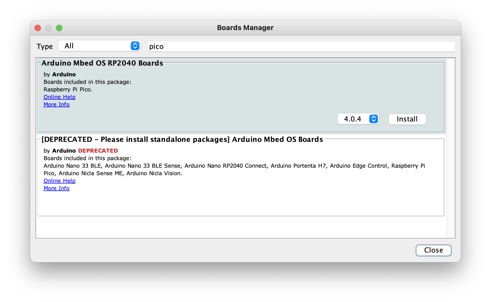
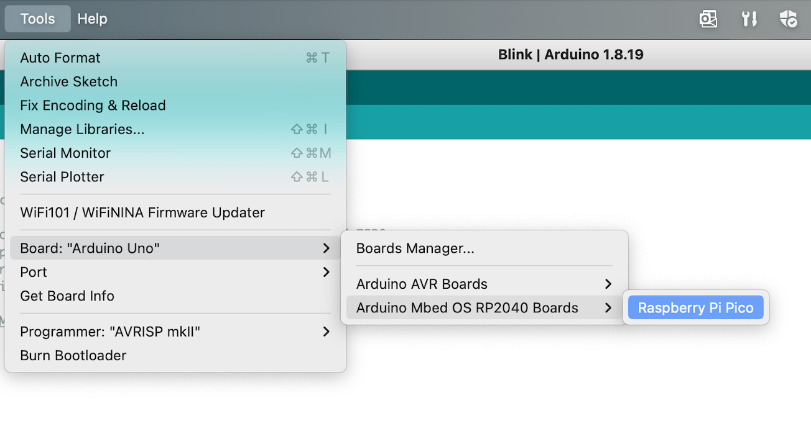

In this guide we will walk through the process of installing Arduino Core software onto your Raspberry Pi Pico.

Arduino Core is the software stack that powers Arduino brand devices and development boards. And while the Raspberry Pi Pico isn't an Arduino board, it uses the same RP2040 SoC as the Arduino RP2040 Connect, and therefore can run the same Arduino Core software.

## Install Arduino IDE

First, you will need to install the Arduino IDE onto your laptop or desktop. You can download it for your operating system from [the Arduino Software website](https://www.arduino.cc/en/software). Follow the provided instructions for installing the IDE.

## Install Board Support Package

The Arduino software is comprised of the Core libraries and a Board Support Package that is specific to your device. We will need to install the `Arduino Mbed OS RP2040 Boards` package to support our Raspberry Pi Pico.

You can install this package by opening the `Boards Manager` from the `Tools -> Board` menu. Search for `pico` and it should find the appropriate board package. Click the `Install` button to add it to the Arduino IDE.

## Select your board

Once the support package is installed, you need to tell the Arduino IDE which supported board you will be using. From the `Tools -> Board` menu, find and select the `Raspberry Pi Pico` option.

## Upload to your board

Because the Raspberry Pi Pico doesn't come with the Arduino Code software by default, the Arduino IDE won't recognize it. So the next thing we need to do is install the Arduino Core software onto our device. To do that, we must upload a Sketch. It doesn't matter which one, it can be the example `Blink` sketch, or even an empty one.

After the upload is complete, your Raspberry Pi Pico will be fully recognized by the Arduino IDE, and you are ready to start writing an Arduino Sketch for it.