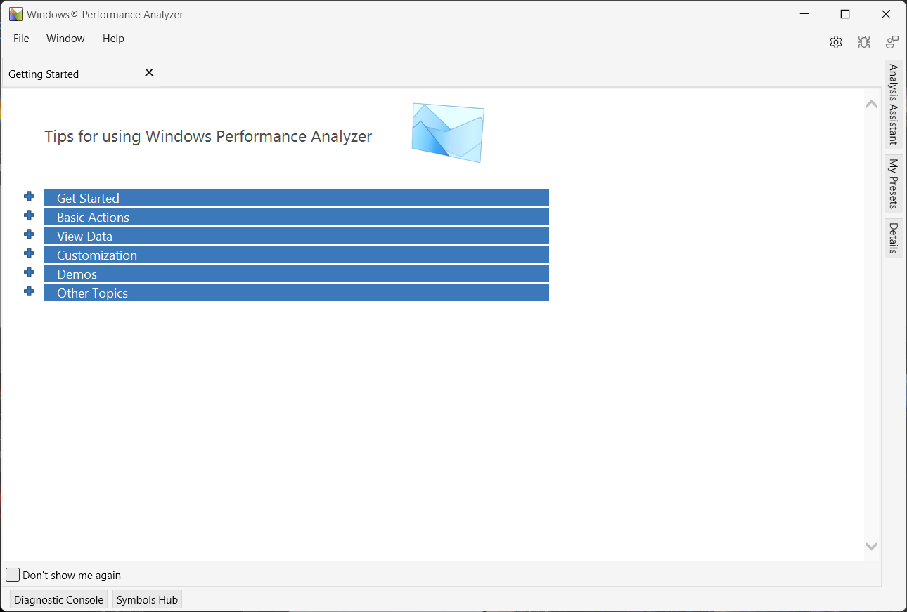

---
### Title the install tools article with the name of the tool to be installed
### Include vendor name where appropriate
title: WindowsPerf Ecosystem - the Windows Performance Analyzer (WPA) Plugin
minutes_to_complete: 5

official_docs: https://github.com/arm-developer-tools/windowsperf-wpa-plugin

author_primary: Alaaeddine Chakroun 

### Optional additional search terms (one per line) to assist in finding the article
additional_search_terms:
  - perf
  - profiling
  - profiler
  - windows
  - woa
  - windows on arm
  - open source windows on arm
  - windows performance analyzer
  - wpa
### FIXED, DO NOT MODIFY
weight: 1 # Defines page ordering. Must be 1 for first (or only) page.
tool_install: true # Set to true to be listed in main selection page, else false
multi_install: FALSE # Set to true if first page of multi-page article, else false
multitool_install_part: false # Set to true if a sub-page of a multi-page article, else false
layout: installtoolsall # DO NOT MODIFY. Always true for tool install articles
---

## Introduction

[**WindowsPerf**](https://gitlab.com/Linaro/WindowsPerf/windowsperf) is a lightweight performance profiling tool inspired by Linux perf, specifically tailored for Windows on ARM.
It leverages the ARM64 PMU (Performance Monitor Unit) and its hardware counters to offer precise profiling capabilities.
The **WindowsPerf WPA plugin** bridges the gap between the detailed output of **WindowsPerf** and the powerful capabilities of **Windows Performance Analyzer**.

The plugin is built on the [`microsoft-performance-toolkit-sdk`](https://github.com/microsoft/microsoft-performance-toolkit-sdk)
and is shipped as a single `.dll` file.


**Windows Performance Analyzer (WPA)** is a tool that creates graphs and data tables of Event Tracing for Windows (ETW) events
that are recorded by Windows Performance Recorder (WPR), Xperf, or an assessment that is run in the
Assessment Platform. WPA can open any event trace log (ETL) file for analysis.

WPA's capabilities can be expanded upon using the `microsoft-performance-toolkit-sdk` by creating
plugins which enables parsing any type of data (`.json` in this case).


## A Glimpse of the available features

The WindowsPerf GUI extension is composed of several key features, each designed to streamline the user experience:

- **Timeline View**: Visualize a `wperf stat` timeline command output as a plotted graph grouped by event group.


- **Telemetry View**: Display telemetry events grouped by unit ready to be compared and diagnosed. 


## Getting Started
### Installation 

WPA is included in the Windows Assessment and Deployment Kit (Windows ADK)
that can be downloaded [here](https://go.microsoft.com/fwlink/?linkid=2243390).

> The wperf WPA plugin requires a WPA version of `11.0.7.2` or higher.

Once downloaded, make sure that "Windows Performance Toolkit" checkbox is
checked under "Select the features you want to install/change".



The plugin can be downloaded from the [releases page](https://github.com/arm-developer-tools/windowsperf-wpa-plugin/releases).

To install the plugin you have the option between:

- Moving the plugin dll to the **CustomDataSources** directory next
to the WPA executable (defaults to `C:\\Program Files (x86)\Windows Kits\10\Windows Performance Toolkit\CustomDataSources`).
- Setting up the `WPA_ADDITIONAL_SEARCH_DIRECTORIES` env variable and moving the dll to that directory
- Calling `wpa` from the command line and passing the plugin directory
to the `-addsearchdir` flag (example : `wpa -addsearchdir "%USERPROFILE%\plugins"`).


> To verify that the plugin is loaded successfully, launch WPA then the plugin
should appear under Help > About Windows Performance Analyzer.


### Running from the command line

After installing WPA, it should be added automatically to the path environnment variable.
If it's not the case, add the WPA directory (defaults to `C:\\Program Files (x86)\Windows Kits\10\Windows Performance Toolkit`)
to your environnment variable.


To open a json file directly from the command line, you can use the `-i` flag to specify the
file path to open.

Example: to open a `timeline_long.json` that sits in the Downloads directory, run the following
command in the command line:

`wpa -i \"%USERPROFILE%\\Downloads\\timeline_long.json\"`

### Running in debug mode

To run the plugin in debug mode, clone the repository then edit `WPAPlugin/Properties/launchSettings.json` file.

```json
{
  "profiles": {
    "Debug": {
      "commandName": "Executable",
      "executablePath": "C:\\Program Files (x86)\\Windows Kits\\10\\Windows Performance Toolkit\\wpa.exe",
      "commandLineArgs": "-nodefault -addsearchdir \"%USERPROFILE%\\devProjects\\wpa-plugin\\WPAPlugin\\bin\\Debug\\netstandard2.0\""
    }
  }
}

```

- `executablePath`: Path to the `wpa` executable
- `commandLineArgs`: Absolute path to `bin/Debug/netstandard2.0`


> Make sure that no other version of the plugin is in the same directory as WPA.


### Uninstalling the plugin

To uninstall the plugin simply delete the `.dll` file.
