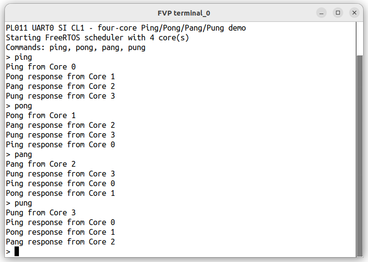

# Run FreeRTOS on the Cortex-R82AE

## Objective

The goal of this Learning Path is to demonstrate a practical method for porting a new operating system to a complex firmware stack such as Zena CSS. Although porting an OS to one of its cores may seem overwhelming, this Learning Path breaks the process into manageable steps with clear progress checks. It also explains the debugging techniques used at each stage.


After completing this section, you will have verified that:

- The FreeRTOS SMP application builds successfully for Cortex-R82AE.
- FreeRTOS runs across all four cores of `FVP_BaseR_Cortex-R82AE`.
- The ELF image can be loaded directly by the FVP.
- The raw binary can also be loaded directly into the FVP memory.
- UART output and the interactive command prompt work correctly.
- SMP scheduling, task affinity, shared state, and interprocessor interrupts operate as expected.
- The generated ELF image can be used for source-level debugging


## Start from the Cortex-R82 SMP port

Begin with the partner-supported Cortex-R82 SMP demo. It provides the Armv8-R FreeRTOS port, Generic Interrupt Controller (GIC) setup, Memory Protection Unit (MPU) configuration, and SMP scheduler support needed for Cortex-R82.

The Zena CSS FVP provides a configuration that adds a second cluster containing four Cortex-R82AE cores.
The objective is to run FreeRTOS on this R82AE cluster.

Begin by running FreeRTOS on the standalone `FVP_BaseR_Cortex-R82AE`, which is available with Arm Development Studio. You can configure this FVP to closely match the Cortex-R82AE cluster in the Zena CSS FVP.

The demo provides the board support code for `FVP_BaseR_Cortex-R82AE` and a four-task command-line application. Each task has a fixed core affinity, which makes scheduler and coherency problems visible during bring-up.

Clone the `R82AE-demo` branches of the [Cortex-R82AE partner-supported demos](https://github.com/JulienJayat-Arm/FreeRTOS-Partner-Supported-Demos/tree/R82AE-demo/CORTEX_R82AE_SMP_FVP_MPU_GCC_ARMCLANG) and [FreeRTOS Kernel](https://github.com/JulienJayat-Arm/FreeRTOS-Kernel/tree/R82AE-demo) repositories into the same parent directory:

```bash
git clone --branch R82AE-demo --single-branch \
  https://github.com/JulienJayat-Arm/FreeRTOS-Partner-Supported-Demos.git \
  FreeRTOS-Partner-Supported-Demos
git clone --branch R82AE-demo --single-branch \
  https://github.com/JulienJayat-Arm/FreeRTOS-Kernel.git \
  FreeRTOS-Kernel
```

The demo repository does not include the kernel as a submodule. The CMake configuration therefore uses `KERNEL_DIR_PATH` to select the adjacent kernel clone. This kernel branch adds the configurable GICv3 SGI affinity routing required by the Cortex-R82AE topology.


## Understand the Cortex-R82AE changes

### FVP configuration

The [Zena CSS boot-flow documentation](https://arm-zena-css.docs.arm.com/en/v2.2/design/boot_process.html#boot-flow) explains that Safety Island Cluster 1 boots from LLRAM:

```RSE BL2:
    If CFG2, copies the encrypted SI CL1 image from the RSE flash to SI LLRAM, decrypts and authenticates the image
```

The [Zephyr board description for Safety Island Cluster 1](https://gitlab.arm.com/automotive-and-industrial/arm-auto-solutions/arm-zena-css/-/blob/release-v2.2/components/safety_island/zephyr/src/boards/arm/fvp_rd_aspen_safety_island/fvp_rd_aspen_safety_island_c1.dts?ref_type=heads#L109) defines 8 MiB of SRAM at `0x140000000`.

The FVP_BaseR_Cortex-R82AE can be configured to expose the same amount of LLRAM at the same base address. The Reset vector Address (RVBAR) can be configured to boot from this address. 

```
cluster0.memory.has_llram=1
cluster0.memory.llram_base=0x140000000
cluster0.memory.llram_enable_at_reset=1
cluster0.memory.llram_shared=1
cluster0.memory.llram_size=0x00800000
cluster0.cpu0.RVBAR=0x140000000
cluster0.cpu1.RVBAR=0x140000000
cluster0.cpu2.RVBAR=0x140000000
cluster0.cpu3.RVBAR=0x140000000
```
Other configurations:
- Use MPU mode for the Cortex R82AE,
- Configure 4 cores, 
- Enable the automatically starts refcounter
- Model architectural cache state
- Disable semihosting

```
cluster0.VMSA_supported=0
cluster0.NUM_CORES=4
bp.refcounter.non_arch_start_at_default=1
cache_state_modelled=1
semihosting-enable=0
```

### Code adaptation 

The generic demo isn't sufficient for the Cortex-R82AE FVP. Check that the port handles these platform differences:

- The processors start at Exception Level 2 (EL2), while the FreeRTOS port runs at EL1. The original Cortex-R82 example boots directly at EL1, which is not possible with this Cortex-R82AE configuration.
- The Cortex-R82AE affinity layout differs from the layout assumed by the original interprocessor interrupt code
- The GIC uses the architectural affinity layout and must be configured separately from task affinity
- MPU programming needs the required data and instruction synchronization barriers
- The application uses a PL011 UART instead of semihosting
- The FVP protected MPU and shared low-latency RAM (LLRAM) need explicit configuration

The reference FVP configuration uses four cores and an 8 MiB LLRAM window. It divides that window into code and data regions:

| Region | Address | Size |
| --- | ---: | ---: |
| Code | `0x140000000` | 4 MiB |
| Data | `0x140400000` | 4 MiB |

All four reset vector base address registers (RVBARs) point to `0x140000000`. Keep the linker scripts, binary load address, and FVP configuration consistent.


## Compile and run the standalone platform

Enter the Cortex-R82AE demo directory:

```bash
cd FreeRTOS-Partner-Supported-Demos/CORTEX_R82AE_SMP_FVP_MPU_GCC_ARMCLANG
```

Configure and build the target. The exact CMake platform name is `standalone_R82AE_fvp`:

```bash
cmake -S . -B build/standalone_R82AE \
  -DCMAKE_TOOLCHAIN_FILE=gnu_toolchain.cmake \
  -DCMAKE_BUILD_TYPE=Debug \
  -DKERNEL_DIR_PATH=../../FreeRTOS-Kernel \
  -DR82AE_PLATFORM=standalone_R82AE_fvp
cmake --build build/standalone_R82AE --parallel
```

Load the generated ELF file directly. The FVP uses the load addresses recorded in the ELF file and retains its debug symbols:

```bash
FVP_BaseR_Cortex-R82AE \
  --config fvp_R82AE_config.txt \
  --application build/standalone_R82AE/r82ae_smp_fvp_gcc_armclang.elf
```

### Create and load a raw binary

The target platform loads a raw binary rather than an ELF file. Use the conversion tool supplied with the compiler that produced the ELF file. GNU and ArmClang handle this image layout differently.

For an ELF file built with the GNU toolchain, use `aarch64-none-elf-objcopy`:

```bash
aarch64-none-elf-objcopy -O binary \
  build/standalone_R82AE/r82ae_smp_fvp_gcc_armclang.elf \
  build/standalone_R82AE/r82ae_smp_fvp_gcc_armclang.bin
```

For an ELF file built with ArmClang, use `fromelf` from Arm Compiler for Embedded instead of GNU `objcopy`:

```bash
fromelf --bin \
  --output build/standalone_R82AE/r82ae_smp_fvp_gcc_armclang.bin \
  build/standalone_R82AE/r82ae_smp_fvp_gcc_armclang.elf
```

The ArmClang linker uses a scatter-loading description with separate load and runtime addresses. For this application, `fromelf` places the table's load image at offset `0x1ef60`. The startup code then copies the table to its runtime address at `0x1404004e0`.

Using GNU `objcopy` on the ArmClang ELF file does not preserve this load-image layout correctly. It produces a binary of approximately 4.3 MB, while `fromelf` produces the expected binary of approximately 262 KB. A large difference in file size is therefore an indication that the wrong conversion tool was used.

After generating the binary with the appropriate tool, load it at the Cluster 0 LLRAM base address:

```bash
FVP_BaseR_Cortex-R82AE \
  --config fvp_R82AE_config.txt \
  --data build/standalone_R82AE/r82ae_smp_fvp_gcc_armclang.bin@0x140000000
```

At the application prompt, enter `ping`. The four tasks exchange a message in a cycle across the four cores, as shown in the terminal output:



This output validates UART access, SMP scheduling, core affinity, interprocessor interrupts, and visibility of shared task state.

## Debug early port failures

### Use the Arm Development Studio debugger
Start the FVP with its debug server enabled when the application doesn't reach the prompt:

```bash
FVP_BaseR_Cortex-R82AE \
  --config fvp_R82AE_config.txt \
  --application build/standalone_R82AE/r82ae_smp_fvp_gcc_armclang.elf \
  -I -p
```
Load the debug image symbols in Arm Development Studio, then set breakpoints on `main`, `FreeRTOS_Abort`, and `App_Fault_Handler`. Load symbols in the EL1 Secure address space if the debugger doesn't resolve the running code automatically.


```text
add-symbol-file build/standalone_R82AE/r82ae_smp_fvp_gcc_armclang.elf
add-symbol-file build/standalone_R82AE/r82ae_smp_fvp_gcc_armclang.elf EL1S:0
delete breakpoints
b main
b FreeRTOS_Abort
```

### Use Tarmac Trace

A different debugging approach is to use [Tarmac Trace](https://developer.arm.com/community/arm-community-blogs/b/tools-software-ides-blog/posts/tarmac-trace-utilities).

Tarmac Trace records the execution of software running on an Arm FVP. It can log:

- Instructions executed by each core
- Register updates
- Memory reads and writes
- Interrupts and exceptions
- Changes in processor state

This execution history is especially useful when the software fails before UART output or when attaching a debugger changes the behavior. Unlike a breakpoint, the trace lets you inspect what happened immediately before the failure. Arm describes Tarmac as a textual record of CPU instructions and their effects.


Enable the Tarmac Trace plugin and write the trace to `tarmac.log`:

```bash
FVP_BaseR_Cortex-R82AE \
  --config fvp_R82AE_config.txt \
  --application build/standalone_R82AE/r82ae_smp_fvp_gcc_armclang.elf \
  --plugin=/opt/arm/developmentstudio_platinum-2025.a/sw/models/bin/TarmacTrace.so \
  -C TRACE.TarmacTrace.trace-file=tarmac.log
```

Tracing generates a large amount of data and slows the FVP, so stop the model soon after the failure occurs. You can then search the trace for a synchronous exception event:

```text
grep -B 6 -A 4 'CoreEvent_CURRENT_SPx_SYNC' tarmac.log
  2368226 clk cpu0 IT (694295) 8000f284 f2a02dc0 O EL1h_s : MOVK     x0,#0x16e,LSL #16
  2368226 clk cpu0 R X0 00000000016E3600
  2368227 clk cpu0 IT (694296) 8000f288 97ffff6e O EL1h_s : BL       0x8000f040
  2368227 clk cpu0 R X30 000000008000F28C
  2368228 clk cpu0 IT (694297) 8000f040 d51be000 O EL1h_s : MSR      CNTFRQ_EL0,x0
  2368228 clk cpu0 E 000000008000f040 00000084 CoreEvent_CURRENT_SPx_SYNC
  2368228 clk cpu0 R cpsr 600003c5
  2368228 clk cpu0 R ELR_EL1 000000008000f040
  2368228 clk cpu0 R SPSR_EL1 00000000600002c5
  2368228 clk cpu0 R ESR_EL1 0000000002000000
```

The lines before `CoreEvent_CURRENT_SPx_SYNC` show the execution leading to the exception. Identify the core that generated the event and inspect the last executed instruction. Use the trace alongside these exception registers:

- `ELR_EL1` contains the address to which the processor returns after handling the exception. For a synchronous exception, it identifies the instruction associated with the failure.
- `ESR_EL1` describes the exception class and provides information about its cause.
- `FAR_EL1` contains the address associated with an instruction or data access fault, when valid for that exception.
- `SPSR_EL1` captures the processor state at the time of the exception.

Together, this information can reveal an incorrect branch target, an invalid memory access, a stack error, or an unexpected exception-level transition. For an SMP failure, compare the trace events from all four cores. This can show whether a core failed to start, did not receive an interprocessor interrupt, or accessed shared state in an unexpected order. arm also provides Arm also provides Tarmac Trace Utilities for indexing and browsing large trace files.

In this example, we can retrive the relevant information from the the tarmac trace.
``` text
X0 = 0x016E3600, or 24 MHz
ELR_EL1 = 0x8000F040, the address of the failing MSR
ESR_EL1 = 0x02000000EC = 0x00: unknown or undefined instruction
IL = 1: the faulting instruction is 32 bits
EL1h_s: the application is executing at Secure EL1
```
The trace shows that execution stops on `MSR CNTFRQ_EL0, x0`. `ELR_EL1` contains the address of this instruction, while the exception class in `ESR_EL1` reports an undefined instruction. The application runs at EL1, but `CNTFRQ_EL0` can be written only from the highest implemented Exception Level, which is EL2 on Cortex-R82AE. The timer frequency must therefore be initialized at EL2 before entering EL1.

For more advanced analysis, use the open-source [Arm Tarmac Trace Utilities](https://github.com/ARM-software/tarmac-trace-utilities).


## What you've accomplished and what's next

You've built and validated the FreeRTOS SMP port on a standalone Cortex-R82AE FVP. You also have a raw binary for direct memory loading and an ELF image for source-level debugging.

Next, you'll adapt this known-good port to the Zena CSS Safety Island memory and peripheral map.
