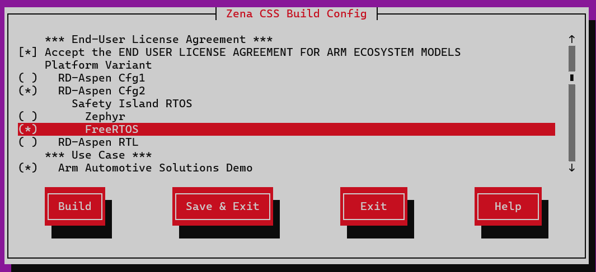
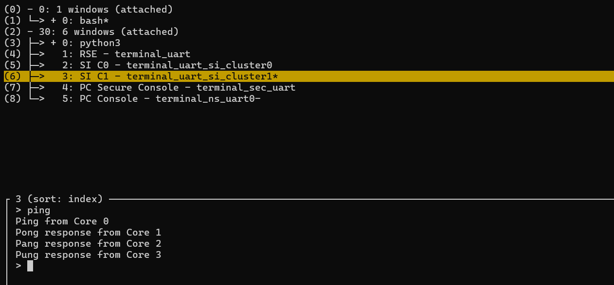

# Integrate the FreeRTOS image with Yocto

## Objective
The previous section manually replaced the Safety Island Cluster 1 (SI CL1) payload. That experiment proved that FreeRTOS can meet the Zena CSS secure boot requirements: RSE authenticates the image, copies it to SI CL1 low-latency RAM (LLRAM), and releases the cluster through the standard platform boot flow.

The next step is to build the FreeRTOS application in Yocto.

This section explains how to:

- Trace a firmware payload from a `kas` build target to the recipe that supplies it
- Identify the file names, variables, and sysroot layout that a replacement recipe must provide
- Add a FreeRTOS recipe and make it selectable without changing the default Zephyr build
- Verify that Yocto builds, signs, packages, and boots the selected FreeRTOS image

The steps also demonstrate a reusable Yocto investigation method: start from a known build output, trace its dependencies, identify the interface between recipes, implement a compatible replacement, and validate the complete path.


## Investigate how Yocto selects the SI CL1 image

The rest of this section explains how the integration was derived and how to validate each boundary independently.

The previous section identified [`yocto/meta-zena-css-bsp/recipes-bsp/images/firmware-fvp-rd-aspen.bb`](https://gitlab.arm.com/automotive-and-industrial/arm-auto-solutions/arm-zena-css/-/blob/release-v2.2/yocto/meta-zena-css-bsp/recipes-bsp/images/firmware-fvp-rd-aspen.bb) as the recipe that creates the RSE flash image. Its dependencies include the recipe named by `SAFETY_ISLAND_CL1_RECIPE`:

```bitbake
DEPENDS += "\
    ${SAFETY_ISLAND_CL1_RECIPE} \
"
```

By default, [`arm-zena-css/yocto/meta-zena-css-bsp/conf/machine/fvp-rd-aspen.conf`](https://gitlab.arm.com/automotive-and-industrial/arm-auto-solutions/arm-zena-css/-/blob/release-v2.2/yocto/meta-zena-css-bsp/conf/machine/fvp-rd-aspen.conf?ref_type=heads#L92) selects the minimal bare-metal `si-hello-world` recipe:
```bitbake
SAFETY_ISLAND_CL1_RECIPE ??= "si-hello-world"
```

When you select **Arm Automotive Solutions Demo** in the menu, [`arm-zena-css/yocto/meta-zena-css-safety-island/conf/machine/include/fvp/fvp-rd-aspen-zephyr.inc`](https://gitlab.arm.com/automotive-and-industrial/arm-auto-solutions/arm-zena-css/-/blob/release-v2.2/yocto/meta-zena-css-safety-island/conf/machine/include/fvp/fvp-rd-aspen-zephyr.inc?ref_type=heads#L15) sets the variable to `zephyr-demos-cl1`:
```bitbake
SAFETY_ISLAND_CL1_RECIPE ??= "zephyr-demos-cl1"
```

This immediately suggests the main integration approach: create a `freertos-demos-cl1.bb` recipe and select it instead of [`zephyr-demos-cl1.bb`](https://gitlab.arm.com/automotive-and-industrial/arm-auto-solutions/arm-zena-css/-/blob/release-v2.2/yocto/meta-zena-css-safety-island/recipes-kernel/zephyr-kernel/zephyr-demos-cl1.bb).

The following investigation explains how the top-level image reaches `firmware-fvp-rd-aspen.bb` and how the machine configuration selects Zephyr. Readers already familiar with this Yocto dependency flow can continue at **Add the FreeRTOS machine configuration**.

When integrating a component into an unfamiliar Yocto build, start with information that the build must resolve: its target and machine. Following those two values is more reliable than searching every layer for a guessed component name.

Next, determine how the Zephyr demo is added to the build:

```console
arm-zena-css$ grep -rn -B1  fvp-rd-aspen-zephyr.inc
yocto/meta-zena-css-safety-island/conf/machine/include/fvp/fvp-rd-aspen-extras.inc-7-require ${@bb.utils.contains('DISTRO_FEATURES', 'zephyr', 'conf/machine/include/fvp/fvp-rd-aspen-zephyr.inc', '', d)}
```

The Zephyr recipe is used when `DISTRO_FEATURES` contains `zephyr`. Next, determine where and when it is set.

```console
sw-ref-stack$ grep -nr DISTRO_FEATURES | grep zephyr
yocto/kas/arm-auto-solutions.yml:73:    DISTRO_FEATURES:append = " cassini-dev zephyr"
```

The [`yocto/kas/arm-auto-solutions.yml`](https://gitlab.arm.com/automotive-and-industrial/arm-auto-solutions/sw-ref-stack/-/blob/release-v2.2/yocto/kas/arm-auto-solutions.yml?ref_type=heads#L73) file therefore adds `zephyr` unconditionally to `DISTRO_FEATURES`.

```console
sw-ref-stack$ grep -nr arm-auto-solutions.yml
yocto/kas/virtualization.yml:11:    - ../sw-ref-stack/yocto/kas/arm-auto-solutions.yml
yocto/kas/baremetal.yml:11:    - ../sw-ref-stack/yocto/kas/arm-auto-solutions.yml
```
The build uses `arm-auto-solutions.yml` for both the `baremetal` and `virtualization` configurations.

To add a FreeRTOS build option, remove the unconditional `zephyr` distro feature. Then add a menu entry that selects either FreeRTOS or Zephyr.

Remove the unconditional `zephyr` setting from `yocto/kas/arm-auto-solutions.yml`:
```diff
 local_conf_header:
   cassini: |
     CASSINI_GENERIC_ARM64_FILESYSTEM = "0"
     DISTRO_FEATURES:remove = "cassini-security cassini-ota cassini-parsec"
-    DISTRO_FEATURES:append = " cassini-dev zephyr"
+    DISTRO_FEATURES:append = " cassini-dev "
     KERNEL_CLASSES:remove = "containers_kernelcfg_check"
```

For more details about the kas Yaml file, refer to the [Kas project configuration](https://kas.readthedocs.io/en/4.8.1/userguide/project-configuration.html).

In [`arm-zena-css/Kconfig`](https://gitlab.arm.com/automotive-and-industrial/arm-auto-solutions/arm-zena-css/-/blob/release-v2.2/Kconfig?ref_type=heads), add a kas menu entry that selects either Zephyr or FreeRTOS:
```diff
+choice
+    prompt "Safety Island RTOS"
+    depends on RD_ASPEN_CFG2 && USE_CASE_DEMOS
+    default SI_CL1_RTOS_ZEPHYR
+
+config SI_CL1_RTOS_ZEPHYR
+    bool "Zephyr"
+
+config SI_CL1_RTOS_FREERTOS
+    bool "FreeRTOS"
+
+endchoice
+
+config KAS_INCLUDE_SI_CL1_RTOS
+    string
+    default "../sw-ref-stack/yocto/kas/si-cl1-zephyr.yml" if SI_CL1_RTOS_ZEPHYR
+    default "../sw-ref-stack/yocto/kas/si-cl1-freertos.yml" if SI_CL1_RTOS_FREERTOS
+
```
The choice appears only when `RD_ASPEN_CFG2` and `USE_CASE_DEMOS` are enabled. It allows either Zephyr or FreeRTOS to be selected, but not both. Zephyr remains the default to preserve the existing build behavior.
`KAS_INCLUDE_SI_CL1_RTOS` is an internal string option with no visible prompt. Its conditional defaults map the selected RTOS to the corresponding kas configuration file. The build configuration can then include the selected YAML file without duplicating the RTOS-selection logic.

*For more information about choices, dependencies, and conditional defaults, see the [Kconfig language documentation](https://docs.kernel.org/kbuild/kconfig-language.html).*

**Add a `kas` configuration fragment for each SI CL1 operating system.**

Create `sw-ref-stack/yocto/kas/si-cl1-freertos.yml` and add the following content:
```diff
+local_conf_header:
+  si-cl1-freertos: |
+    DISTRO_FEATURES:append = " freertos"
```

Create `sw-ref-stack/yocto/kas/si-cl1-zephyr.yml` and add the following content:
```diff
+local_conf_header:
+  si-cl1-zephyr: |
+    DISTRO_FEATURES:append = " zephyr"
```


In [`yocto/meta-zena-css-safety-island/conf/machine/include/fvp/fvp-rd-aspen-extras.inc`](https://gitlab.arm.com/automotive-and-industrial/arm-auto-solutions/arm-zena-css/-/blob/release-v2.2/yocto/meta-zena-css-safety-island/conf/machine/include/fvp/fvp-rd-aspen-extras.inc), add a conditional include for the `freertos` distro feature:

```diff
 require ${@bb.utils.contains('DISTRO_FEATURES', 'zephyr', \
     'conf/machine/include/fvp/fvp-rd-aspen-zephyr.inc', '', d)}
+
+require ${@bb.utils.contains('DISTRO_FEATURES', 'freertos', \
+    'conf/machine/include/fvp/fvp-rd-aspen-freertos.inc', '', d)}
```


Create `yocto/meta-zena-css-safety-island/conf/machine/include/fvp/fvp-rd-aspen-freertos.inc` with the FreeRTOS defaults:

```bitbake
# Safety Island FreeRTOS defaults.
SAFETY_ISLAND_CL1_RECIPE ??= "freertos-demos-cl1"
SAFETY_ISLAND_CL1_IMAGE ??= "${SAFETY_ISLAND_CL1_RECIPE}"
```

BitBake uses these values only when `DISTRO_FEATURES` contains `freertos`. The two assignments tell the existing firmware recipe which recipe to build and which image name to sign.

However, the referenced `freertos-demos-cl1` recipe doesn't exist yet. The next step is to build that recipe by following the behavior of `zephyr-demos-cl1` and other bare-metal recipes.

## Create the FreeRTOS recipe

The remaining task is to make `freertos-demos-cl1.bb` build the FreeRTOS application and expose its binary under the name expected by the signing flow.

Use `yocto/meta-zena-css-bsp/recipes-bsp/si-hello-world/si-hello-world.bb` as a bare-metal example. Inspect `zephyr-environment.txt` to understand the expanded `do_install` and `do_deploy` behavior. Build the recipe after each meaningful addition so BitBake can report any missing requirements.

Create the recipe directory in `arm-zena-css/`:

```bash
mkdir -p yocto/meta-zena-css-safety-island/recipes-kernel/freertos-kernel
```

Begin by identifying the recipe inputs:

- `SRC_URI` fetches the Cortex-R82AE demo and FreeRTOS Kernel repositories.
- `inherit cmake` supplies the native CMake dependency and standard configure and compile tasks.
- `DEPENDS` supplies the AArch64 bare-metal compiler.
- `EXTRA_OECMAKE` maps the CMake configuration from the previous section into the standard `cmake` class.
- `do_compile:append` converts the ELF file to the raw binary required by the RSE image.
- `do_install` and `do_deploy` implement the `/firmware` interface discovered from Zephyr.

When the required compiler recipe is uncertain, search the existing metadata:

```bash
grep -R -n 'gcc-aarch64-none-elf.*-native' yocto
```

The `scp-firmware-fvp-rd-aspen.inc` file depends on `gcc-aarch64-none-elf-native`, so use the same dependency for FreeRTOS. A compiler compatibility issue is addressed later.

Create `yocto/meta-zena-css-safety-island/recipes-kernel/freertos-kernel/freertos-demos-cl1.bb`, add the source, dependency, and build tasks, then test it directly:

```bash
kas shell -c 'bitbake freertos-demos-cl1'
```
The first build might expose recipe requirements that aren't visible in the CMake build.

{}
- This error means that a fetched source doesn't have license metadata:

```output
ERROR: freertos-demos-cl1-1.0-r0 do_populate_lic: QA Issue: freertos-demos-cl1: Recipe file fetches files and does not have license file information (LIC_FILES_CHKSUM) [license-checksum]
```

Add the source license and checksum with `LICENSE` and `LIC_FILES_CHKSUM`. `LICENSE = "CLOSED"` can isolate a license-checksum problem during local diagnosis, but the completed recipe must declare the actual source license.


- The signing task can then report that no package version was recorded:

```output
ERROR: firmware-fvp-rd-aspen-1.0-r0 do_sign_images: pv_tracker: No PV recorded for freertos-demos-cl1
```

Add `inherit pv_tracker` because the Zena CSS signing flow records the versions of its firmware inputs.


- If `do_package` reports files that were installed but not shipped, set `PACKAGES = ""` because this firmware isn't installed in a Linux root file system. Add `/firmware` to `SYSROOT_DIRS` so that `firmware-fvp-rd-aspen.bb` can read the binary from its recipe sysroot.

{}

The compiler dependency reveals another issue. The version of `gcc-aarch64-none-elf-native` provided by Zena CSS is GCC 13, which doesn't recognize `-mcpu=cortex-r82ae`.

Use a source patch to replace that option with the supported `cortex-r82` name in both the C and assembly flags:

```diff
-set(CMAKE_C_FLAGS "-mcpu=cortex-r82ae ...")
-set(CMAKE_ASM_FLAGS "-mcpu=cortex-r82ae ...")
+set(CMAKE_C_FLAGS "-mcpu=cortex-r82 ...")
+set(CMAKE_ASM_FLAGS "-mcpu=cortex-r82 ...")
```

This change allows the image to compile, but runtime validation reveals another GCC 13 problem. The SI CL1 UART becomes unresponsive before you can enter `ping`. Arm Development Studio debugger reports `ESR_EL1=0x96000061` and a fault address of `0x1404321f8`.

The generated code contains `stp q0, q0, [x1]`. This SIMD store needs 16-byte alignment, but the destination is only 8-byte aligned. GCC 13 generated the instruction while optimizing the replacement `memset`.

Keep alignment checking enabled in `SCTLR_EL1`. Disabling it would hide the invalid access instead of fixing the generated code.

Extend the compatibility patch to disable the built-in `memset` only for `crt_replacements.c`:

```cmake
set_source_files_properties(crt_replacements.c PROPERTIES
    COMPILE_OPTIONS "$<$<C_COMPILER_ID:GNU>:-fno-builtin-memset>"
)
```

After applying the packaging, version-tracking, and compiler fixes, the completed `freertos-demos-cl1.bb` recipe is:

<details>

<summary>Show the complete freertos-demos-cl1.bb recipe.</summary>

```bitbake 
# SPDX-License-Identifier: MIT

SUMMARY = "FreeRTOS Demo on Safety Island Cluster 1"
DESCRIPTION = "FreeRTOS demo application for Zena CSS SI CL1"

LICENSE = "MIT"
LIC_FILES_CHKSUM = " \
    file://LICENSE.md;md5=5d1c92c2ddf8acf8480e3c18f3ab890b \
    file://${FREERTOS_KERNEL_DIR}/LICENSE.md;md5=7ae2be7fb1637141840314b51970a9f7 \
"

inherit cmake deploy
inherit pv_tracker

SRC_URI = " \
    git://github.com/JulienJayat-Arm/FreeRTOS-Partner-Supported-Demos.git;protocol=https;branch=R82AE-demo;name=demos;destsuffix=demos \
    git://github.com/JulienJayat-Arm/FreeRTOS-Kernel.git;protocol=https;branch=R82AE-demo;name=kernel;destsuffix=kernel \
    file://0001-toolchain-use-gcc-13-cortex-r82-name.patch \
"
SRCREV_demos = "27962d523fa4d96e643e4f225dd3cd49bb7829de"
SRCREV_kernel = "def452c440997856806ed9a20058bd3c4acde315"
SRCREV_FORMAT = "demos_kernel"

S = "${UNPACKDIR}/demos/CORTEX_R82AE_SMP_FVP_MPU_GCC_ARMCLANG"
FREERTOS_KERNEL_DIR = "${UNPACKDIR}/kernel"

MULTIMACH_TARGET_SYS = "${MACHINE}_safety_island_c1-freertos"

DEPENDS += "gcc-aarch64-none-elf-native"

CMAKE_BUILD_TYPE = "Debug"
OECMAKE_BUILD_TYPE = "${CMAKE_BUILD_TYPE}"
EXTRA_OECMAKE = " \
    -DCMAKE_TOOLCHAIN_FILE=${S}/gnu_toolchain.cmake \
    -DKERNEL_DIR_PATH=${FREERTOS_KERNEL_DIR} \
    -DR82AE_PLATFORM=zena_css_fvp \
    -DFREERTOS_SOURCE_PREFIX_MAP=-ffile-prefix-map=${UNPACKDIR}=/usr/src/debug/${PN}/${PV} \
"

FREERTOS_ELF = "${B}/r82ae_smp_fvp_gcc_armclang.elf"
FREERTOS_BINARY = "${B}/r82ae_smp_fvp_gcc_armclang.bin"

do_compile:append() {
    ${STAGING_BINDIR_NATIVE}/aarch64-none-elf-objcopy -O binary \
        "${FREERTOS_ELF}" "${FREERTOS_BINARY}"
}

do_install() {
    install -d "${D}/firmware"
    install -m 0644 "${FREERTOS_BINARY}" "${D}/firmware/${PN}.bin"
}

PACKAGES = ""
SYSROOT_DIRS += "/firmware"

do_deploy() {
    install -m 0644 "${D}/firmware/${PN}.bin" "${DEPLOYDIR}/${PN}.bin"
}
addtask deploy after do_install
```

{}
Both `SRCREV` values are pinned to commits that have been tested with this integration. To test the latest commits from each branch instead, replace the commit hashes with `${AUTOREV}`.
Note that `${AUTOREV}` does not provide a reproducible build because the selected source can change over time.
{}
</details>

Rebuild the recipe after each change:

```bash
kas shell -c 'bitbake freertos-demos-cl1'
```

When the standalone recipe succeeds, build the complete stack and launch the model to exercise signing, packaging, and startup:

```bash
kas build
kas shell -c '../layers/meta-arm/scripts/runfvp -t tmux --verbose'
```

If a recipe or source change appears not to take effect, clean and rebuild the recipe to eliminate cached output:

```bash
kas shell -c 'bitbake -c cleanall freertos-demos-cl1'
kas shell -c 'bitbake freertos-demos-cl1'
```

With the GCC 13 compatibility patch and recipe available, BitBake can build `freertos-demos-cl1` directly. The menu option provides a controlled user selection that adds `freertos` to `DISTRO_FEATURES`.


## Build and run the integrated image

First, build the complete stack and inspect the dependency graph. Then check the artifacts. Finally, boot the image to confirm that signing and loading also work.

Build either the baremetal or virtualization stack with the FreeRTOS selection:

```bash
kas build
```

Depending on the selected configuration, this builds `baremetal-image` or `virtualization-image` and its firmware dependencies. A successful build ends with a task summary reporting that all tasks succeeded.

Check the recipe dependency graph. `pn-buildlist` must contain `freertos-demos-cl1` instead of `zephyr-demos-cl1`:


  
kas shell -c 'bitbake -g baremetal-image'
grep -E 'freertos-demos-cl1|zephyr-demos-cl1' build/pn-buildlist
  
  
kas shell -c 'bitbake -g virtualization-image'
grep -E 'freertos-demos-cl1|zephyr-demos-cl1' build/pn-buildlist
  


The dependency graph proves that BitBake selected the FreeRTOS producer. Next, inspect the deployed FreeRTOS artifacts and final RSE flash image:


  
ls build/tmp_baremetal/deploy/images/fvp-rd-aspen/freertos-demos-cl1.bin
ls build/tmp_baremetal/deploy/images/fvp-rd-aspen/rse-flash-image.img
  
  
ls build/tmp_virtualization/deploy/images/fvp-rd-aspen/freertos-demos-cl1.bin
ls build/tmp_virtualization/deploy/images/fvp-rd-aspen/rse-flash-image.img
  


Old artifacts can remain in the deploy directory, so file presence alone doesn't prove which recipe was selected. Use the resolved `DISTRO_FEATURES` and `pn-buildlist` checks as the authoritative evidence.

The deploy directory proves that the build produced files, but not that the binary was signed correctly or accepted by RSE. Launch the Zena CSS FVP through the standard runner:

```bash
kas shell -c '../layers/meta-arm/scripts/runfvp -t tmux'
```

No additional FVP configuration, such as core_power_on_by_default, or --data override is needed. RSE authenticates the integrated payload, copies it to the SI CL1 LLRAM, and then releases the cluster.

At the SI CL1 console, enter `ping`. The expected output is:

```output
> ping
Ping from Core 0
Pong response from Core 1
Pang response from Core 2
Pung response from Core 3
>
```

This confirms that Yocto built the FreeRTOS application, the firmware recipe signed and packaged it, and RSE started it through the normal boot flow.

The CLI also accepts `pong`, `pang`, and `pung`. Each command starts the same four-hop exchange from the corresponding fixed-affinity task, so any of the four commands can be used to repeat the multicore validation from a different starting core.

Finally, return to `kas menu`, select Zephyr, and rebuild. Verify that the original SI CL1 firmware still boots. This last check matters because the integration adds a choice to an existing product configuration. Testing both branches confirms that FreeRTOS works without regressing the default Zephyr path.

## Reproduce the integration

The [`freertos-yocto-integration.patch`](freertos-yocto-integration.patch) file combines the FreeRTOS recipe, GCC 13 compatibility patch, machine configuration, and Kconfig selection changes described later in this section. It applies to a clean [`Zena CSS v2.2`](https://arm-zena-css.docs.arm.com/en/v2.2/user_guide/reproduce.html#download) folder.

Run the following commands from the root of the Zena CSS checkout. Download the patch, then set `PATCH_FILE` to its absolute path. Confirm that the patch applies before changing the source tree:

```bash
PATCH_FILE=/absolute/path/to/freertos-yocto-integration.patch
git apply --check "$PATCH_FILE"
git apply "$PATCH_FILE"
```

Open the build configuration menu:

```bash
kas menu arm-zena-css/Kconfig
```

Select **RD-Aspen Cfg2**, either **Baremetal** or **Virtualization**, and then **FreeRTOS** under **Safety Island RTOS**:



Select **Build** or instead **Save & Exit**, then build the complete software stack:

```bash
kas build
```

Launch the model after the build completes:

```bash
kas shell -c '../layers/meta-arm/scripts/runfvp -t tmux'
```

At the SI CL1 console, enter `ping`. A successful four-core exchange confirms that the patched Yocto configuration built, signed, packaged, and booted FreeRTOS through the standard Zena CSS flow.




## What you've accomplished and what's next

The Cortex-R82AE FreeRTOS port is now integrated as a reproducible Yocto recipe and selectable as the Zena CSS SI CL1 firmware. The implementation was derived by tracing the working Zephyr flow, identifying the interface between its producer and consumer recipes, and implementing FreeRTOS against the same interface.

Each boundary was verified separately: menu selection, distro features, recipe dependency, deployed artifact, signed flash image, and runtime output. The same investigation pattern can be used to replace or add other firmware components without manually modifying their consuming image recipes.

The next platform-integration step is to add Message Handling Unit (MHU) communication backed by a shared-memory buffer. This provides communication between the FreeRTOS Safety Island application and the primary compute domain, replacing the equivalent inter-processor communication path used by the Zephyr application.
