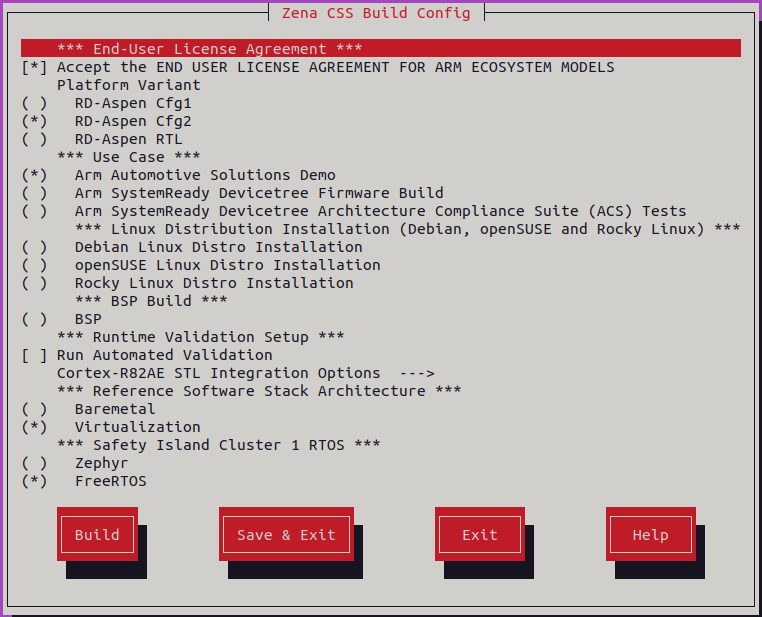
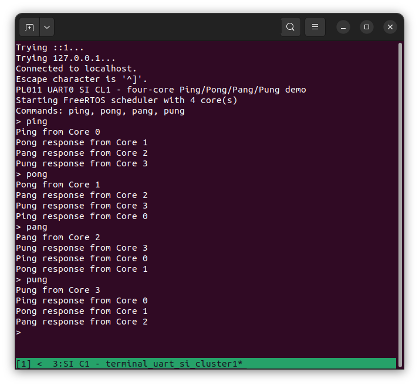

## Move from direct loading to an integrated image

The previous validation used a known-good binary built outside Yocto. That checkpoint proved that the Zena CSS packaging, authentication, loading, and secure boot flow can start FreeRTOS.

The next step builds FreeRTOS from source with Yocto. This changes several variables at once: the compiler version, compiler flags, source paths, dependency handling, CMake invocation, and deployment tasks. Any one of these changes can introduce a new failure. Keeping the successful result from the previous page gives you a reference for separating a Yocto build problem from a FreeRTOS port or platform boot problem.

Two patches add the Yocto integration:

- [`0001-Allow-for-selection-of-Zephyr-or-FreeRTOS-in-the-KAS.patch`](0001-Allow-for-selection-of-Zephyr-or-FreeRTOS-in-the-KAS.patch) applies to `sw-ref-stack`
- [`0001-Add-recipe-for-building-and-deploying-FreeRTOS.patch`](0001-Add-recipe-for-building-and-deploying-FreeRTOS.patch) applies to `arm-zena-css`

Apply both patches to the same Zena CSS v2.2 source trees used in the previous steps.


## Understand the KAS menu patch

The first patch changes `sw-ref-stack`. It adds a **Safety Island Cluster 1 RTOS** choice to `extension.Kconfig` when RD-Aspen Configuration 2 is selected. Zephyr remains the default, and you can select FreeRTOS explicitly.

The patch also:

- Adds `si-cl1-zephyr.yml` and `si-cl1-freertos.yml`
- Enables either the `zephyr` or `freertos` Yocto distribution feature
- Removes the unconditional `zephyr` feature from `arm-auto-solutions.yml`
- Selects the matching KAS include through `KAS_INCLUDE_SI_CL1_RTOS`

This keeps the original Zephyr workflow available while making the Safety Island Cluster 1 firmware selectable from the same build menu.

## Understand the FreeRTOS recipe patch

The second patch changes the `arm-zena-css` layer. It adds `freertos-demos-cl1.bb`, which:

- Fetches pinned revisions of the `R82AE-demo` branches from the FreeRTOS demo and kernel repositories
- Configures CMake with `R82AE_PLATFORM=zena_css_fvp`
- Uses the Yocto-provided `aarch64-none-elf` compiler
- Converts the ELF file to `freertos-demos-cl1.bin`
- Installs the binary into the recipe sysroot and deploy directory

The patch also adds `fvp-rd-aspen-freertos.inc`. When the `freertos` distribution feature is active, this file selects `freertos-demos-cl1` as the Safety Island Cluster 1 recipe and image.

### Accommodate the GCC 13 toolchain

The standalone build and the Yocto build do not use identical toolchain environments. The Zena CSS Yocto configuration supplies GCC 13.3 through `meta-arm`. This version does not recognize `cortex-r82ae` as an `-mcpu` value, so the nested compatibility patch uses `-mcpu=cortex-r82`. GCC 13 generates the required Cortex-R82 instruction set for this Cortex-R82AE application.

The `crt_replacements.c` change fixes an alignment fault reported by `ESR_EL1=0x96000061` at address `0x1404321f8`. GCC 13 converts the `memset` call into `stp q0, q0, [x1]`, which needs 16-byte alignment, but the destination is only 8-byte aligned. GCC 15 instead calls the alignment-safe `__wrap_memset` when using `-mstrict-align`.

The compatibility patch prevents GCC 13 from replacing the operation with unsafe SIMD stores by compiling `crt_replacements.c` with `-fno-builtin-memset`:

```cmake
set_source_files_properties(crt_replacements.c PROPERTIES
    COMPILE_OPTIONS "$<$<C_COMPILER_ID:GNU>:-fno-builtin-memset>"
)
```

This option prevents the unsafe SIMD store. Keep alignment checking enabled in `SCTLR_EL1`; disabling it would hide the problem rather than fix the generated code.

Finally, the patch adds `FREERTOS_SOURCE_PREFIX_MAP`. The recipe passes `-ffile-prefix-map` through this variable so absolute Yocto work-directory paths do not become embedded in assertion strings in the firmware. This makes the output less dependent on the host build path.

These changes illustrate why incremental validation matters. If the externally built binary works but the Yocto-built binary does not, investigate compiler flags, the map file, ELF sections, and binary size before changing the secure boot configuration.

## Apply the patches

Follow the source-fetch instructions in the [RD-Aspen reproduction guide](https://arm-auto-solutions.docs.arm.com/en/v2.1.1/rd-aspen/user_guide/reproduce.html). This creates the `sw-ref-stack` and `arm-zena-css` directories needed here.

From the directory containing both repositories, apply each supplied patch to its matching clean source tree. Replace `/path/to/patches` with the directory containing the patch files:

```bash
git -C sw-ref-stack am \
  /path/to/patches/0001-Allow-for-selection-of-Zephyr-or-FreeRTOS-in-the-KAS.patch
git -C arm-zena-css am \
  /path/to/patches/0001-Add-recipe-for-building-and-deploying-FreeRTOS.patch
```

`git am` applies each change and preserves the commit metadata stored by `git format-patch`.

## Select FreeRTOS from the KAS menu

Open the Zena CSS configuration menu from the directory containing `sw-ref-stack`:

```bash
kas menu sw-ref-stack/Kconfig
```

Select **RD-Aspen Cfg2**, then select **FreeRTOS** under **Safety Island Cluster 1 RTOS**. Accept the model license and select the other options needed for your Zena CSS build. The menu should look similar to:



Select **Build** to start the Yocto build. KAS adds the FreeRTOS include file, enables the `freertos` distribution feature, and causes BitBake to build `freertos-demos-cl1` for the Safety Island payload.

## Validate the Yocto integration from source

Boot the complete image through the normal Zena CSS flow:

```bash
kas shell -c '../layers/meta-arm/scripts/runfvp -t tmux'
```

Open the Safety Island Cluster 1 UART pane and run `ping`, `pong`, `pang`, and `pung`. Each command should circulate through all four Cortex-R82AE cores:



Successful execution confirms that Yocto fetched the pinned sources, applied the GCC 13 compatibility patch, compiled and deployed FreeRTOS, selected it as the Cluster 1 firmware, and included it in the authenticated Zena CSS image.

## What you've accomplished

You have applied the KAS selection and FreeRTOS recipe patches, built FreeRTOS from source with the Yocto GCC 13 toolchain, and booted it as the Safety Island Cluster 1 firmware through the complete Zena CSS flow.


## Next steps

You can now start developing your own FreeRTOS application. Choose the simplest workflow that provides the hardware IP and platform functionality your application needs.

The standalone FVP provides the shortest build and debug loop for application logic. Direct loading on the Zena CSS FVP is useful when you need to validate interactions with Safety Island hardware. Building from source with Yocto provides the reproducible integration needed for a complete system, but rebuilding, deploying, and flashing lengthens each debug cycle.

One possible next step is to add Message Handling Unit (MHU) communication with a shared-memory buffer. This can replace the inter-processor communication functionality currently provided by the Zephyr application.

The best workflow depends on your application's hardware interactions. Develop and debug with the shortest suitable loop, then return to Yocto when you need to validate the complete software stack.