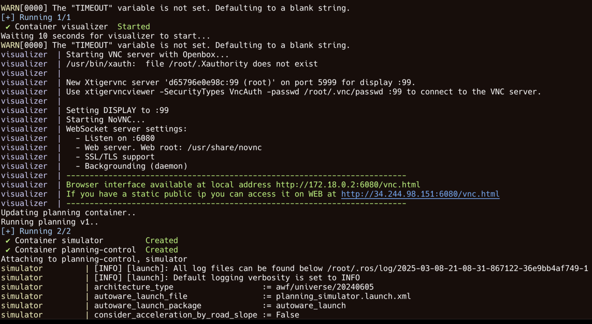
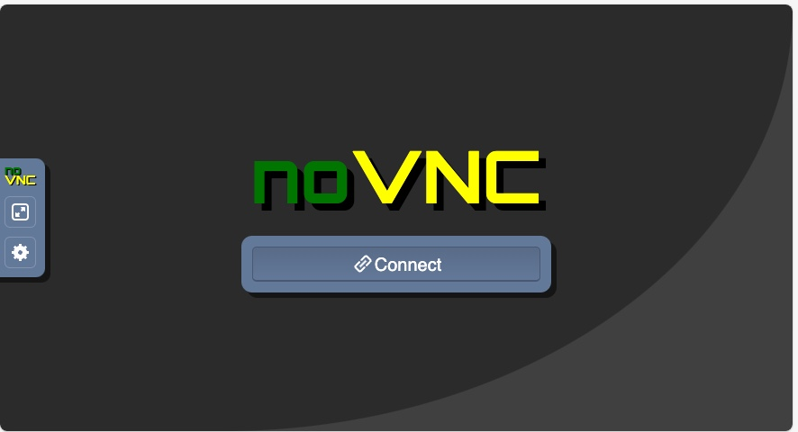
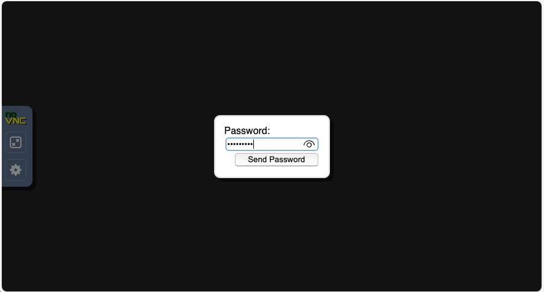

## Execute Autoware Open AD Kit using Docker Compose

Open AD Kit leverages Docker Compose to integrate all container initialization and corresponding configurations, allowing you to start with all the settings from the previous session without any modifications.

That said, you can still gain a deeper understanding of the system by examining the `docker/docker-compose.yml` file.

The script first starts the Visualizer service in detached mode, followed by the continuous execution of Planning and Simulation. The detailed ROS commands are defined in the `docker/docker-compose.yml` file.


### Visualizer configuration

Similar to the example in the previous session, this Docker Compose service configures and runs a visualization tool (Visualizer) within a Docker container. It renders real-time simulation data using RViz and allows remote access via VNC and Ngrok.

The `visualizer` service maps:

- **volume `./etc/simulation:/autoware/scenario-sim`**

  The volume mapping `./etc/simulation:/autoware/scenario-sim` mounts a local directory `./etc/simulation` to a specific path inside the container `/autoware/scenario-sim`. This means that files stored in `./etc/simulation` on the host machine will be accessible from inside the container at `/autoware/scenario-sim`.

- **Port `6080:6080`**

  In the Autoware visualization environment, the 6080:6080 port mapping is used to enable web-based VNC remote desktop access, allowing users to interact with tools like Rviz directly from their browser without needing an external VNC client.
  
  Inside the container, VNC is enabled via the `VNC_ENABLED=true` environment variable, ensuring that the VNC server is running. The VNC server listens on port 6080, making it accessible through a web-based interface, which simplifies remote monitoring and control of autonomous driving simulations, improving development and testing efficiency.

  Enable VNC-based remote visualization to interact with the Autoware environment remotely.

  To access the visualization interface:
	-	On the same machine, open: `http://localhost:6080`
	-	From another device, use: `http://<VISUALIZER_IP_ADDRESS>:6080`

Here is the Docker Compose file:

```yml
  visualizer:
    image: ghcr.io/autowarefoundation/demo-packages:visualizer
    container_name: visualizer
    volumes:
      - ./etc/simulation:/autoware/scenario-sim
    ports:
      - 6080:6080
      - 5999:5999
    environment:
      - ROS_DOMAIN_ID=88
      - VNC_ENABLED=true
      - RVIZ_CONFIG=/autoware/scenario-sim/rviz/scenario_simulator.rviz
      - NGROK_AUTHTOKEN=${NGROK_AUTHTOKEN}
      - NGROK_URL=${NGROK_URL}
```

### Planning-Control module

The second Docker Compose service defines the `planning-control` module within a simulation environment. The planning-control container is responsible for motion planning, trajectory generation, and vehicle control.

One key aspect to mention is the `depends_on` directive.

To ensure that planning-control receives sensor data from the simulator, use `depends_on` to make sure the simulator service starts before planning-control begins execution.

The `ros2` command starts the `planning_simulator.launch.xml` launch file, which initializes the motion planning module:

- `map_path:=/autoware/scenario-sim/map` → Loads the simulation map.
- `vehicle_model:=sample_vehicle` → Uses a predefined vehicle model for testing.
- `sensor_model:=sample_sensor_kit` → Loads sensor configurations for perception.
- `scenario_simulation:=true` → Enables scenario-based simulation.
- `rviz:=false` → Disables RViz visualization inside this container.
- `perception/enable_traffic_light:=false` → Disables traffic light recognition for this test.

Here is the Docker Compose file:

```yml
  planning-control:
    image: ghcr.io/autowarefoundation/demo-packages:planning-control
    container_name: planning-control
    depends_on:
      - simulator 
    volumes:
      - ./etc/simulation:/autoware/scenario-sim
      - $CONF_FILE:/opt/autoware/share/autoware_launch/config/planning/scenario_planning/lane_driving/behavior_planning/behavior_path_planner/autoware_behavior_path_static_obstacle_avoidance_module/static_obstacle_avoidance.param.yaml
      - $COMMON_FILE:/opt/autoware/share/autoware_launch/config/planning/scenario_planning/common/common.param.yaml
    environment:
      - ROS_DOMAIN_ID=88
      - RMW_IMPLEMENTATION=rmw_cyclonedds_cpp
    command: >
      ros2 launch autoware_launch planning_simulator.launch.xml
      map_path:=/autoware/scenario-sim/map
      vehicle_model:=sample_vehicle
      sensor_model:=sample_sensor_kit
      scenario_simulation:=true
      rviz:=false
      perception/enable_traffic_light:=false
```

### Simulator Module

The final Docker Compose service defines the `simulator` module. The simulator is responsible for creating a virtual driving environment, generating sensor data, and providing vehicle state information to other components such as planning-control and visualizer.

Maps local directory `./etc/simulation` to `/autoware/scenario-sim` inside the container.

The `ros2` command starts the `scenario_test_runner.launch.py` launch file, initializing the Autoware simulation:

- `scenario:=/autoware/scenario-sim/scenario/yield_maneuver_demo.yaml` → Specifies the scenario configuration file.
- `sensor_model:=sample_sensor_kit` → Uses a predefined sensor configuration.
- `vehicle_model:=sample_vehicle` → Uses a sample vehicle model.
- `global_frame_rate:=20` → Sets the simulation frame rate to 20 FPS.
- `launch_rviz:=false` → Prevents RViz from launching in the container.

Here is the Docker Compose file:

```yml
  simulator:
    image: ghcr.io/autowarefoundation/demo-packages:simulator
    container_name: simulator
    volumes:
      - ./etc/simulation:/autoware/scenario-sim
    environment:
      - ROS_DOMAIN_ID=88
      - RMW_IMPLEMENTATION=rmw_cyclonedds_cpp
    command: >
      ros2 launch scenario_test_runner scenario_test_runner.launch.py
      record:=false
      scenario:=/autoware/scenario-sim/scenario/yield_maneuver_demo.yaml
      sensor_model:=sample_sensor_kit
      vehicle_model:=sample_vehicle
      initialize_duration:=90
      global_timeout:=$TIMEOUT
      global_frame_rate:=20
      launch_autoware:=false
      launch_rviz:=false
```

### Execute the Planning Visualizer demo

To start the Planning Visualizer Demo, execute the following script:

```bash
./docker/run.sh
```

This Bash script sets up environment variables and orchestrates the execution of Open AD Kit's visualizer, planning-control, and simulator using the previously mentioned Docker Compose setup. The script runs in a loop, continuously testing two different planning configurations: `CONF_FILE_FAIL` and `CONF_FILE_PASS`.

Once the script starts successfully, you will see a similar output to the image below.

You can use your browser to monitor the simulation data in real-time.



Now you can use the browser to access visualization.
In this example the URL is http://34.244.98.151:6080/vnc.html

{}
Ensure that the server allows your IP address and port 6080 to connect. You may need to adjust the security group settings if you are using a cloud instance.
{}

To access the visualizer:
1. Open a web browser and go to: `http://<server-ip>:6080/vnc.html`
2. Click **Connect** on the VNC login screen.

3. Enter the default VNC password: **"openadkit"**.


You are now in the Open AD Kit simulation environment.

The demo will continuously repeat the two scenarios.
- **fail_static_obstacle_avoidance.param.yaml**: In the first scenario, the vehicle remains stationary behind the obstacle. 
- **pass_static_obstacle_avoidance.param.yaml**: In the second scenario, the vehicle is permitted to change lanes to maneuver around the obstacle.

The vehicle starts from a stationary position, moves along the road, and stops when there is a vehicle ahead, waiting for the obstruction to clear before proceeding.

After each simulation run, it automatically restarts after 90 seconds. You can use the mouse to adjust different viewing angles for observation.


Congratulations! You have successfully executed the Open AD Kit demo.
