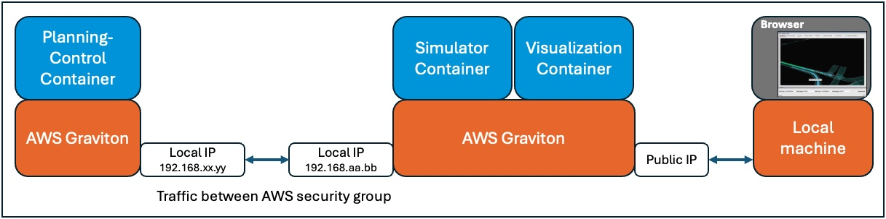

## Refactor OpenAD Kit for distributed deployment

Now that you’ve explored the concept of a safety island, a dedicated subsystem responsible for executing safety-critical control logic, and learned how DDS (Data Distribution Service) enables real-time, distributed communication, you’ll refactor the original OpenAD Kit architecture into a multi-instance deployment.

The predecessor Learning Path, [Deploy Open AD Kit containerized autonomous driving simulation on Arm Neoverse](/learning-paths/automotive/openadkit1_container/), showed how to  deploying three container components on a single Arm-based instance, to handle:
- The simulation environment
- Visualization
- Planning and control

In this Learning Path, you will split the simulation and visualization stack from the planning-control logic and deploy them across two independent Arm-based instances. 

These nodes communicate using ROS 2 with DDS as the middleware layer, ensuring low-latency and fault-tolerant data exchange between components.

## Architectural Benefits

This architecture brings several practical benefits:

- **Enhanced System Stability**: decoupling components prevents resource contention and ensures that safety-critical functions remain deterministic and responsive.

- **Real-Time, Scalable Communication**: DDS enables built-in peer discovery and configurable QoS, removing the need for a central broker or manual network setup.

- **Improved Scalability and Performance Tuning**: each instance can be tuned based on its workload,for example, simulation tasks can use GPU-heavy hardware, while planning logic might benefit from CPU-optimized setups.

- **Support for Modular CI/CD Workflows**: with containerized separation, you can build, test, and deploy each module independently, which enables agile development and faster iteration cycles.



## Configure networking for DDS communication

To begin, launch two Arm-based VM instances. AWS EC2 is used, but you can use any Arm-based instances.

These instances will independently host your simulation and control workloads.

{}
The specifications of the two Arm instances don’t need to be identical. For testing, 16 CPUs and 32GB of RAM show good performance.
{}

After provisioning the machines, determine where you want the `Planning-Control` container to run. 
The other instance will host the `Simulation Environment` and `Visualization` components.

To enable ROS 2 and DDS communication between the two nodes, configure network access accordingly. 

If you are using AWS EC2, both instances should be assigned to the same Security Group.

Within the EC2 Security Group settings:
- Add an inbound rule that allows all traffic from the same Security Group by setting the source to the security group itself.
- Outbound traffic is typically allowed by default and usually does not require changes.


This configuration allows automatic discovery and peer-to-peer communication between DDS participants across the two instances.

Once both systems are operational, record the private IP addresses of each instance. You will need them when configuring CycloneDDS peer discovery in the next step.

## Update Docker and DDS configuration

Before you begin, ensure that Docker is installed on both of your development instances. Review the [Docker Install Guide](/install-guides/docker/docker-engine/) if needed.

First, clone the demo repo and create xml file called `cycloneDDS.xml`

## Clone the repository and prepare configuration files

```bash
git clone https://github.com/odincodeshen/openadkit_demo.autoware.git
cd openadkit_demo.autoware
cp docker/docker-compose.yml docker/docker-compose-2ins.yml
touch docker/cycloneDDS.xml
```

This will create a duplicate Compose configuration (docker-compose-2ins.yml) and an empty CycloneDDS configuration file to be shared across containers.

To ensure a smooth experience during testing and simulation, it’s a good idea to pull all required container images before moving on.

This avoids interruptions in later steps when you run `docker compose up` or `docker compose run`, especially during the cross-instance DDS validation or full scenario launch.

Run the following command in your project directory:

```bash
cd docker
export TIMEOUT=120
export CONF_FILE=/home/ubuntu/openadkit_demo.autoware/docker/etc/simulation/config/fail_static_obstacle_avoidance.param.yaml
export COMMON_FILE=/home/ubuntu/openadkit_demo.autoware/docker/etc/simulation/config/common.param.yaml
docker compose -f docker-compose.yml pull
```

{}
Each image is around 4–6 GB, so the time to download them can vary depending on your network speed.
{}

This command downloads all images defined in the docker-compose-2ins.yml file, including:
- odinlmshen/autoware-simulator:v1.0
- odinlmshen/autoware-planning-control:v1.0
- odinlmshen/autoware-visualizer:v1.0

## Configure CycloneDDS for peer-to-peer communication

The cycloneDDS.xml file is used to customize how CycloneDDS (the middleware used by ROS 2) discovers and communicates between distributed nodes.

Copy the following configuration into docker/cycloneDDS.xml on both machines, and replace the IP addresses with the private IPs of each EC2 instance:

```xml
<CycloneDDS>
	<Domain>
		<General>
			<AllowMulticast>false</AllowMulticast>
			<Interfaces>
				<NetworkInterface
					autodetermine="false"
					name="ens5"
					priority="default"
					multicast="false"
				/>
			</Interfaces>
		</General>
		<Discovery>
			<MaxAutoParticipantIndex>1000</MaxAutoParticipantIndex>
			<ParticipantIndex>auto</ParticipantIndex>
			<Peers>
				<!-- Replace these with the private IP addresses of both EC2 instances -->
        <Peer address="192.168.xx.yy"/>
				<Peer address="192.168.aa.bb"/>
			</Peers>
		</Discovery>
		<Tracing>
			<OutputFile>/root/workspace/cyclonelog.log</OutputFile>
			<Verbosity>config</Verbosity>
		</Tracing>
	</Domain>
</CycloneDDS>
```

{}
- Make sure the network interface name (for example, `ens5`) matches the one used by your EC2 instances. You can verify the instance name by running `ip -br a`.
- This configuration disables multicast and enables static peer discovery between the two machines using unicast.
- For more information on CycloneDDS settings, see the [Cyclone DDS Configuration Guide](https://cyclonedds.io/docs/cyclonedds/latest/config/config_file_reference.html#cyclonedds-domain-internal-socketreceivebuffersize).
{}

## Update the Docker Compose Configuration for Multi-Host Deployment

To support running containers across two separate hosts, you’ll need to modify the docker/docker-compose-2ins.yml file. 
This includes removing inter-container dependencies and updating the network and environment configuration.

## Remove cross-container dependency

Since the planning-control and simulator containers will run on separate machines, remove any `depends_on` references between them. This prevents Docker from treating them as interdependent services on a single host.

```YAML
  planning-control:
  # Remove this block
  # depends_on:
  #   - simulator
```

## Enable host networking

All three containers (visualizer, simulator, and planning-control) need access to the host’s network interfaces for DDS-based peer discovery. 

Replace Docker's default bridge network with host networking:

```YAML
  visualizer:
    network_mode: host
```

## Apply the CycloneDDS configuration using an environment variable

To ensure that each container uses your custom DDS configuration, mount the current working directory and set the CYCLONEDDS_URI environment variable:

```YAML
    volumes:
      - .:/root/workspace
    environment:
      - CYCLONEDDS_URI=/root/workspace/cycloneDDS.xml
```

Add this to every container definition to ensure consistent behavior across the deployment.

Here is the complete YAML file:

```YAML
services:
  simulator:
    image: odinlmshen/autoware-simulator:v1.0
    container_name: simulator
    network_mode: host
    volumes:
      - ./etc/simulation:/autoware/scenario-sim
      - .:/root/workspace
    environment:
      - ROS_DOMAIN_ID=88
      - RMW_IMPLEMENTATION=rmw_cyclonedds_cpp
      - CYCLONEDDS_URI=/root/workspace/cycloneDDS.xml
    command: >
      ros2 launch scenario_test_runner scenario_test_runner.launch.py
      record:=false
      scenario:=/autoware/scenario-sim/scenario/yield_maneuver_demo.yaml
      sensor_model:=sample_sensor_kit
      vehicle_model:=sample_vehicle
      initialize_duration:=90
      global_timeout:=$TIMEOUT
      global_frame_rate:=20
      launch_autoware:=false
      launch_rviz:=false

  planning-control:
    image: odinlmshen/autoware-planning-control:v1.0
    container_name: planning-control
    network_mode: host
    deploy:
    volumes:
      - ./etc/simulation:/autoware/scenario-sim
      - $CONF_FILE:/opt/autoware/share/autoware_launch/config/planning/scenario_planning/lane_driving/behavior_planning/behavior_path_planner/autoware_behavior_path_static_obstacle_avoidance_module/static_obstacle_avoidance.param.yaml
      - $COMMON_FILE:/opt/autoware/share/autoware_launch/config/planning/scenario_planning/common/common.param.yaml
      - .:/root/workspace
    environment:
      - ROS_DOMAIN_ID=88
      - RMW_IMPLEMENTATION=rmw_cyclonedds_cpp
      - CYCLONEDDS_URI=/root/workspace/cycloneDDS.xml
    command: >
      ros2 launch autoware_launch planning_simulator.launch.xml
      map_path:=/autoware/scenario-sim/map
      vehicle_model:=sample_vehicle
      sensor_model:=sample_sensor_kit
      scenario_simulation:=true
      rviz:=false
      perception/enable_traffic_light:=false

  visualizer:
    image: odinlmshen/autoware-visualizer:v1.0
    network_mode: host
    container_name: visualizer
    volumes:
      - ./etc/simulation:/autoware/scenario-sim
      - .:/root/workspace
    ports:
      - 6080:6080
      - 5999:5999
    environment:
      - ROS_DOMAIN_ID=88
      - VNC_ENABLED=true
      - RVIZ_CONFIG=/autoware/scenario-sim/rviz/scenario_simulator.rviz
      - NGROK_AUTHTOKEN=${NGROK_AUTHTOKEN}
      - NGROK_URL=${NGROK_URL}
      - CYCLONEDDS_URI=/root/workspace/cycloneDDS.xml
    command: >-
      sleep infinity
```

Before moving to the next step, make sure that `docker-compose-2ins.yml` and `cycloneDDS.xml` are already present on both instances.

## Optimize Network Settings for DDS Communication

In a distributed DDS setup, `high-frequency UDP traffic` between nodes may lead to  `IP packet fragmentation` or  `buffer overflows`, especially under load. 
These issues can degrade performance or cause unexpected system behavior.


```bash
sudo sysctl net.ipv4.ipfrag_time=3
sudo sysctl net.ipv4.ipfrag_high_thresh=134217728 
sudo sysctl -w net.core.rmem_max=2147483647
```

## Explanation of parameters
- `net.ipv4.ipfrag_time=3`: reduces the timeout for holding incomplete IP fragments, helping free up memory more quickly.
- `net.ipv4.ipfrag_high_thresh=134217728`: increases the memory threshold for IP fragment buffers to 128 MB, preventing early drops under high load.
- `net.core.rmem_max=2147483647`: expands the maximum socket receive buffer size to support high-throughput DDS traffic.

To ensure these settings persist after reboot, create a configuration file under /etc/sysctl.d/:

```bash
sudo bash -c 'cat > /etc/sysctl.d/10-cyclone-max.conf <<EOF
net.core.rmem_max=2147483647
net.ipv4.ipfrag_time=3
net.ipv4.ipfrag_high_thresh=134217728
EOF'
```

Then apply the configuration system-wide:
```bash
sudo sysctl --system
```

Links to documentation: 
 - [Autoware dds-setting](https://autowarefoundation.github.io/autoware-documentation/main/installation/additional-settings-for-developers/network-configuration/dds-settings/)
 - [ROS2 documentation](https://docs.ros.org/en/humble/How-To-Guides/DDS-tuning.html#cyclone-dds-tuning)


## Verify DDS communication between instances using ROS 2

To confirm that ROS 2 nodes can exchange messages across two separate EC2 instances using DDS, this test walks you through a minimal publisher-subscriber setup using a custom topic.

## On the planning-control node (publisher)

On the first EC2 instance, you will publish a custom message to the /hello topic using ROS 2. 
This will simulate outbound DDS traffic from the planning-control container.

Set the required environment variables and launch the planning-control container:

```bash
# Replace this path with the location where you cloned the repository, if different
export SCRIPT_DIR=/home/ubuntu/openadkit_demo.autoware/docker
export CONF_FILE=$SCRIPT_DIR/etc/simulation/config/fail_static_obstacle_avoidance.param.yaml 
export COMMON_FILE=$SCRIPT_DIR/etc/simulation/config/common.param.yaml
export NGROK_AUTHTOKEN=""
export NGROK_URL=""
export TIMEOUT=300
# Launch the container
docker compose -f docker-compose-2ins.yml run --rm planning-control bash
```

Once inside the container shell, activate the ROS 2 environment and start listening to the /hello topic:

```bash
# Inside the container:
source /opt/ros/humble/setup.bash
ros2 topic list
ros2 topic pub /hello std_msgs/String "data: Hello From Planning" --rate 1
```

## On the simulator node (subscriber) 

On the second EC2 instance, you will listen for the /hello topic using ros2 topic echo. 
This confirms that DDS communication from the planning node is received on the simulation node.

Same with Publisher side, you need to set the required environment variables and launch the Simulator container.

Navigate to the directory with the Docker Compose file:

```bash
cd $HOME/openadkit_demo.autoware/docker
```

Launch the application:

```bash
export SCRIPT_DIR=/home/ubuntu/openadkit_demo.autoware/docker
export CONF_FILE=$SCRIPT_DIR/etc/simulation/config/fail_static_obstacle_avoidance.param.yaml 
export COMMON_FILE=$SCRIPT_DIR/etc/simulation/config/common.param.yaml
export NGROK_AUTHTOKEN=""
export NGROK_URL=""
export TIMEOUT=300

# Launch the container
docker compose -f docker-compose-2ins.yml run --rm simulator bash
```

Once inside the container shell, activate the ROS 2 environment and start listening to the /hello topic:

```bash
# Inside the container:
source /opt/ros/humble/setup.bash
ros2 topic list
ros2 topic echo /hello
```

In the simulator container, you should see repeated outputs like:

{}
If the subscriber shows a continuous stream of `/hello` messages, DDS discovery and ROS 2 communication between the nodes is working as expected.
{}

```
root@ip-172-31-19-5:/autoware# ros2 topic echo /hello
data: Hello From Planning
---
data: Hello From Planning
---
data: Hello From Planning
---
data: Hello From Planning
---
```

This confirms that:
- DDS peer discovery between the two machines is successful.
- ROS 2 nodes are able to communicate across EC2 instances via /hello topic.
- The network settings including host mode, security group, and CycloneDDS peer configuration are correctly applied.

In the next section, you’ll complete the full end-to-end demonstration.
