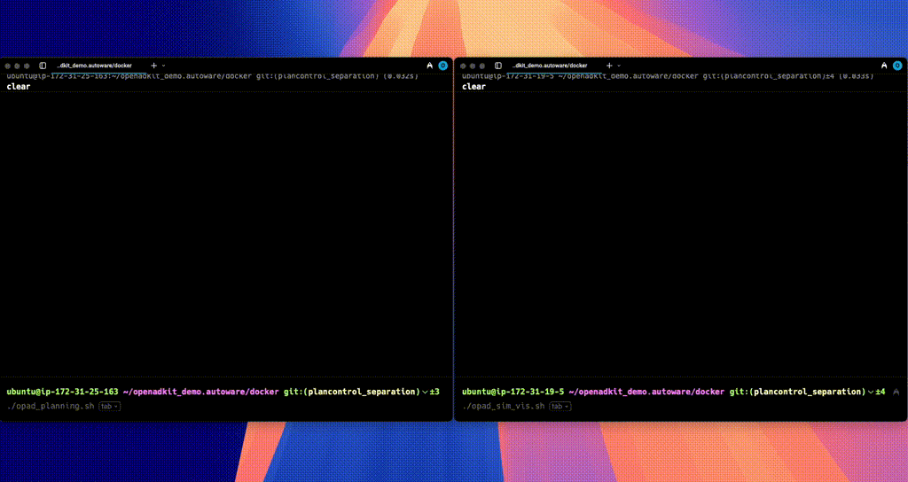

## What you'll learn in this section

The OpenAD Kit is an open-source reference design for autonomous driving workloads on Arm. It demonstrates how Autoware modules can run on scalable infrastructure, whether on a single machine or distributed across multiple compute nodes using ROS 2 and DDS.

In this section, you'll run the full OpenAD Kit demo across two Arm-based cloud instances using the setup from previous steps.

## Set up launch scripts on both instances

This setup separates the simulation and visualization environment from the planning and control logic, allowing you to explore how ROS 2 nodes communicate over a distributed system using DDS (Data Distribution Service).

To start the system, run separate launch scripts on each machine:

On each instance, copy the appropriate launch script into the `openadkit_demo.autoware/docker` directory.


  
    #!/bin/bash
    # Configure the environment variables
    export SCRIPT_DIR=/home/ubuntu/openadkit_demo.autoware/docker
    export CONF_FILE_PASS=$SCRIPT_DIR/etc/simulation/config/pass_static_obstacle_avoidance.param.yaml
    export CONF_FILE_FAIL=$SCRIPT_DIR/etc/simulation/config/fail_static_obstacle_avoidance.param.yaml

    export CONF_FILE=$CONF_FILE_FAIL
    export COMMON_FILE=$SCRIPT_DIR/etc/simulation/config/common.param.yaml
    export NGROK_AUTHTOKEN=$NGROK_AUTHTOKEN
    export NGROK_URL=$NGROK_URL

    # Start planning-control
    echo "Running planning v1.."
    TIMEOUT=120 CONF_FILE=$CONF_FILE_PASS docker compose -f "$SCRIPT_DIR/docker-compose-2ins.yml" up planning-control -d  
  
  
  
    #!/bin/bash
    export SCRIPT_DIR=/home/ubuntu/openadkit_demo.autoware/docker

    export CONF_FILE_FAIL=$SCRIPT_DIR/etc/simulation/config/fail_static_obstacle_avoidance.param.yaml
    export CONF_FILE=$CONF_FILE_FAIL
    export COMMON_FILE=$SCRIPT_DIR/etc/simulation/config/common.param.yaml
    export NGROK_AUTHTOKEN=$NGROK_AUTHTOKEN
    export NGROK_URL=$NGROK_URL
    export TIMEOUT=300

    # Start visualizer once
    docker compose -f "$SCRIPT_DIR/docker-compose-2ins.yml" up visualizer -d
    echo "Waiting 10 seconds for visualizer to start..."
    sleep 10

    # Run simulator scenario 3 times
    for i in {1..3}; do
      echo "Running simulator demo round $i..."
      docker compose -f "$SCRIPT_DIR/docker-compose-2ins.yml" run --rm simulator
      echo "Round $i complete. Waiting 5 seconds before next run..."
      sleep 5
    done
    echo "All simulator runs complete." 
  


You can also find these scripts `opad_planning.sh` and `opad_sim_vis.sh` inside the `openadkit_demo.autoware/docker` directory on both instances.

These scripts encapsulate the required environment variables and container commands for each role.

## Run the distributed OpenAD Kit demo

On the Planning-Control node, execute:

```bash
./opad_planning.sh
```

On the Simulation and Visualization node, execute:

```bash
./opad_sim_vis.sh
```

Once both machines are running their launch scripts, the Visualizer container exposes a web-accessible interface at: http://6080/vnc.html.

Open this link in your browser to observe the simulation in real time. The demo closely resembles the output in the [previous Learning Path, Deploy Open AD Kit containerized autonomous driving simulation on Arm Neoverse](/learning-paths/automotive/openadkit1_container/4_run_openadkit/). 



You’ve now run the OpenAD Kit across two nodes with separated control and visualization roles. DDS enabled real-time, peer-to-peer communication between the ROS 2 nodes, supporting synchronized behavior across the planning and simulation components deployed on two separate instances.

The containers are now distributed across two separate instances, enabling real-time, cross-node communication. Behind the scenes, this architecture demonstrates how DDS manages low-latency, peer-to-peer data exchange in a distributed ROS 2 environment.

The simulator runs three times by default, giving you multiple chances to observe data flow and verify stable communication between nodes.

Now that you’ve seen the distributed system in action, try modifying QoS settings, simulating network conditions, or scaling to a third node to explore more complex configurations.
