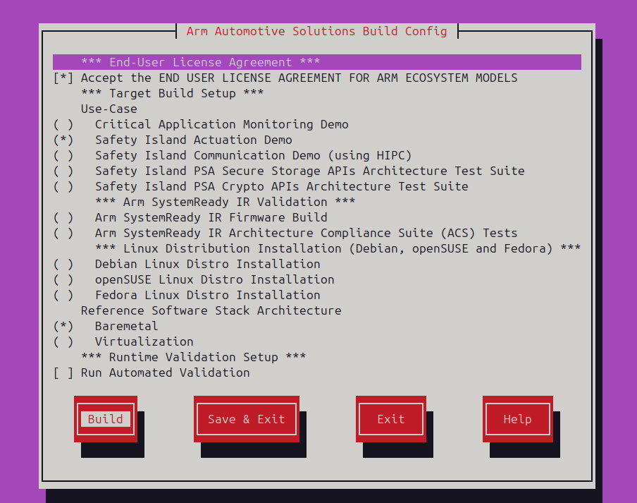

---
# User change
title: "Build the Arm Automotive Solutions Software Reference Stack"

weight: 5

layout: "learningpathall"
---
## Build the Automotive Software Stack

The Thelio Astra makes it possible to build the complete software stack on an Arm-based local machine instead of using a non-Arm desktop computer, with the ISA compatibility benefits that it brings to Arm-based software development. Using Arm-based cloud instances is another option.

You can build the Arm Automotive Solutions Software Reference Stack from the command line of the Ubuntu 20.04 Multipass virtual machine. 

Start by creating a new directory, and then clone the repository:

```console
mkdir -p ~/arm-auto-solutions
cd ~/arm-auto-solutions
git clone https://git.gitlab.arm.com/automotive-and-industrial/arm-auto-solutions/sw-ref-stack.git --branch v1.1
```

Open the configuration menu:

```console
kas menu sw-ref-stack/Kconfig
```

Press the space bar and the arrow keys to select the three components shown in the screen capture below:
- **Accept the END USER LICENSE AGREEMENT FOR ARM ECOSYSTEM MODELS**.
- **Safety Island Actuation Demo**.
- **Baremetal**. 



{}
To build and run, you must accept the EULA. 
{}

Press tab to navigate to **Build** and press Enter to start the build.

The build will take some time, depending on the number of CPUs in your virtual machine.

