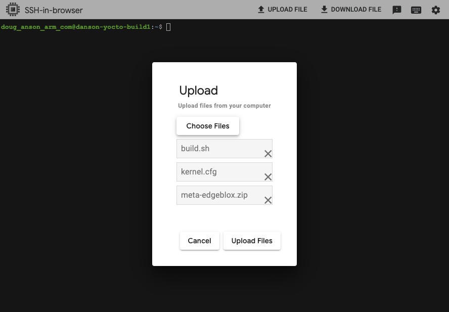
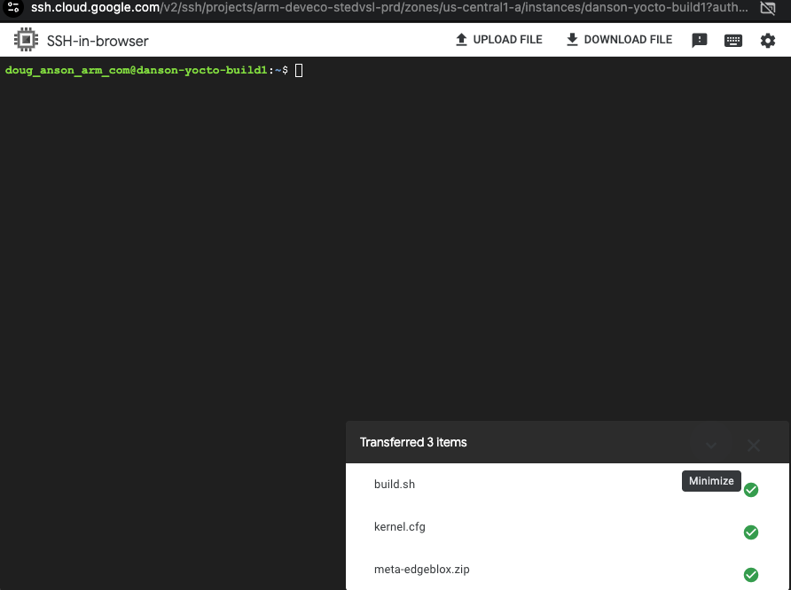
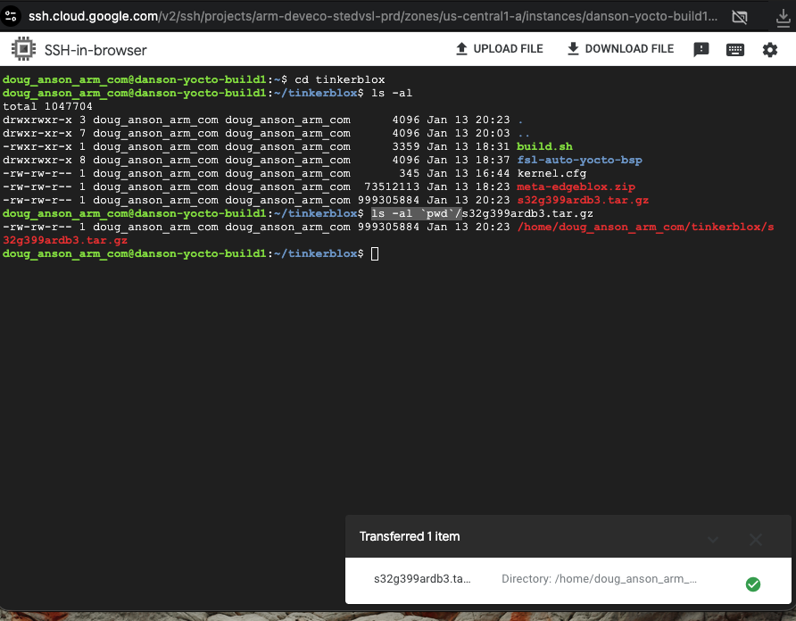

# System Requirements

{}
The requirements below are given as additional information only. The GCP C4A VM instance, running Ubuntu 22.04 with 100GB disk space, will work fine for this learning path.
{}

- Linux host system (64-bit recommended)
- Supported host architectures:
  - AArch64 (arm64)
  - ARMv7

- Supported Linux distributions(Tested):
  - Ubuntu 20.04 LTS (AArch64)
  - Ubuntu 22.04 LTS (AArch64)

{}
As of this learning path's publication, Ubuntu 24.04 LTS is NOT a supported Yocto build host OS. This may change in the future. 
{}

- Minimum hardware requirements:
  - CPU: Quad-core processor minimum (16 cores or greater recommended)
  - RAM: 8 GB minimum (16 GB or greater recommended)
  - Disk space: At least 100 GB free (250 GB +recommended for multiple builds)

- Required software (will be installed below):
  - Git (for fetching Yocto layers)
  - Python (Yocto-supported version from host distro)
  - GNU build tools (gcc, make, etc.)

- Internet access:
  - Required for downloading source code, layers, and dependencies

{}
Yocto builds are **very** resource-intensive and may take several hours depending on hardware and memory capacities
{}

# Yocto Build Instructions for NXP S32G-VNP-GLDBOX3

In this section, we use the **NXP S32G-VNP-GLDBOX3** hardware platform, using the **BSP 38.0** release from NXP’s
`auto_yocto_bsp` repository, to run EdgeBlox Agent. The following steps demonstrate how to build a Yocto-based Linux image for this board and prepare it for EdgeBlox deployment.

- **NXP Auto Linux BSP Repository (BSP 38.0):**  
  https://github.com/nxp-auto-linux/auto_yocto_bsp/tree/release/bsp38.0

- **NXP GoldBox 3 Design Page:**  
  https://www.nxp.com/design/design-center/development-boards-and-designs/GOLDBOX-3

#### Acquire the replacement "meta-edgeblox" layer from Tinkerblox

Please reach out to the Tinkerblox support team to request access to the meta-edgeblox zip file that contains the replacement layer for your Yocto image: **techsupport@tinkerblox.io**

For sake of example, the file received will be called "meta-edgeblox.zip" and will be used in the next section and via the build script below.

#### Building the Yocto Image for **NXP S32G-VNP-GLDBOX3**

{}
In default installs of Ubuntu for your YOCTO build environment, you will get an error from the above command stating that the `/etc/sudoers` file needs to be updated.  Please follow those instructions as the script needs the additional permissions to fully setup properly. Otherwise, the subsequent `bitbake` commands below will fail. 
{}

First, copy this entire config file and save it as "kernel.cfg":

```bash
CONFIG_NAMESPACES=y
CONFIG_UTS_NS=y
CONFIG_IPC_NS=y
CONFIG_PID_NS=y
CONFIG_NET_NS=y
CONFIG_USER_NS=y
CONFIG_CGROUPS=y
CONFIG_CGROUP_BPF=y
CONFIG_CGROUP_SCHED=y
CONFIG_CPUSETS=y
CONFIG_MEMCG=y
CONFIG_BLK_CGROUP=y
CONFIG_CGROUP_HUGETLB=y
CONFIG_OVERLAY_FS=y
CONFIG_SECCOMP=y
CONFIG_SECCOMP_FILTER=y
CONFIG_VETH=y
CONFIG_BRIDGE=y
CONFIG_IPTABLES=y
CONFIG_NETFILTER=y
CONFIG_NETFILTER_ADVANCED=y
CONFIG_IP_NF_IPTABLES=y
CONFIG_IP_NF_FILTER=y
CONFIG_NF_CONNTRACK=y
CONFIG_IP6_NF_IPTABLES=y
CONFIG_IP6_NF_FILTER=y
```

Next copy this entire build script and save it as "build.sh":

```bash
#!/bin/bash

export BASE_CWD=`pwd`
export BLOX_MACHINE="s32g399ardb3"
export LANG=en_US.UTF-8
export LC_ALL=en_US.UTF-8
export LC_CTYPE=en_US.UTF-8

echo "Clearing out old build..."
rm -rf fsl-auto-yocto-bsp 

echo "Installing prerequisites..."
sudo apt update
sudo apt install -y gawk wget git diffstat unzip texinfo gcc build-essential chrpath socat cpio python3 python3-pip python3-pexpect xz-utils debianutils iputils-ping python3-git python3-jinja2 libegl1-mesa libsdl1.2-dev xterm python3-subunit mesa-common-dev zstd liblz4-tool
sudo apt-get install -y chrpath diffstat gawk lz4 mtools
sudo apt-get install -y curl
sudo apt-get install -y git
sudo apt-get install -y python2

echo "Installing repo..."
mkdir -p ~/bin
curl https://storage.googleapis.com/git-repo-downloads/repo > ~/bin/repo
chmod a+x ~/bin/repo
export PATH=${PATH}:~/bin

echo "Creating build directory..."
mkdir fsl-auto-yocto-bsp
cd fsl-auto-yocto-bsp/

echo "Cloning repo..."
repo init -u https://github.com/nxp-auto-linux/auto_yocto_bsp -b release/bsp38.0
repo sync

echo "Ready to build!"
sudo ./sources/meta-alb/scripts/host-prepare.sh

echo "Setting locale..."
sudo locale-gen en_US.UTF-8
sudo update-locale LANG=en_US.UTF-8

echo "Sourcing build setup... machine: ${BLOX_MACHINE}..."
source ./nxp-setup-alb.sh -m ${BLOX_MACHINE} 
CWD=`pwd`
echo "Current working directory: ${CWD}"

# Check if we have our custom layer from Tinkerblox
if [ -f ${BASE_CWD}/meta-edgeblox.zip ]; then
    echo "Replacing meta-edgeblox layer..."
    cd ${BASE_CWD}/fsl-auto-yocto-bsp
    rm -rf ../meta-edgeblox
    unzip -q ${BASE_CWD}/meta-edgeblox.zip
else
    echo "ERROR: Unable to find replacement meta-edgeblox.zip layer. Please contact Tinkerblox team via email **techsupport@tinkerblox.io** for the layer"
    echo "Exiting on ERROR"
    exit 1
fi

echo "Adding updated meta-edgeblox layer..."
cd ${CWD}
# not needed due to zip file? time bitbake-layers create-layer ../meta-edgeblox
time bitbake-layers add-layer ../meta-edgeblox

echo "Updating the yocto local configuration: ./conf/layer.conf"
echo "IMAGE_INSTALL:append = \" dpkg ldd libxcrypt binutils zlib cjson edgeblox-agent cgroup-lite rng-tools procps ca-certificates catatonit openssh htop  python3-cantools  python3-joblib  python3-numpy  python3-pandas python3-can python3-djangorestframework python3-dev python3-pip runit go node-exporter  util-linux \"" >> ./conf/local.conf  

echo "Local yocto configuation:"
cat ./conf/local.conf

echo "Building for the machine type: ${BLOX_MACHINE}" 
time bitbake fsl-image-base

# Kernel reconfigure and rebuild of image
if [ -f ${BASE_CWD}/kernel.cfg ]; then
    echo "Customizing kernel..."
    # not needed: time bitbake -c menuconfig virtual/kernel
    echo "Updating kernel configuration: ./tmp/work/s32g399ardb3-fsl-linux/linux-s32/5.15.119-r0/build/.config"
    cat ${BASE_CWD}/kernel.cfg >> ./tmp/work/${BLOX_MACHINE}-fsl-linux/linux-*/*r0/build/.config
    
    echo "Setting config as default kernel config..."
    time bitbake -c savedefconfig virtual/kernel
    
    echo "Rebuilding kernel..."
    time bitbake virtual/kernel -f -c compile
    
    echo "Updating final image content..."
    time bitbake fsl-image-base

    echo "All Done! Exiting..."
else
    echo "ERROR: Unable to find kernel config file: ${BASE_CWD}/kernel.cfg. Exiting on error"
    exit 2
fi
exit 0
```

Next, using the VM SSH window, select "upload" to upload "kernel.cfg", "meta-edgeblox.zip" and "build.sh" up to your VM instance:

Invoking SSH file upload:


Selecting files to upload via SSH:


Uploading of selected files completed:


Next, within your VM SSH window, type these commands to invoke the build:

```bash
chmod 755 ./build.sh
mkdir tinkerblox
mv build.sh kernel.cfg meta-edgeblox.zip tinkerblox
cd ./tinkerblox
./build.sh
```

{}
1). The build will take around 20-40 minutes to fully complete. 

2). During the build, you will be prompted a few times to "restart" some services on the VM. Just press the "tab" key to select "OK" and then "enter" to continue. 

3). Also during the build, you will be prompted to accept the NXP BSP license.  Please type "q" followed by "y" to accept and begin the build. 
{}

The build will take around 20-40 minutes to fully complete. 

#### Downloading the built Yocto image for **NXP S32G-VNP-GLDBOX3**

Once completed, next, the built image is archived up and is then downloaded via the SSH "download" option:

The archived image should be downloaded to a local machine with access to the **NXP S32G-VNP-GLDBOX3** and its SD card for the next steps. 

### 7. Flashing the SD Card

#### Download the build Yocto image from the VM instance

In VM SSH shell, peform the following commands
```bash
cd $HOME/tinkerblox/fsl-auto-yocto-bsp/build_s32g399ardb3/tmp/deploy/images
tar czf s32g399ardb3.tar.gz ./s32g399ardb3
mv s32g399ardb3.tar.gz $HOME/tinkerblox
cd $HOME/tinkerblox
ls -al `pwd`/s32g399ardb3.tar.gz
```

Next, in the VM SSH, press the "Download" button to download the created file:

Selecting our file to download. Please use the fully qualified path for the file in the previous step and paste it into the download dialog to initiate the download:


Download is complete:


Back on your local host (where access to the **NXP S32G-VNP-GLDBOX3** SDcard is available for writing), extract the archive:

```bash
tar xzpf s32g399ardb3.tar.gz
cd s32g399ardb3
ls -al fsl-image-base-s32g399ardb3.sdcard
```

We are now ready to flash the image to the SD card. Insert the SD card (your localhost may expose the SD card as /dev/sdb for example if linux/ubuntu based). 

{}
Replace "/dev/sdb" with your specific local host's device file for the SD card connected to your local device:
{}

```bash
ls -al fsl-image-base-s32g399ardb3.sdcard
sudo dd if=fsl-image-base-s32g399ardb3.sdcard of=/dev/sdb bs=1M && sync
```

# Activation of Agent on the NXP S32G-VNP-GLDBOX3

On the first boot, the agent will automatically generate a file named
`activation_key.json` at the path:

    /opt/tinkerblox/activation_key.json

Log into your **NXP S32G-VNP-GLDBOX3** device via SSH after determing its IP address (i.e. 1.2.3.4 - replace with the IP address of your NXP device):

```bash
ssh root@1.2.3.4
```

Within the SSH login shell:

```bash
cd /opt/tinkerblox/
ls -al activation_key.json
```

Share this `activation_key.json` file with the TinkerBlox team at **techsupport@tinkerblox.io** to
receive license key (which includes license metadata) that will enable device activation. You will receive a new `activation_key.json` that you'll use in the following steps.

Back on the NXP device in the SSH shell, once your device activation json file is received from TinkerBlox support:

1.  Stop the agent using the following command:

        sudo systemctl stop tbx-agent.service

2.  Replace the existing `activation_key.json` file in
    `/opt/tinkerblox/` with the licensed one provided by TinkerBlox.

For example, using "1.2.3.4" as the NXP device's IP address, on your local machine:
```bash
    scp activation_key.json root@1.2.3.4:/opt/tinkerblox
```

3.  Start the agent on the NXP device:

        sudo systemctl start tbx-agent.service

#### Manual Running

-   Binary path: `/bin/tbx-agent`

-   To start:

        cd /bin
        ./tbx-agent

-   To stop, press <span class="kbd">Ctrl</span> +
    <span class="kbd">C</span> once.

<video width="800" controls>
  <source src="https://raw.githubusercontent.com/Tinkerbloxsupport/arm-learning-path-support/main/static/videos/Activation.mp4" type="video/mp4">
  Your browser does not support the video tag.
</video>

# Installing and running workloads

This section demonstrates how to deploy and manage a MicroPac-based
workload on an UltraEdge-enabled device.

This workflow uses the MicroBoost CLI to install, start, stop, and monitor MicroPac-based workloads running on UltraEdge.

### Building the workload using mpac builder

We are going to see how to build the .mpac file from a cross-architecture setup using **Micropac Builder**.

-   Verify QEMU installation:

        qemu-aarch64-static --version

-   Check binfmt registration:

        ls /proc/sys/fs/binfmt_misc/


Navigate to your project directory and Make sure the micropacfile is placed in your project directory,(refer debian_installation.md for more details).

-   Run below command:

        sudo micropac-builder build

After the build completes, the workload file your_service.mpac will be generated in your project directory.

Copy the your_service.mpac file to any root filesystem path of your NXP target to deploy it.


### Install the workloads in the device using below command

```
systemctl start runit-supervise
```

```
tinkerblox-cli microboost install -f /path/to/your_service.mpac
```

Now by using the microboost List command we can find the id of the service.

```
tinkerblox-cli microboost list
```

Copy the id and by using below command we can start,stop and status of the service.

```
tinkerblox-cli microboost start <id>
```

```
tinkerblox-cli microboost stop <id>
```

```
tinkerblox-cli microboost status <id>
```

To Uninstalls the Workload with the specified ID

```
tinkerblox-cli microboost uninstall <id>
```

## Additional information for reference

Below are two additional videos as additional reference information.

Microservice Setup/Install:

<video width="800" controls>
  <source src="https://raw.githubusercontent.com/Tinkerbloxsupport/arm-learning-path-support/main/static/videos/microservice_installation.mp4" type="video/mp4">
  Your browser does not support the video tag.
</video>

Yocto Setup/Build/Install:

<video width="800" controls>
  <source src="https://raw.githubusercontent.com/Tinkerbloxsupport/arm-learning-path-support/main/static/videos/yocto.mp4" type="video/mp4">
  Your browser does not support the video tag.
</video>