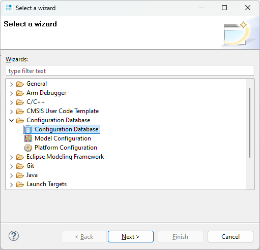

---
# User change
title: "Model Configuration"

weight: 4 # 1 is first, 2 is second, etc.

# Do not modify these elements
layout: "learningpathall"
---

# Debug Configuration

Arm Development Studio requires a `Debug Configuration` of the target that it will connect to.

As of 2025.0, there is no such configuration provided 'out-of-the-box' for the Zena CSS FVP. However creating such a configuration is straight forward.

See the Arm Development Studio [Getting Started Guide](https://developer.arm.com/documentation/101469/latest/Migrating-from-DS-5-to-Arm-Development-Studio/Connect-to-new-or-custom-models) for full instructions, but summarized below.

## Launch FVP

As per previous section, launch FVP with the Iris server enabled:

```command
kas shell -c "../layers/meta-arm/scripts/runfvp -t tmux --verbose -- --iris-server --iris-port 7100"
```

## Configuration Database

Debug Configurations are stored in a configuration database. You must first create a local database in which to store the configuration.

Navigate to `File` > `New` > `Other`, and then select `Configuration Database` > `Configuration Database` from the drop-down list.



Click `Next`. Give the Database a meaningful name, and click `Finish`.

## Debug Configuration

Navigate to the same wizard as above, and select `Model Configuration`.

Click `Next`, and you will be prompted to select the above `Configuration Database`. Click `Next` again, and you will be prompted to select a Model Interface.

Select `Iris` from the pulldown, and click `Next`.

You will then be prompted to locate the model to connect to.

Select `Browse for model running on local host`. The FVP will be detected and interrogated by the debugger.

A `model.mdf` file will be created that identifies all CPUs within the FVP.

You can change the `Manufacturer Name` and `Platform Name` to something more meaningful (such as `Arm` and `Zena_CSS_FVP`), then `Save`, and `Import` into the configuration database.

The debugger is now aware of the FVP and you are ready to debug.
