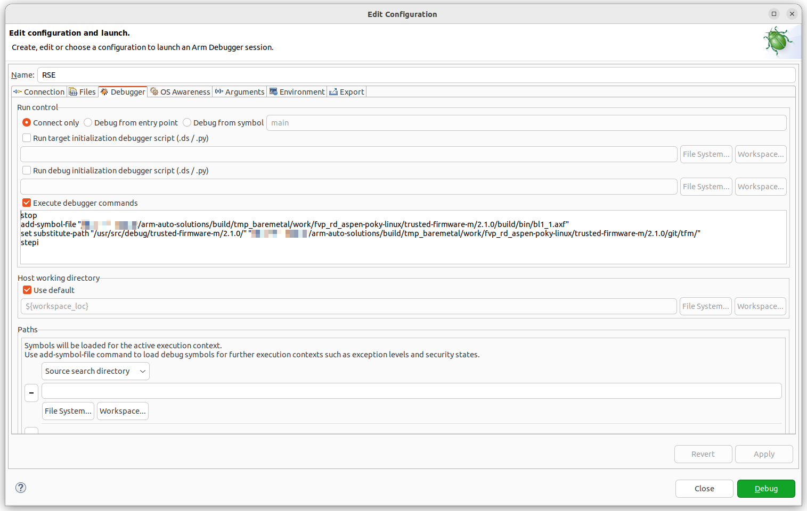

---
# User change
title: "Debug RSE from reset"

weight: 6 # 1 is first, 2 is second, etc.

# Do not modify these elements
layout: "learningpathall"
---

## Overview

You'll now move on to debug the initial code that runs on the Runtime Security Engine (RSE) based on Cortex-M55 in the Zena CSS FVP. You will launch the model with the Iris debug server, connect from Arm Development Studio, load Trusted Firmware-M (TF‑M) symbols, and step from reset.

## Launch the FVP and hold at reset

Start a new `tmux` session for the FVP if needed:
```command
tmux new-session -s arm-auto-solutions
```

Navigate to your code repository, then launch the FVP with Iris **without** running so it stays at reset:
```command
kas shell -c "../layers/meta-arm/scripts/runfvp -t tmux --verbose -- --iris-server --iris-port 7100"
```

The FVP initializes and prints information messages, for example:
```output
...
Info: RD_Aspen: RD_Aspen.css.smb.rse_flashloader: FlashLoader: Saved 64MB to file '~/arm-auto-solutions/build/tmp_baremetal/deploy/images/fvp-rd-aspen/rse-flash-image.img'
Info: RD_Aspen: RD_Aspen.ros.flash_loader: FlashLoader: Saved 128MB to file '~/arm-auto-solutions/build/tmp_baremetal/deploy/images/fvp-rd-aspen/ap-flash-image.img'
```
Note that execution has not started.

{}
If you need remote debugging, start the FVP with `-A` and ensure the chosen Iris port (default `7100`) is reachable through your firewall.
{}

## Connect the debugger to RSE (Cortex-M55)

Use the **RSE** model connection you created earlier to attach the debugger. The processor is stopped before the first instruction.

The FVP configures the secure vector table (**VTOR_S**) at `0x11000000`. If you inspect memory at that address, the vector table is populated, but source is not visible until you load symbols.

Load TF‑M symbols and map sources:

- In **Debug Control**, open the pane menu and choose **Load...**
- Select **Add Symbols file**.
- Locate the TF‑M image, for example:
   ```bash
   /arm-auto-solutions/build/tmp_baremetal/work/fvp_rd_aspen-poky-linux/trusted-firmware-m/2.2.1+git/build/bin/bl1_1.axf
   ```
When prompted for **substitute path**, map build-time paths to your local sources, for example:
   ```bash
   /usr/src/debug/trusted-firmware-m/2.2.1+git/
   /arm-auto-solutions/build/tmp_baremetal/work/fvp_rd_aspen-poky-linux/trusted-firmware-m/2.2.1+git/git/tfm/
   ```

Step one instruction to fetch the reset handler and stop there. In the debugger `Commands` pane enter:
```text
stepi
```

You can now step through code, set breakpoints, and inspect the target as the code proceeds.

{}
Paths vary by environment. Use your actual build output and source locations when adding symbols or configuring path substitution.
{}

## Automate setup with debugger commands

Automate the connection steps by adding **Debugger Commands** to the `.launch` configuration so they run on every attach:

- Open (double-click) your **RSE.launch** file.
- Go to the **Debugger** tab.
- Enable **Execute debugger commands**.
- Add commands similar to the following (adjust paths as needed).

```text
stop
add-symbol-file "/arm-auto-solutions/build/tmp_baremetal/work/fvp_rd_aspen-poky-linux/trusted-firmware-m/2.2.1+git/build/bin/bl1_1.axf"
set substitute-path "/usr/src/debug/trusted-firmware-m/2.2.1+git/" "/arm-auto-solutions/build/tmp_baremetal/work/fvp_rd_aspen-poky-linux/trusted-firmware-m/2.2.1+git/git/tfm/"
stepi
```

{}
Use the `Commands` or `History` pane to see and copy the equivalent debugger commands of the GUI actions.
{}



