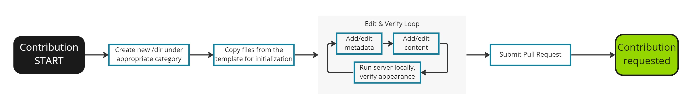

---
# User change
title: "2d) Write in the correct style"

weight: 8 # 1 is first, 2 is second, etc.

# Do not modify these elements
layout: "learningpathall"
---
<!--  -->

Read this section to effectively write in a style consistent with the rest of the tutorials. Content that deviates too much from these guidelines will have to be revised accordingly. 

## Voice

Voice or tone describes the way something is expressed. This is different from describing the facts that you are writing about. The same idea can be described in a variety of voices, for example, formal or informal. 

Learning Paths should be written in a clear, simple, and informal voice. You should write in a voice that anticipates the needs of your reader and is not pedantic or formal. However, do not write like you are speaking, because that is too informal.  

If you write in this clear, simple, and informal voice, your content will be easy to understand.

{}
Too formal:
- Hardware-based security is needed to protect FIDO from malicious attack.

Recommended:
- You need hardware-based security to help protect FIDO from malicious attack.
{}

&nbsp;  
&nbsp;  

## Use shorter words

Avoid a long or complex word when a simpler, shorter word will make the same point. 

{}
Too confusing:
- You can nest any combination of lists.

Recommended:
- You can nest one type of list inside another.
{}

&nbsp;  
&nbsp;  

## Use active voice

Use active voice and present tense when possible. In the active voice, the subject of the sentence performs the action. In the passive voice, the action happens to the subject of the sentence. 

**Active voice:** Press the F1 key to display help information in a separate window. 

**Passive voice:** When the F1 key is pressed, help information is displayed in a separate window.  

{}
Passive voice (bad):
- We will be focusing on three versions of HPCG.

Recommended:
- We focus on three versions of HPCG.
{}

&nbsp;  
&nbsp;  

## Avoid jargon

Avoid overuse of adjectives. Avoid jargon including Latin abbreviations. 

{}
Too many 'filler' words:
- There are numerous different versions of the Arm architecture, which are shown as ArmvX, in which X is the designated version number, e.g., Armv8-A denotes version 8 of the Arm A-profile architecture.

Recommended:
- There are different versions of the Arm architecture. These different versions are usually shown as ArmvX, in which X is the version number. For example, Armv8-A means version 8 of the Arm A-profile architecture.
{}

&nbsp;  
&nbsp;  

## Hyperlinks

Linking data allows readers to access related content quickly and easily. However, too many links can make your writing difficult to read, so use links carefully.     

Create a hyperlink for the title of the item you are linking to. Make the hyperlinked text part of your sentence. 

If possible, include a verb that tells your reader what they will do when they click the hyperlink. Avoid embedding the link in an extra word like **here**.

{}
Unclear:
- To learn about embedded voice assistants, read our white paper **here**.

Recommended:
- To learn about embedded voice assistants, read **The new voice of the embedded intelligent assistant**.
{}

Sometimes, text should not be hyperlinked. For example, when you want the reader to see the URL. For these cases you can print the link and use a hyperlink. 

**Example:** To view your content open [http://localhost:1313](http://localhost:1313)

&nbsp;  
&nbsp;  

## Use second person point of view

Use second person to refer to your reader, and when writing user-oriented instructions. Second person uses, or implies, the pronoun you, and addresses your reader directly. 

Using second person helps your reader to engage, and helps to avoid the use of passive voice, because your reader is the subject of the sentence. 

{}
Too passive:
- An architecture can be thought of like a contract between the hardware and the software. 

Recommended:
- You can think of the architecture like a contract between the hardware and the software.  
- Think of an architecture like a contract between the hardware and the software.  
{}

When writing user-oriented instructions or guidance, using you makes it clear that your reader, and not the item in discussion, is the agent who performs the action. In the following recommended example, it is clear that your reader is the agent using the flag to do the tracking, and that the flag is not doing the tracking automatically. 

{}
Too passive:
- Use of the Access Flag (AF bit) tracks whether a region covered by the translation table entry has been accessed. 

Recommended:
- You can use the Access Flag (AF bit) to track whether a region covered by the translation table entry has been accessed. 
{}

&nbsp;  
&nbsp;  

## Give only required details

Use short, crisp sentences. Avoid storytelling and excessive background. 

{}
Too verbose:
- Due to the fact that we leveraged the CMSIS software library, issues with starting from scratch were avoided, and where you totally lacked the ability to implement optimized software before, you can now do so easily.

Recommended:
- The CMSIS library enables optimized software.
{}

&nbsp;  
&nbsp;  

## Be specific

Use numbers and provide examples when possible. Avoid general statements try to be as specific.

{}
Too nebulous:
- Using the library on almost always works.

Recommended:
- The library works on Linux and Windows 11.
{}

## Expected skills of your target audience

The learning paths are intended for software developers with differing experience levels (Introductory and advanced). The intended audience are expected to have some domain specific knowledge, examples of which are listed below:

| Software Development Areas                 | Skills |
|-------------------------------------       |----------|
| Embedded and Microcontroller               | Understanding of programming languages such as C, C++ and assembly.  Basic awareness of Linux OS, RTOSes.  Fundamental knowledge of hardware and software architecture (Not necessarily Arm) |
| Server and Cloud                           | <ul><li> Understanding of web services and Linux.</li><li> Basic awareness of containerization and orchestration technologies such as Docker and Kubernetes.</li><li> Proficient in programming languages such as Python and Java.</li></ul> | 
| Mobile				     | <ul> <li> Experience with software development on mobile platforms like Android. </li> <li> Experience with mobile development and testing frameworks. </li> </ul> |
| Desktop and Laptop                         | <ul> <li> Experience with operating systems such as Windows and macOS. </li> <li> Experience with popular development frameworks such as .NET and Electron. </li> Proficient in programming languages such as C++, Java and Python </li> </ul> |
 

