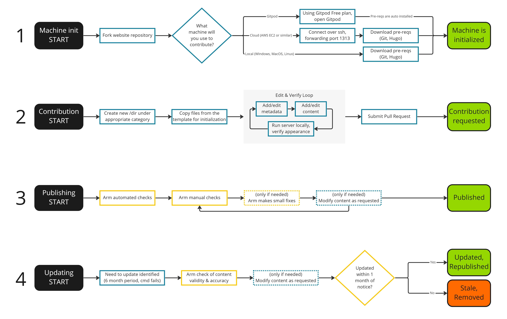

---
# User change
title: "Contribution process overview"

weight: 3 # 1 is first, 2 is second, etc.

# Do not modify these elements
layout: "learningpathall"
---

## Contribution process

The complete process consists of four steps, all covered in this Learning Path:
- **Setup**: prepare required tools and setup GitHub repository
- **Contribute**: create new content and submit a pull request on GitHub
- **Publish**: work with project maintainer to resolve any feedback
- **Update**: keep the Learning Path up to date as things change

The four steps to create a Learning Path are shown in the diagram below. You will be walked through each step throughout this Learning Path.

