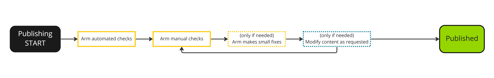

---
# User change
title: "3) Submit for publishing"

weight: 10 # 1 is first, 2 is second, etc.

# Do not modify these elements
layout: "learningpathall"
---
<!--  -->

## Submit your changes

Commit your changes to your GitHub fork using git. This can be done with a single commit or a series of commits. 

Before submitting a pull request, make sure `hugo` runs without errors on the command line. This should be run from the top level directory of the repository. 

```console
hugo
```

The output should be a table similar to the one below with no other error messages.

```console

                   | EN
-------------------+------
  Pages            | 685
  Paginator pages  |   0
  Non-page files   | 189
  Static files     |  53
  Processed images |   0
  Aliases          |   0
  Sitemaps         |   1
  Cleaned          |   0

Total in 864 ms
```

If there are any errors, such as incorrect formatting of metadata, fix them and try again. 

After you have reviewed the new material using `hugo server` and there are no issues running `hugo` submit a GitHub pull request. 

Search for a tutorial about how to create a pull request from a GitHub fork if you need guidance on creating the pull request. 

## Publishing

After submitting a pull request, automated checks will run to validate your metadata format and the Learning Path team will start reviewing your submission. This is done for technical accuracy and to review writing style. Watch the pull request for review comments and respond as needed. Once the pull request is merged, the website is automatically updated with the new contribution. 

{}
If there are small typos or formatting issues, we will fix them before publishing. This is done to reduce the amount of back-and-forth overhead on small issues; you will always be able to view all changes through GitHub and let us know if you object to any changes.
{}

{}
If there are large factual or reproducibility errors in your contribution, we will contact you via the pull request to resolve them before publishing.
{}
