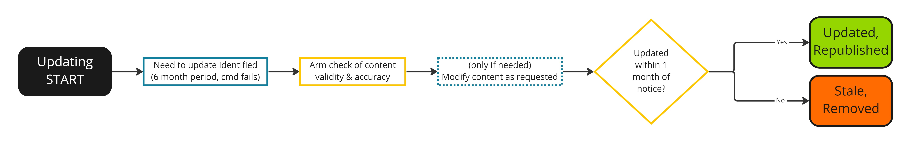

---
# User change
title: "4) Updating your Learning Path"

weight: 11 # 1 is first, 2 is second, etc.

# Do not modify these elements
layout: "learningpathall"
---
<!--  -->

## Updating Learning Paths

Learning Paths should be always up to date and high quality. Over time software may change and instructions may be out of date. 

Learning Path content is automatically monitored for out of date material. We may contact you to confirm a Learning Path is still up to date or to request some modifications to a Learning Path that has become out of date. 

Community members may also submit feedback on Learning Paths so we appreciate any help on keeping content current. 

Keep an eye out for requests and please respond as needed. 

Thank you!