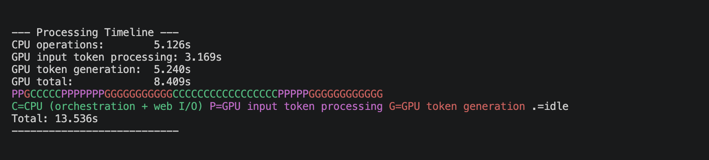
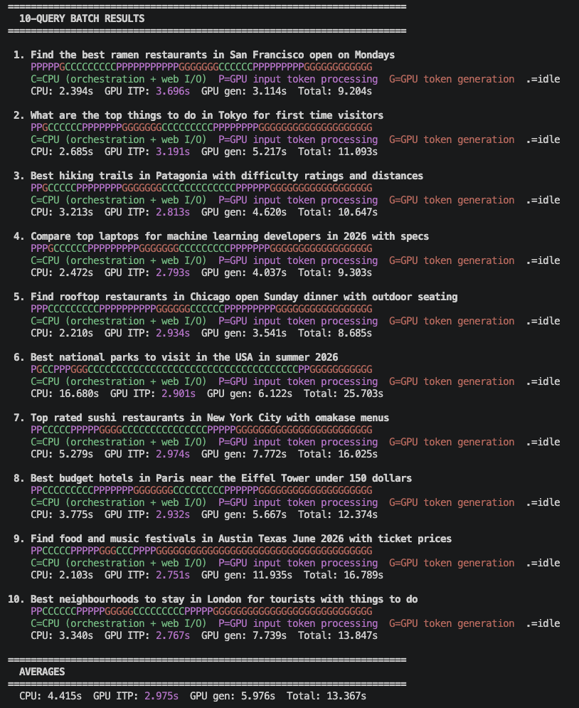

## Start the agent

Make sure the following are in place before you start:

- Ollama is running and serving `gemma3:4b`.
- Your virtual environment is active and `SERPER_API_KEY` is set in the current terminal.

From your project directory, start the agent:

```bash
python3 concierge_agent.py
```

The agent greets you and waits for a question:

```output
Hello! I am your local concierge agent.
Ask me anything - I research topics by browsing multiple websites in real time.
Make sure Ollama is running in the background.
Type "quit" or "exit" to end the session.

What would you like to find?
>
```

## Ask a research question

Type a question that benefits from searching and reading several pages. For example:

```text
Find three highly rated ramen restaurants in San Francisco that are open late
```

As the agent works, watch the log lines. Cyan <code style="color:#00aaaa"><strong>[CPU]</strong></code> lines show orchestration and web I/O; yellow <code style="color:#aaaa00"><strong>[GPU]</strong></code> lines show each model call:

```output
[GPU] Thinking with local Gemma model...
[CPU] Expanding base query 'late night ramen San Francisco' into multiple variants...
[CPU] Generated 3 search variants: [...]
[CPU] Dispatching 3 parallel search threads...
[CPU] Merging search results and deduplicating URLs...
[GPU] Thinking with local Gemma model...
[CPU] Dispatching 8 parallel browse threads...
[CPU] Running TF-IDF ranking on scraped content...
[CPU] Deduplicating sentences across all scraped sources...
[CPU] Extracting named entities from aggregated content...
[GPU] Thinking with local Gemma model...
```

The agent then prints a fact-checked summary that answers your question.

## Read the timing breakdown

After each answer, the agent prints how the time was spent:

```output
--- Processing Timeline ---
CPU operations:             4.812s
GPU input token processing: 1.934s
GPU token generation:       3.057s
GPU total:                  4.991s
```

These numbers separate the three kinds of work:

- `CPU operations` – every orchestration and text-processing stage combined.
- `GPU input token processing` – the time the model spends reading each prompt before producing output (prefill).
- `GPU token generation` – the time spent writing the answers.

{}
Your exact numbers depend on your hardware, the model size, and how many pages the agent reads. The point isn't the absolute values, but the fact that CPU work is a substantial share of every query.
{}

## Read the timeline

The agent also prints a text-based timeline. Each character is a slice of wall-clock time, color-coded by what was active:

```output
CCCCCCCPGGGGCCCCCCCCCCCCCCPGGGGGGGGCCCCCCCCCCCCCCCCCCCPGGGGGGGGGGGG
C=CPU (orchestration + web I/O) P=GPU input token processing G=GPU token generation .=idle
Total: 9.803s
```

Reading left to right, you can see the pattern of an agentic query: long stretches of CPU work (<code style="color:#00aa00"><strong>C</strong></code>) for searching, browsing, and processing, punctuated by GPU bursts where the model reads a prompt (<code style="color:#aa00aa"><strong>P</strong></code>) and generates text (<code style="color:#cc0000"><strong>G</strong></code>).



## Try more queries

Ask a few different kinds of research questions and compare their timelines:

```text
Compare the battery life of the three most recommended noise-cancelling headphones
```

```text
Summarize the key differences between the latest Raspberry Pi models
```

The screenshot shows example queries and the answers the agent returns:



Type `quit` or `exit` to end the session.

## What you've accomplished and what's next

You've now started the agent and asked questions to see how query response steps are split between the CPU and the GPU.

Next, you'll learn why the CPU does so much of the work in an agentic workflow.
