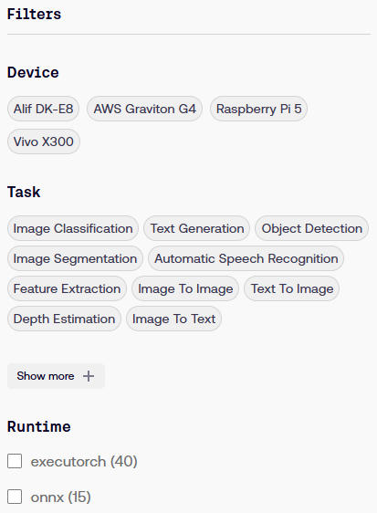
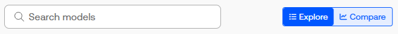
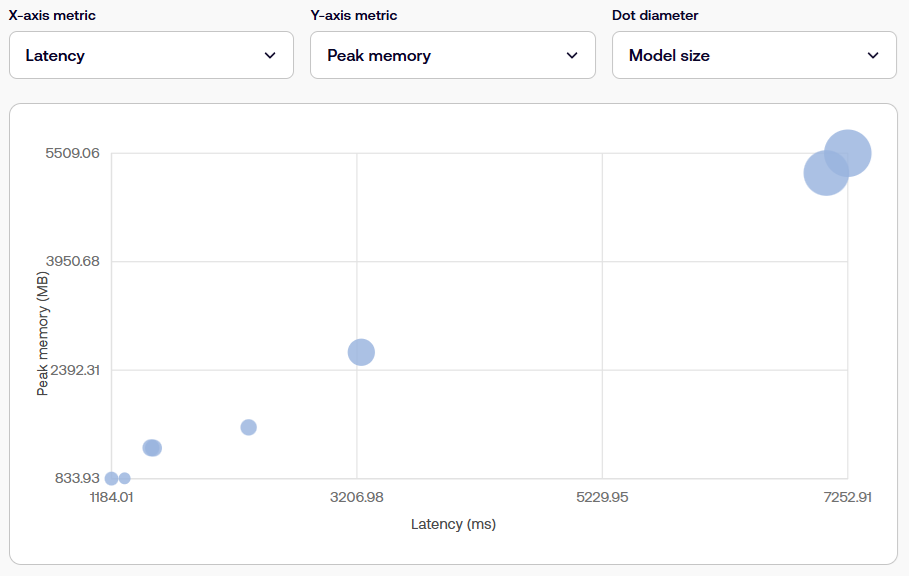

## Browse models on the Arm AI Portal

The Arm AI Portal brings together AI models optimized for Arm platforms and provides:

- Filtering tools
- Analytics for easy model comparison
- Supporting content such as Learning Paths and code examples

You'll browse models in the Arm AI Portal, compare their characteristics, and select a model to deploy.

Start by navigating to the [AI Portal](https://developer.arm.com/ai/models/).

You'll see filters for task and device compatibility, runtime framework, quantization, and model and memory size. 

Models that meet the filter criteria are each shown as a model card in the central area of the screen.

Select one of the model cards and review its model detail page. 

The detail page shows the following information about the model:

  - Model accuracy
  - Throughput, latency and peak memory usage
  - Platform details that the model is optimized for
  - Benchmarking details
  - A **Use this Model** button that downloads the model, opens its page on Hugging Face, and — for selected models — offers Topo deployment options

## Compare models on the Arm AI Portal

To compare models on AI Portal, return to the [Models](https://developer.arm.com/ai/models/) page and follow these steps:

1. There are two buttons on the top-right of the page: **Explore** and **Compare**. Select **Compare**.

2. Under **Filters**, for **Device**, select **AWS Graviton G4**.
3. For **Task**, select **Text Generation**.

  The main area of the page now contains a graph. Experiment with changing the axis and dot diameter metrics using the dropdown lists.

4. Set the **X-axis metric** to **Latency**, the **Y-axis metric** to **Peak memory**, and the **Dot diameter** to **Score**. 

  Now, identify and select a dot that corresponds to a model that has low latency and size, but a decent score. 

After you select the model, its name appears in a callout box next to the dot, and its corresponding row is highlighted in a table.

In the table, select **TinyLlama-1.1B-Chat INT4 — ONNX GenAI (Graviton G4)** to visit its page. Review the benchmarking details at the bottom of the page. Note that the HellaSwag score is similar to the baseline model, yet the optimized model is about a fifth of the size.

## What you've accomplished and what's next

You've navigated to the Arm AI Portal and used the comparison view to identify a TinyLlama model with lower latency and size but similar reasoning capabilities as a baseline model.

Next, you'll deploy the TinyLlama model.
