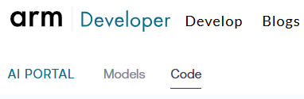

## Locate the ExecuTorch code example on AI Portal

To locate the ExecuTorch image classifier code example in the Arm AI Portal:

1. At the top of the AI Portal, next to the menu items **AI Portal** and **Models**, select **Code**.

  

  You'll see a mixture of Learning Paths, examples, and documentation. 

2. In the filters pane, select **Containerized examples**.
3. In the central card area, select **Image Classifier (ExecuTorch)**. 

The page includes:

- A description of the code example
- On the right, a **Deploy Project** box with **CLI** and **VS Code** tabs
- A list of build-time parameters
- Build and deploy commands

## Install Topo

To deploy using Topo, install Topo on your host using one of the following commands:


  
curl -fsSL https://raw.githubusercontent.com/arm/topo/refs/heads/main/scripts/install.sh | sh
  
  
irm https://raw.githubusercontent.com/arm/topo/refs/heads/main/scripts/install.ps1 | iex
  


Alternatively, you can find the [latest release of Topo](https://github.com/arm/topo/releases), download the binary for your platform, and extract it. Topo is a single executable file. Move the file to a directory on your `PATH`, for example `/usr/local/bin/` on Linux and macOS.

## Install Docker

To install Docker on Linux, run:

```bash 
curl -fsSL get.docker.com -o get-docker.sh && sh get-docker.sh
sudo usermod -aG docker $USER ; newgrp docker
```

For more information, see the [Docker install guides](https://learn.arm.com/install-guides/docker/).

## Test Topo installation

When Topo runs on Windows, macOS, or Linux, it supports deployment only to targets that run Arm Linux. If you deploy to a remote Arm Linux device, you also need to provision keys on the device.

Run one of the following commands to test the Topo installation:


  
topo health --target localhost
  
  
topo setup-keys --target ssh://username@target-ip-address
topo health --target target-ip-address
  


The output is similar to:

```output
Host
----
Topo: ✅ (topo)
OpenSSH: ✅ (ssh)
Container Engine: ✅ (docker)
Docker Compose: ✅ (docker-compose)

Target
------
Destination: ssh://localhost
Container Engine: ✅ (docker)
Hardware Info: ✅ (lscpu)
Processing Domain Driver (remoteproc): ℹ️ (no remoteproc devices found)
```

## (Optional) Install remoteproc

Remoteproc is a Linux kernel framework for managing remote or auxiliary processors in a heterogeneous SoC. If you see the `no remoteproc devices found` message, install the `remoteproc-runtime` using Topo. However, you need `remoteproc-runtime` only if your target is a heterogeneous SoC.

```bash
topo install remoteproc-runtime --target username@target-ip-address
```

Run the health command again to verify installation. Topo uses `remoteproc-runtime` internally when deploying to heterogeneous devices.

## Clone the ExecuTorch image classifier project

On the [**Image Classifier (ExecuTorch)**](https://developer.arm.com/ai/examples/topo-executorch-image-classifier) page, in the **Configure Project** box, select a model such as **ViT-Base INT8 - ExecuTorch + XNNPACK**.

The **Deploy Project** box contains **CLI** and **VS Code** tabs customized for your model selection.

### Clone the project using VS Code

To clone the project using VS Code, follow these steps:

1. Select the **VS Code** tab.
2. Select the **Open in VS Code** button. Your browser will ask for permission to open VS Code. 
3. Next, VS Code installs its Arm Topo extension. When prompted, grant VS Code permission to access the clone URL.
4. When prompted, specify a directory to contain the project.

### Clone the project using the command line

If you're not using VS Code and prefer to use Topo from the command line, follow these steps to clone from the AI Portal:

1. Select the **CLI** tab.
2. Select the copy icon at the top-right of the **Clone Project** box to copy the provided command.
3. Paste the copied into the command line and run it.

Alternatively, you can run the following command:

```bash
topo clone https://github.com/Arm-Examples/topo-executorch-image-classifier.git
```

When prompted with `HF_REPO_ID>`, paste the model name. For example, `Arm/vit-base-int8-xnnpack-executorch`.

## Deploy the project

Deployment depends on the `HF_TOKEN` environment variable that you set up earlier. 

Run one of the following commands, depending on whether you're deploying to localhost or a remote target:


  
cd topo-executorch-image-classifier
topo deploy -t localhost
  
  
cd topo-executorch-image-classifier
topo deploy -t target-ip-address
  


The output includes the following:

```output
┌─ Deployment Success ──────────────────────────────────
Image classifier is running. Open http://<target-ip>:7860 to upload an image.
```

Open `http://<target-ip>:7860` in a browser. The web app prompts you to upload an image for classification.

## Troubleshoot deployment issues

If deployment is successful on a cloud instance, but you can't access the image classifier URL, ensure that you've enabled access to port `7860`. 

If deployment fails, check whether you have sufficient disk space to download the model. On a constrained embedded device with limited memory, you might also need to add a swapfile to run large models.

On the target, check whether the Docker container is running with `docker container ls`. If the container isn't running, view its logs:

```sh
docker container ls --all --filter "status=exited"   # to get the container_id
docker container logs container_id
```

## (Optional) Try other examples

You can try other code examples from the AI Portal by using the `topo clone` command listed on AI Portal for the example that you want to try. Follow the same deployment steps as earlier. 

{}
Some code examples listen on the same port. If you've already deployed a code example, stop its Docker container to free the port before launching another example.

The following command stops all containers that use port `7860`:

```bash 
docker container stop $(docker container ls --filter expose=7860 -q)
```
{}

## What you've accomplished and what's next

You've now successfully deployed the ExecuTorch image classifier project using Topo.

To continue with MCP-assisted model discovery and deployment, see [Discover and deploy AI models with the Arm AI Portal MCP server](/learning-paths/servers-and-cloud-computing/ai-portal-mcp/).
