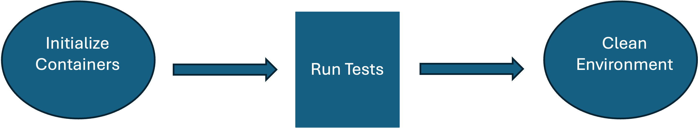

## What is MCP?

The Model Context Protocol (MCP) is an open standard that enables AI assistants to securely connect to external data sources and tools. MCP servers provide AI models with context aware capabilities, such as code analysis, knowledge base lookups, and system introspection.

The Arm MCP Server is a reference implementation that provides AI assistants with tools and knowledge specifically for Arm architecture development, migration, and optimization. It includes capabilities like container architecture checking, code analysis with LLVM-MCA, and access to Arm Learning Paths.

## Why automate MCP server testing?

MCP servers expose multiple tools that AI assistants can invoke. As these tools evolve, you need reliable automated tests to:

- Verify that each tool responds correctly to valid requests.
- Catch regressions when updating server code or dependencies.
- Validate container startup and communication protocols.
- Ensure compatibility across different environments.

## Understanding Testcontainers

Testcontainers is a Python library that provides lightweight, throwaway instances of Docker containers for testing. Instead of mocking your MCP server, you can spin up the actual Docker container, run tests against it, and tear it down automatically.

This approach offers several benefits:

- **Realistic testing**: Tests run against the actual server implementation.
- **Isolation**: Each test run gets a fresh container instance.
- **Reproducibility**: Tests behave consistently across development machines and CI environments.
- **No external dependencies**: Tests don't require a pre-deployed server.

## What you will build

In this Learning Path, you will create an integration test suite that:

1. Starts the Arm MCP server in a Docker container using Testcontainers.
2. Communicates with the server using the MCP stdio transport protocol.
3. Tests multiple MCP tools including container image checking, knowledge base search, and code analysis.
4. Integrates with GitHub Actions for continuous testing.

## What you've accomplished and what's next

In this section:
- You learned what MCP servers are and why automated testing matters.
- You discovered how Testcontainers enable realistic integration testing.

In the next section, you will set up your development environment and install the required dependencies.
