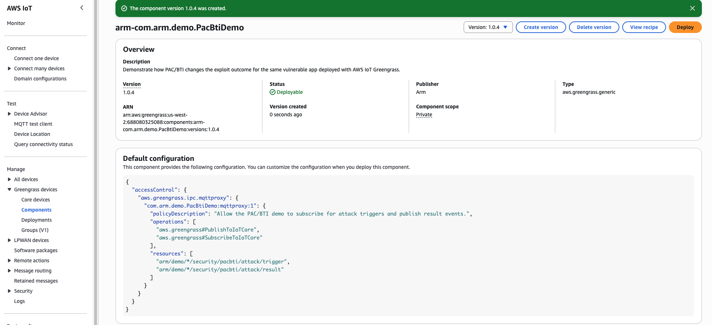

### Overview

In this section, you create an AWS IoT Greengrass custom component that uses an artifact package to test PAC/BTI support on target Arm devices.

### Upload the component artifact to S3

1. In the AWS Console, go to **S3**.


2. Create a bucket and give it a name. Keep the default settings for this tutorial.


3. Select **Create bucket**.


4. Record the bucket name. You will use it in the YAML recipe.

5. On your local machine, clone the asset repository:

```bash
git clone https://github.com/DougAnsonAustinTx/pac-bti-gg-assets
cd ./pac-bti-gg-assets
```

6. In the S3 bucket view, select **Upload**. Upload the following artifact from the cloned repository:

   `arm-pac-bti-greengrass-demo-mqtt-trigger.zip`


7. Select **Add files**, choose the artifact, and then select **Upload**.


Your artifact is now available in S3. Next, create the custom Greengrass component.

### Create the custom component

1. In the AWS Console, go to **IoT Core** > **Greengrass devices** and select **Components**.

2. Select **Create component**.


3. Select **Enter recipe as YAML** and clear the default sample content.


4. Copy and paste the following YAML recipe into the editor.

{}
In the YAML code below, locate **YOUR_S3_BUCKET** and replace it with the S3 bucket name you created in the previous step.
{}

```yaml
RecipeFormatVersion: '2020-01-25'
ComponentName: arm-com.arm.demo.PacBtiDemo
ComponentVersion: '1.0.4'
ComponentDescription: Demonstrate how PAC/BTI changes the exploit outcome for the same vulnerable app deployed with AWS IoT Greengrass.
ComponentPublisher: Arm
ComponentType: aws.greengrass.generic

ComponentConfiguration:
  DefaultConfiguration:
    accessControl:
      aws.greengrass.ipc.mqttproxy:
        com.arm.demo.PacBtiDemo:mqttproxy:1:
          policyDescription: Allow the PAC/BTI demo to subscribe for attack triggers and publish result events.
          operations:
            - aws.greengrass#PublishToIoTCore
            - aws.greengrass#SubscribeToIoTCore
          resources:
            - arm/demo/*/security/pacbti/attack/trigger
            - arm/demo/*/security/pacbti/attack/result

Manifests:
  - Platform:
      os: linux

    Artifacts:
      - Uri: s3://YOUR_S3_BUCKET/arm-pac-bti-greengrass-demo-mqtt-trigger.zip
        Unarchive: ZIP
        Permission:
          Read: OWNER
          Execute: OWNER

    Lifecycle:
      Install:
        RequiresPrivilege: true
        Script: |-
          set -e

          PROJECT_ROOT="{artifacts:decompressedPath}/arm-pac-bti-greengrass-demo-mqtt-trigger/arm-pac-bti-greengrass-demo"
          WORK_DIR="{work:path}"
          VENV_DIR="{work:path}/venv"

          python3 -m venv "${VENV_DIR}"
          "${VENV_DIR}/bin/python" -m pip install --upgrade pip
          "${VENV_DIR}/bin/pip" install --no-cache-dir awsiotsdk

          bash "${PROJECT_ROOT}/greengrass/install.sh" \
            "${PROJECT_ROOT}" \
            "${WORK_DIR}"

      Run:
        Script: |-
          set -e

          PROJECT_ROOT="{artifacts:decompressedPath}/arm-pac-bti-greengrass-demo-mqtt-trigger/arm-pac-bti-greengrass-demo"
          WORK_DIR="{work:path}"
          VENV_DIR="{work:path}/venv"

          BUILD_FLAVOR="$(cat "${WORK_DIR}/state/selected_flavor")"
          BINARY="${WORK_DIR}/build/${BUILD_FLAVOR}/vuln_demo"
          OUTPUT_DIR="${WORK_DIR}/results"
          THING_NAME="{iot:thingName}"
          TRIGGER_TOPIC="arm/demo/${THING_NAME}/security/pacbti/attack/trigger"
          RESULT_TOPIC="arm/demo/${THING_NAME}/security/pacbti/attack/result"


          mkdir -p "${OUTPUT_DIR}"

          echo "THING_NAME=${THING_NAME}"
          echo "TRIGGER_TOPIC=${TRIGGER_TOPIC}"
          echo "RESULT_TOPIC=${RESULT_TOPIC}"

          if [ ! -x "${VENV_DIR}/bin/python" ]; then
            echo "Virtual environment Python not found at ${VENV_DIR}/bin/python"
            exit 1
          fi

          if [ ! -x "${BINARY}" ]; then
            echo "Binary not found or not executable: ${BINARY}"
            exit 1
          fi

          export PYTHONUNBUFFERED=1

          exec "${VENV_DIR}/bin/python" "${PROJECT_ROOT}/tools/demo_runner.py" \
            --project-root "${PROJECT_ROOT}" \
            --binary "${BINARY}" \
            --build-flavor "${BUILD_FLAVOR}" \
            --output-dir "${OUTPUT_DIR}" \
            --trigger-topic "${TRIGGER_TOPIC}" \
            --result-topic "${RESULT_TOPIC}"
```

5. After you update the bucket name, select **Create component**.


6. Confirm the custom component appears in the component list.



### What you've accomplished

You created an AWS IoT Greengrass custom component and connected it to the S3-hosted artifact. In the next section, you'll deploy it to both Greengrass core devices.