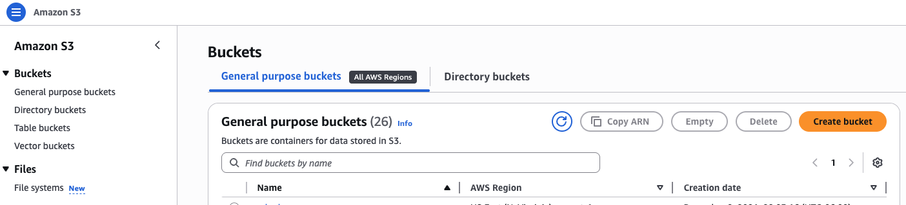
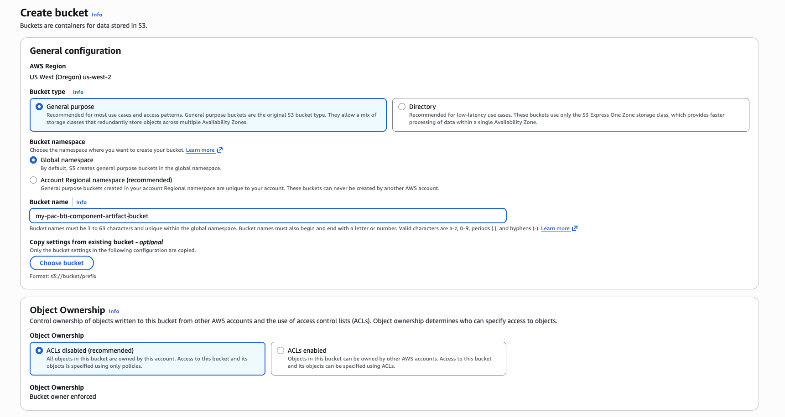
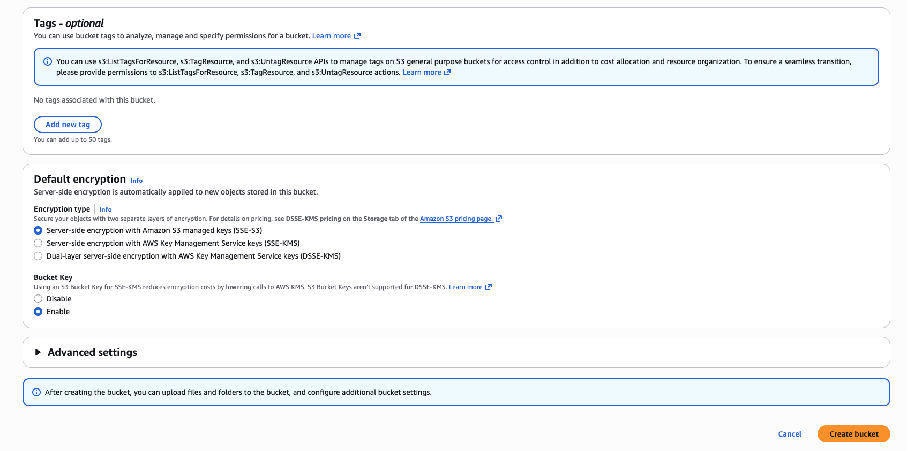
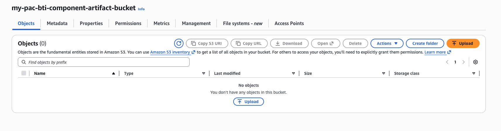
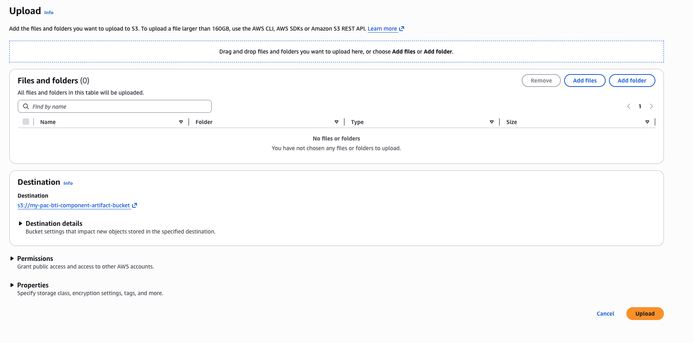
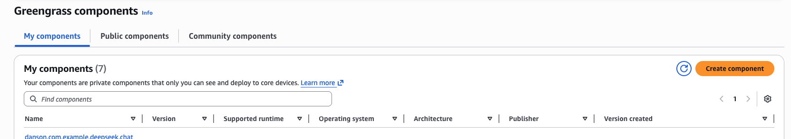
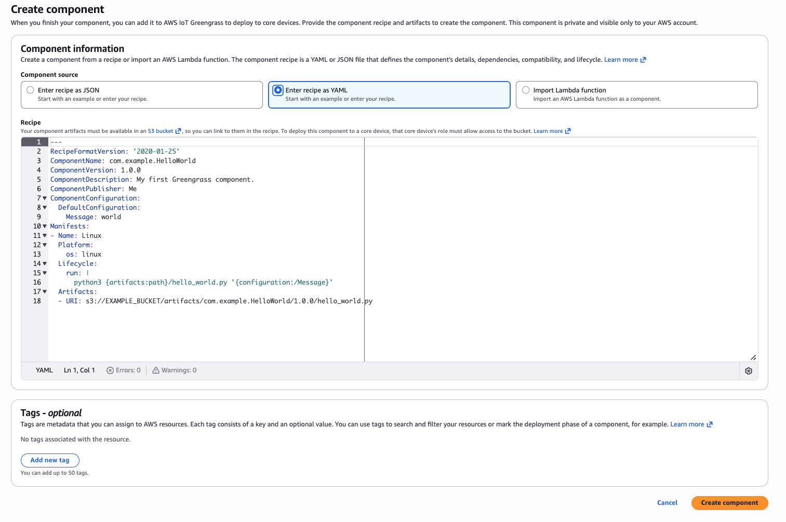
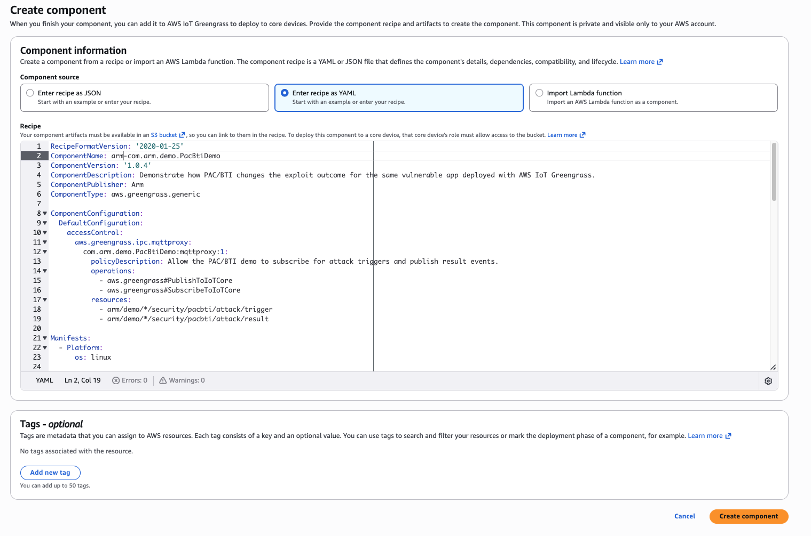
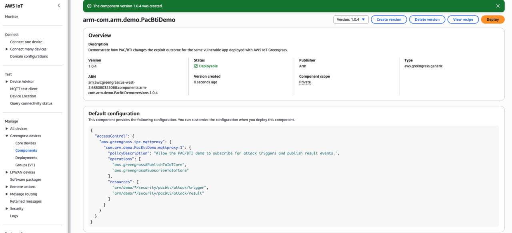

## Create a custom component to test PAC/BTI 

In this section, you'll create an AWS IoT Greengrass custom component that uses an artifact package to test PAC/BTI support on target Arm devices.

### Upload the component artifact to Amazon S3

Create an Amazon S3 bucket and upload the component artifact:

1. In the AWS Console, go to **S3**.



2. Create a bucket and give it a name. Keep the default settings for this tutorial.



3. Select **Create bucket**.



4. Record the bucket name. You'll use it in the YAML recipe.

5. On your local machine, clone the asset repository:

```bash
cd $HOME
git clone https://github.com/DougAnsonAustinTx/pac-bti-gg-assets
cd ./pac-bti-gg-assets
```

6. In the S3 bucket view, select **Upload**. Upload the following artifact from the cloned repository:

   `arm-pac-bti-greengrass-demo-mqtt-trigger.zip`



7. Select **Add files**, choose the artifact, and then select **Upload**.



Your artifact is now available in S3. Next, create the custom Greengrass component.

### Create the custom component

Create a custom component in AWS IoT Greengrass:

1. In the AWS Console, go to **IoT Core** > **Greengrass devices** and select **Components**.

2. Select **Create component**.



3. Select **Enter recipe as YAML** and clear the default sample content.



4. Copy and paste the following YAML recipe into the editor.

{}
In the following YAML code, locate **YOUR_S3_BUCKET** and replace it with the name of the S3 bucket that you created in the previous step.
{}

```yaml
RecipeFormatVersion: '2020-01-25'
ComponentName: arm-com.arm.demo.PacBtiDemo
ComponentVersion: '1.0.4'
ComponentDescription: Demonstrate how PAC/BTI changes the exploit outcome for the same vulnerable app deployed with AWS IoT Greengrass.
ComponentPublisher: Arm
ComponentType: aws.greengrass.generic

ComponentConfiguration:
  DefaultConfiguration:
    accessControl:
      aws.greengrass.ipc.mqttproxy:
        com.arm.demo.PacBtiDemo:mqttproxy:1:
          policyDescription: Allow the PAC/BTI demo to subscribe for attack triggers and publish result events.
          operations:
            - aws.greengrass#PublishToIoTCore
            - aws.greengrass#SubscribeToIoTCore
          resources:
            - arm/demo/*/security/pacbti/attack/trigger
            - arm/demo/*/security/pacbti/attack/result

Manifests:
  - Platform:
      os: linux

    Artifacts:
      - Uri: s3://YOUR_S3_BUCKET/arm-pac-bti-greengrass-demo-mqtt-trigger.zip
        Unarchive: ZIP
        Permission:
          Read: OWNER
          Execute: OWNER

    Lifecycle:
      Install:
        RequiresPrivilege: true
        Script: |-
          set -e

          PROJECT_ROOT="{artifacts:decompressedPath}/arm-pac-bti-greengrass-demo-mqtt-trigger/arm-pac-bti-greengrass-demo"
          WORK_DIR="{work:path}"
          VENV_DIR="{work:path}/venv"

          python3 -m venv "${VENV_DIR}"
          "${VENV_DIR}/bin/python" -m pip install --upgrade pip
          "${VENV_DIR}/bin/pip" install --no-cache-dir awsiotsdk

          bash "${PROJECT_ROOT}/greengrass/install.sh" \
            "${PROJECT_ROOT}" \
            "${WORK_DIR}"

      Run:
        Script: |-
          set -e

          PROJECT_ROOT="{artifacts:decompressedPath}/arm-pac-bti-greengrass-demo-mqtt-trigger/arm-pac-bti-greengrass-demo"
          WORK_DIR="{work:path}"
          VENV_DIR="{work:path}/venv"

          BUILD_FLAVOR="$(cat "${WORK_DIR}/state/selected_flavor")"
          BINARY="${WORK_DIR}/build/${BUILD_FLAVOR}/vuln_demo"
          OUTPUT_DIR="${WORK_DIR}/results"
          THING_NAME="{iot:thingName}"
          TRIGGER_TOPIC="arm/demo/${THING_NAME}/security/pacbti/attack/trigger"
          RESULT_TOPIC="arm/demo/${THING_NAME}/security/pacbti/attack/result"


          mkdir -p "${OUTPUT_DIR}"

          echo "THING_NAME=${THING_NAME}"
          echo "TRIGGER_TOPIC=${TRIGGER_TOPIC}"
          echo "RESULT_TOPIC=${RESULT_TOPIC}"

          if [ ! -x "${VENV_DIR}/bin/python" ]; then
            echo "Virtual environment Python not found at ${VENV_DIR}/bin/python"
            exit 1
          fi

          if [ ! -x "${BINARY}" ]; then
            echo "Binary not found or not executable: ${BINARY}"
            exit 1
          fi

          export PYTHONUNBUFFERED=1

          exec "${VENV_DIR}/bin/python" "${PROJECT_ROOT}/tools/demo_runner.py" \
            --project-root "${PROJECT_ROOT}" \
            --binary "${BINARY}" \
            --build-flavor "${BUILD_FLAVOR}" \
            --output-dir "${OUTPUT_DIR}" \
            --trigger-topic "${TRIGGER_TOPIC}" \
            --result-topic "${RESULT_TOPIC}"
```

5. After you update the bucket name in the YAML, select **Create component**.



6. Confirm the custom component appears in the component list.



Your Greengrass custom component is now ready for deployment. 

## Explore the PAC/BTI tester artifact

Before deployment, look at some of the details of the PAC/BTI tester artifact that is part of the custom component. 

Start by navigating to the cloned repo:

```bash
cd $HOME/pac-bti-gg-assets
```

Next, unzip the PAC/BTI tester artifact to see the files that it contains:

```bash
unzip arm-pac-bti-greengrass-demo-mqtt-trigger.zip
cd ./arm-pac-bti-greengrass-demo
```

### Details of the PAC/BTI tester

The PAC/BTI tester is a proof-of-concept that deploys the same vulnerable C application to Armv8 and Armv9 devices through AWS IoT Greengrass. The tester then runs the same exploit attempt and records the outcome.

The intent of the PAC/BTI tester is to demonstrate that:

- an unprotected build can be exploited
- the same source built for Armv9 without branch protection remains exploitable
- the Armv9 build compiled with `-mbranch-protection=standard` blocks the exploit from reaching the attacker-controlled function

#### Invocation and execution model

The component chooses the build flavor at runtime on the target and then waits for an MQTT trigger from AWS IoT Core before it runs the attack.

Selection priority:

1. `armv9-protected` when PAC/BTI-related CPU features are detected
2. `armv9-unprotected` on `aarch64` when PAC/BTI hints are not detected
3. `armv8-unprotected` as the fallback

The selector writes its decision into `{work:path}/state/` and the Greengrass run step adds that metadata into `result.json`.

#### MQTT control plane

Default AWS IoT Core topics:

- test trigger invocation topic: `arm/demo/{iot:thingName}/security/pacbti/attack/trigger`
- test result topic: `arm/demo/{iot:thingName}/security/pacbti/attack/result`

When the component starts, it publishes a `ready` event on the result topic. A user or test harness then publishes a trigger on the trigger topic. The component then runs the exploit and publishes the JSON result to the result topic.

Example trigger payload:

```json
{
  "action": "run_attack",
  "request_id": "demo-001"
}
```

#### PAC/BTI tester directory layout

The PAC/BTI tester project has the following layout:

```text
arm-pac-bti-greengrass-demo/
├── README.md
├── build/
│   ├── build_demo.sh
│   └── detect_capabilities.sh
├── docs/
│   └── deployment_notes.md
├── greengrass/
│   ├── com.arm.demo.PacBtiGreengrassDemo-1.0.0.yaml
│   ├── install.sh
│   ├── run.sh
│   └── select_flavor.sh
├── src/
│   └── vuln_demo.c
└── tools/
    ├── demo_runner.py
    ├── exploit.py
    └── render_results.py
```


#### Example result JSON

The result payload includes runtime flavor selection details and the trigger metadata that initiated the attack run.

```json
{
  "runtime_selection": {
    "selected_flavor": "armv9-protected",
    "selection_reason": "PAC/BTI-related CPU features detected",
    "detected_arch": "aarch64",
    "detected_features": ["bti", "paca"]
  },
  "trigger": {
    "source_topic": "arm/demo/myThing/security/pacbti/attack/trigger",
    "payload": {
      "action": "run_attack",
      "request_id": "demo-001"
    }
  }
}
```

## What you've accomplished and what's next

You've now created an AWS IoT Greengrass custom component and connected it to the Amazon S3-hosted artifact. You also learned how the PAC/BTI test works.

Next, you'll deploy the component to both Greengrass core devices.