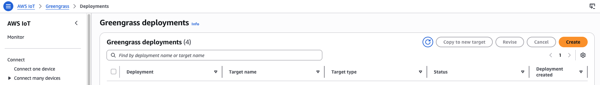
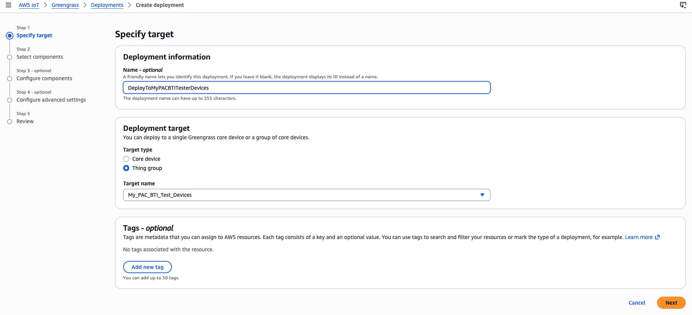
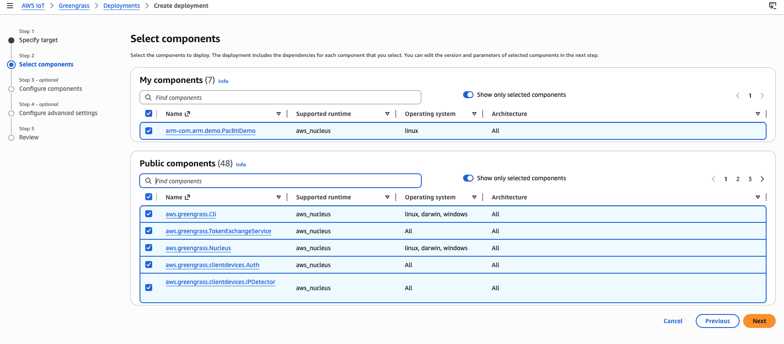
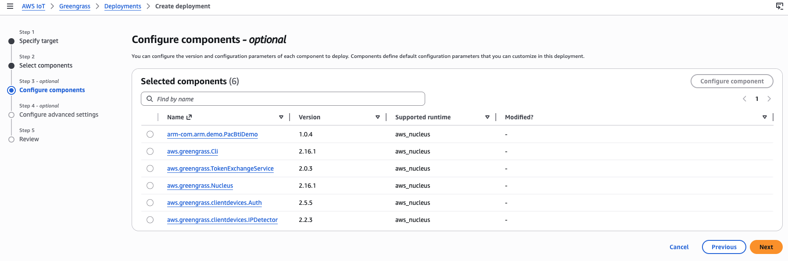
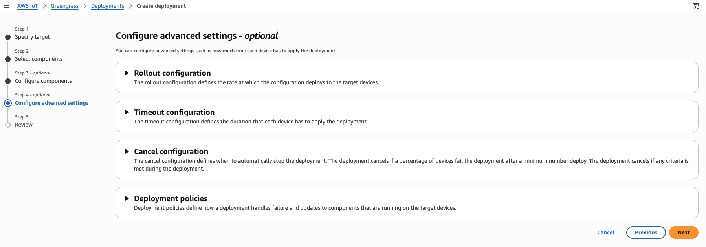
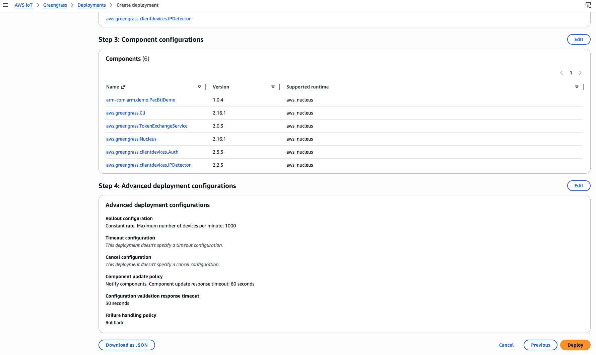
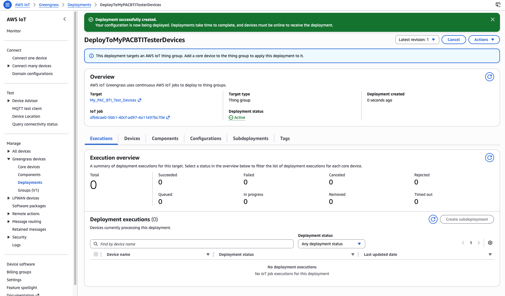

### Introduction

In this section, you use a Greengrass thing group to deploy a set of components, including your PAC/BTI test component, to both Greengrass core devices.

### Create Deployment

1. In the AWS Console, go to **IoT Core** -> **Greengrass** -> **Deployments**, then select **Create**.

2. Name your deployment and select the thing group `My_PAC_BTI_Test_Devices`, then select **Next**.

3. Select **Next**.

4. Select **Next**.

5. Select **Next**.

6. Scroll down and select **Deploy**.

7. Once deployed, Greengrass installs and prepares the custom component on each PAC/BTI test device (Thor and RPi5). Wait until the **Execution overview** shows **2** successful targets.

When both devices show successful deployment, you're ready to run PAC/BTI tests on each device.

### What we learned

In this section, you created a Greengrass deployment that targeted the thing group containing both PAC/BTI test devices. The deployment installed the PAC/BTI custom component by following the YAML recipe you defined.