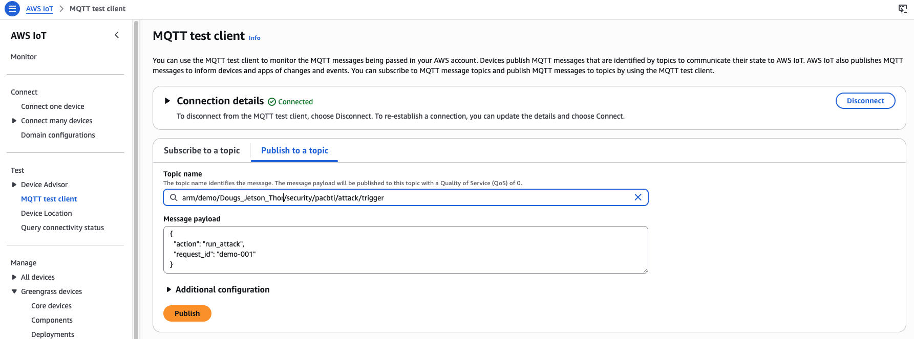

## Use MQTT to test PAC/BTI support

In this section, you'll run a test through the AWS IoT Core MQTT test client to check PAC/BTI availability on each platform.

### Run the PAC/BTI test on the Thor device

Test the Thor device to see whether the exploit is successful on a device with PAC/BTI capabilities.

1. In the AWS Console, go to **IoT Core** > **Greengrass devices** > **Core devices** and record both core device names.


2. In the AWS Console, open **IoT Core** > **MQTT test client** and select **Subscribe to a topic**.

3. For **Topic filter**, enter the following topic:

```
arm/demo/+/security/pacbti/attack/result
```

4. Select **Subscribe**.


5. On the same page, select the **Publish to a topic** tab.

6. For **Topic name**, enter the following, replacing **YOUR_CORE_DEVICE_NAME** with the name of your Jetson Thor device:

```
arm/demo/YOUR_CORE_DEVICE_NAME/security/pacbti/attack/trigger
```

7. Set the **Message payload**:

```json
{
  "action": "run_attack",
  "request_id": "demo-001"
}
```

8. Select **Publish**.



### Review the result for the Thor device

In the subscriptions area of the MQTT test client window, you should see results similar to the following for your Thor device. The exploit fails as expected due to the presence of PAC/BTI capabilities:

```output
{
  "binary": "/greengrass/v2/work/arm-com.arm.demo.PacBtiDemo/build/armv9-protected/vuln_demo",
  "build_flavor": "armv9-protected",
  "device": "thor",
  "executed_at": "2026-04-30T21:33:18.796870+00:00",
  "exploit_run": {
    "returncode": 252,
    "stderr": "",
    "stdout": ""
  },
  "exploit_succeeded": false,
  "interpretation": "Exploit did not reach malicious_success(); on PAC/BTI builds a crash or early termination is expected.",
  "machine": "aarch64",
  "marker_found": false,
  "normal_run": {
    "returncode": 0,
    "stderr": "",
    "stdout": "Usage: vuln_demo <hex_payload>\n"
  },
  "protections": {
    "has_autiasp": true,
    "has_bti": true,
    "has_paciasp": true,
    "has_retaa": true
  },
  "trigger": {
    "payload": {
      "action": "run_attack",
      "request_id": "demo-001"
    },
    "source_topic": "arm/demo/YOUR_THOR_DEVICE_NAME/security/pacbti/attack/trigger"
  }
}
```

This result indicates that the Thor device (Armv9) reports PAC and BTI capabilities.

### Run the PAC/BTI test on the Raspberry Pi 5 device

Now test the RPi5 to see whether the exploit is successful on a device without PAC/BTI capabilities. 

1. Under **Publish to a topic**, set the **Topic name** as follows. Replace **YOUR_CORE_DEVICE_NAME** with your RPi5 core device name:

```
arm/demo/YOUR_CORE_DEVICE_NAME/security/pacbti/attack/trigger
```

2. Set the **Message payload**:

```json
{
  "action": "run_attack",
  "request_id": "demo-001"
}
```

3. Select **Publish**.


### Review the result for the Raspberry Pi 5 device

Your output should be similar to the following, indicating a successful exploit as expected:

```output
{
  "binary": "/greengrass/v2/work/arm-com.arm.demo.PacBtiDemo/build/armv8-unprotected/vuln_demo",
  "build_flavor": "armv8-unprotected",
  "device": "rpi5-desktop-16",
  "executed_at": "2026-04-30T21:33:53.526756+00:00",
  "exploit_run": {
    "returncode": 0,
    "stderr": "",
    "stdout": ""
  },
  "exploit_succeeded": true,
  "interpretation": "Exploit reached malicious_success()",
  "machine": "aarch64",
  "marker_found": true,
  "normal_run": {
    "returncode": 0,
    "stderr": "",
    "stdout": "Usage: vuln_demo <hex_payload>\n"
  },
  "protections": {
    "has_autiasp": false,
    "has_bti": false,
    "has_paciasp": false,
    "has_retaa": false
  },
  "trigger": {
    "payload": {
      "action": "run_attack",
      "request_id": "demo-001"
    },
    "source_topic": "arm/demo/YOUR_RPI5_DEVICE_NAME/security/pacbti/attack/trigger"
  }
}
```

This result indicates the RPi5 device (Armv8) does not report PAC and BTI capabilities. The device is potentially vulnerable to control-flow attacks that PAC/BTI inhibits on Armv9.

### What you've accomplished

You've now used AWS IoT Greengrass to deploy and trigger a custom PAC/BTI validation component across two Arm devices. The Jetson Thor (Armv9) reported PAC and BTI protections active and blocked the exploit. The RPi5 (Armv8) reported no PAC or BTI support and the exploit succeeded, confirming the architectural difference between the two platforms.