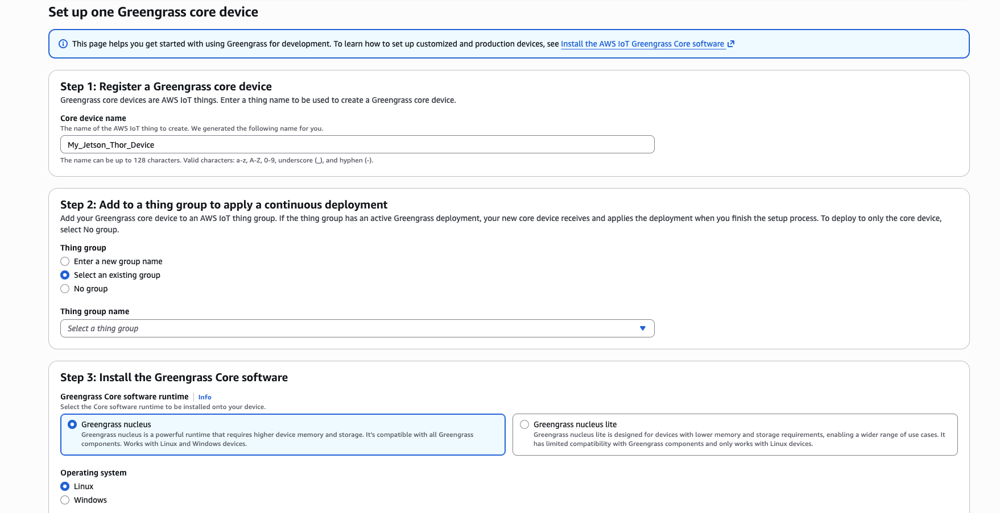

### Introduction

In this section, you prepare a Jetson Thor device as an AWS IoT Greengrass core device. Jetson Thor is an Armv9 platform with PAC/BTI support, so it serves as the positive comparison platform for this test.

### Basic OS Install

To install NVIDIA JetPack 7.1 on Jetson Thor, follow this guide:
https://www.youtube.com/watch?v=IpiZyoqQTl8


### Install Java

Open a terminal on your Jetson Thor and run:

```bash
sudo apt update
sudo apt -y dist-upgrade
sudo apt install -y default-jdk
```

Confirm that Java is available:

```bash
java --version
```

Your output should resemble:

```output
openjdk 25.0.2 2026-01-20
OpenJDK Runtime Environment (build 25.0.2+10-Ubuntu-124.04)
OpenJDK 64-Bit Server VM (build 25.0.2+10-Ubuntu-124.04, mixed mode, sharing)
```

### Install AWS IoT Greengrass

Before you complete these steps, create an AWS access key pair for the account you will use. You can follow this short video (or ask your AWS administrator):
https://www.youtube.com/watch?v=QzTkIfQNsVw

1. Open the AWS Console and go to **IoT Core** -> **Greengrass devices** -> **Core devices**.

2. Select **Set up core device** -> **Set up one core device**.

3. Enter a core device name that is different from your RPi5 device.

4. Select **Select an existing group** and choose `My_PAC_BTI_Test_Devices`.

5. Select **Greengrass nucleus** for installation.

6. Select **Linux**.



7. Select **Set up a device by downloading and running an installer locally on device**.

8. Follow the generated installer instructions on the Jetson Thor and authenticate with your AWS credentials.


9. Confirm registration by selecting **View core devices**.
You should see the Jetson Thor listed with recent activity.

### What's next

Your Jetson Thor is now set up as an AWS IoT Greengrass core device. Next, you'll create the custom component used to test PAC/BTI on both devices.