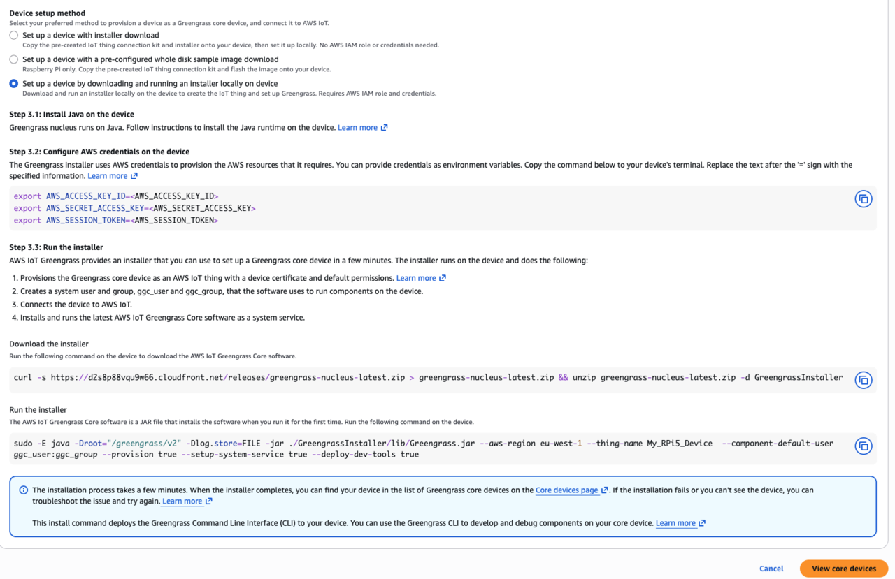

## Configure a Raspberry Pi 5 as a negative comparison platform

In this section, you'll prepare a Raspberry Pi 5 (RPi5) device to become an AWS IoT Greengrass core device. The RPi5 uses a Cortex-A76 processor, which is Armv8.2-A. Because PAC requires Armv8.3-A and BTI requires Armv8.5-A, the RPi5 does not support either feature. The device serves as the negative comparison platform in this test.

### Install Raspberry Pi OS

Install the latest Raspberry Pi OS on your RPi. For instructions, see the [Getting started - Raspberry Pi documentation](https://www.raspberrypi.com/documentation/computers/getting-started.html).


### Install Java

Open a terminal on your RPi and run:

```bash
sudo apt update
sudo apt -y dist-upgrade
sudo apt install -y default-jdk
```

Confirm that Java is available:

```bash
java --version
```

The output is similar to:

```output
openjdk 21.0.10 2026-01-20
OpenJDK Runtime Environment (build 21.0.10+7-Debian-1deb13u1)
OpenJDK 64-Bit Server VM (build 21.0.10+7-Debian-1deb13u1, mixed mode, sharing)
```

### Install AWS IoT Greengrass

Before you complete these steps, create an AWS access key pair for the account you'll use. You can follow the [AWS IoT Greengrass](/install-guides/aws-greengrass-v2/) install guide or ask your AWS administrator.

To install AWS IoT Greengrass:

1. Open the AWS Console and go to **IoT Core** > **Greengrass devices** > **Core devices**.

2. Select **Set up core device** > **Set up one core device**.

3. Enter a name for your core device.

4. For **Thing group**, select **Enter a new group name**.

   Use `My_PAC_BTI_Test_Devices` as the **Thing group name**. Save the name because you'll reuse this group for your Armv9 device in the next section.

5. For **Greengrass Core software runtime**, select **Greengrass nucleus** for installation.

6. For **Operating system**, select **Linux**.


7. For **Device setup method**, select **Set up a device by downloading and running an installer locally on device**.

8. Follow the generated installer instructions on the RPi5 and authenticate with the AWS credentials that you created.



9. Confirm registration by selecting **View core devices**.

   You should see your RPi5 listed with recent activity.

## What you've accomplished and what's next

You've now set up your RPi5 device as an AWS IoT Greengrass core device as the negative comparison platform for PAC/BTI tests. 

Next, you will set up your Armv9 PAC/BTI positive test platform.