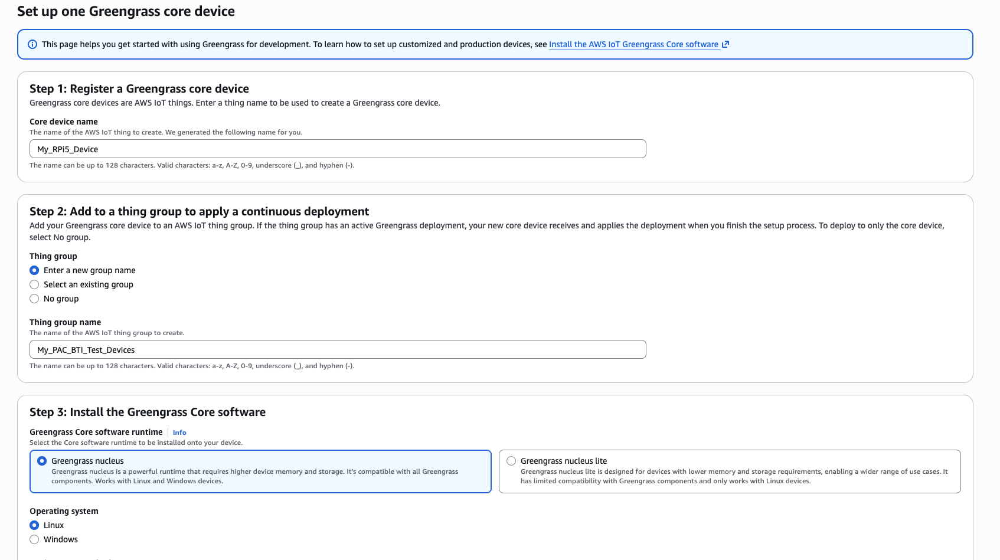

### Introduction

In this section, you prepare an RPi5 device to become an AWS IoT Greengrass core device. The RPi5 is a suitable Armv8 platform where PAC/BTI instruction support is not available, so it serves as the negative comparison platform for this test.

### Basic OS Install

To install the latest Raspberry Pi OS on your RPi, follow the Raspberry Pi setup guide:
https://www.raspberrypi.com/documentation/computers/getting-started.html


### Install Java

Open a terminal on your RPi and run:

```bash
sudo apt update
sudo apt -y dist-upgrade
sudo apt install -y default-jdk
```

Confirm that Java is available:

```bash
java --version
```

Your output should resemble:

```output
openjdk 21.0.10 2026-01-20
OpenJDK Runtime Environment (build 21.0.10+7-Debian-1deb13u1)
OpenJDK 64-Bit Server VM (build 21.0.10+7-Debian-1deb13u1, mixed mode, sharing)
```

### Install AWS IoT Greengrass

Before you complete these steps, create an AWS access key pair for the account you will use. You can follow this short video (or ask your AWS administrator):
https://www.youtube.com/watch?v=QzTkIfQNsVw

1. Open the AWS Console and go to **IoT Core** -> **Greengrass devices** -> **Core devices**.

2. Select **Set up core device** -> **Set up one core device**.

3. Enter a name for your core device.

4. Select **Enter a new group name**.
Use `My_PAC_BTI_Test_Devices` and save it because you'll reuse this group for your Armv9 device in the next section.

5. Select **Greengrass nucleus** for installation.

6. Select **Linux**.



7. Select **Set up a device by downloading and running an installer locally on device**.

8. Follow the generated installer instructions on the RPi5 and authenticate with the AWS credentials you created.


9. Confirm registration by selecting **View core devices**.
You should see your RPi5 listed with recent activity.

### What's next

Your RPi5 is now set up as an AWS IoT Greengrass core device. Next, you will set up your Armv9 PAC/BTI positive test platform.