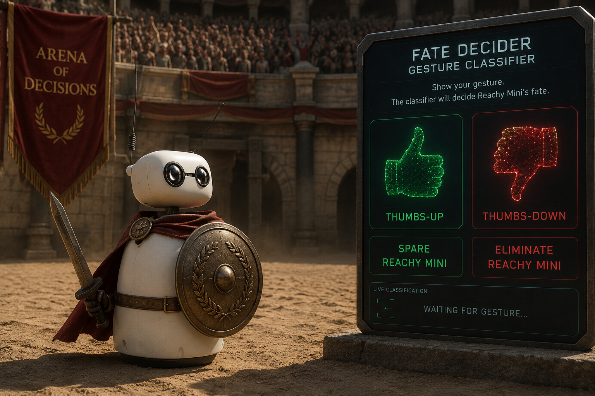

## Reachy Gladiator - Decide Reachy's fate

In this Learning Path, you'll build a distributed edge AI application where a Raspberry Pi runs local gesture inference and sends robot motion commands to a simulated Reachy Mini. The app follows a gladiator arena theme: Reachy performs a move, and you give a thumbs-up for victory or thumbs-down for defeat to trigger a victory or defeat reaction.



## What is Reachy Mini?

Reachy Mini is a small open robotics platform from Pollen Robotics. It's designed for expressive head, antenna, and body motion, and it can be controlled with Python using the Reachy Mini SDK. The Reachy Mini Wireless version includes an onboard Arm-powered Raspberry Pi 4 Compute Module, and the Lite version is operated with external compute such as a Raspberry Pi, DGX Spark, or a Mac or PC.

Reachy can also be simulated using MuJoCo software. Most developers don't have a physical Reachy Mini robot on their desk, and it's often useful to develop software before hardware is available. Extrapolating from Reachy to more industrial robotics, it's also important to test applications in simulation in advance for safety.

{}
If using a physical Reachy Mini, exercise caution and ensure the robot is used in an area with appropriate space. The robot has moving parts and could be a health and safety risk. You're responsible for your safety and the safety of others around you when using physical robotic devices.
{}

## What you'll build

The workflow of this Learning Path is split across two machines:

Laptop/Desktop: macOS, Linux, or Windows with WSL2
  - Runs the Reachy Mini daemon
  - Runs the MuJoCo simulation
  - Displays simulated Reachy movement
  - Displays the Pi-hosted dashboard at `http://<pi-ip-address>:8042`

Raspberry Pi 5: Raspberry Pi OS
  - Captures frames from a USB webcam
  - Runs the Edge AI application (local MediaPipe gesture recognition)
  - Serves a dashboard on port 8042
  - Sends robot movement commands to the simulation host daemon

This split is a common edge/physical AI pattern:

- A small edge device handles sensors and inference close to the user.
- A robot API or daemon receives movement commands.
- A dashboard gives visibility into the live state of the system.
- Digital twin simulation reduces hardware access as a blocker and allows for safer development.

This is similar to how larger industrial robotics systems are often built.
Keeping perception, robot control, and observability as separate pieces makes it easier to test, replace, and deploy parts of the system independently.

## What the app does

The app is called Reachy Gladiator. Reachy (in simulation or otherwise) performs a randomly-chosen scripted gladiator move. You provide a thumbs up for victory, or a thumbs down for defeat. Victory makes Reachy celebrate, and defeat makes Reachy react sadly.

This Learning Path starts from the complete [`reachy_gladiator_lp`](https://github.com/matt-cossins/reachy_gladiator_lp) project, so that you don't have to create every file from scratch. The simulation host needs only a launcher script, but the Raspberry Pi will clone and run the full project. You'll inspect the different parts of the system so you can recreate your own apps running on Reachy or in simulation.

The Reachy Gladiator app runs a repeated loop:

1. Start with a 10-second preparing countdown
2. Randomly pick one gladiator move
3. Repeat the selected move three times
4. Return Reachy to a neutral pose
5. Watch for a thumbs up or a thumbs down
6. Run a victory or defeat reaction
7. Repeat with another move

There are four preset moves:

- `Salute`

- `Sword Swing`

- `Shield Up`

- `Battle Cry`


The app shuffles all four moves and performs each once before any move repeats. When the bag is empty, it reshuffles and avoids repeating the same move at the shuffle boundary.

## Compatible terminals for this project

The commands in this learning path use a Bash-style shell and work directly on macOS and Linux.

On Windows, use WSL2 with an Ubuntu distribution for the simulation host commands. This keeps the commands almost identical to the macOS and Linux flow:

- Use the WSL terminal for `python3`, `source .venv/bin/activate`, and `./scripts/start_sim.sh`.
- Keep the browser on Windows if you prefer; open the Pi dashboard from any browser that can reach the Raspberry Pi.
- If the Pi can't reach a daemon running inside WSL2, check Windows firewall and WSL networking. WSL2 uses virtualized networking, so inbound access from another device on your LAN might require Windows port forwarding.

In the rest of this learning path, you'll see common Bash commands and note the one IP-address command that differs by host operating system.

## Project structure

The simulation host doesn't need the full project checkout. In the next
section, you'll download only the simulation launcher script on that machine.

You'll clone the full `reachy_gladiator_lp` project on the Raspberry Pi later.

The key files are:

```text
reachy_gladiator_lp/
├── pyproject.toml
├── scripts/
│   ├── start_sim.sh
│   ├── setup_pi.sh
│   ├── run_pi_app.sh
│   └── check_pi_camera.sh
└── reachy_gladiator_lp/
    ├── main.py
    ├── camera.py
    ├── gesture.py
    ├── moves.py
    ├── assets/
    │   └── gesture_recognizer.task
    └── static/           # dashboard HTML, CSS, JavaScript, and media
```

## What you've learned and what's next

You learned what Reachy Mini is, why simulation is useful for edge/physical AI development, and how the app splits work between a simulation host and a Raspberry Pi. 

Next, you'll start the simulation host with a lightweight launcher script.
