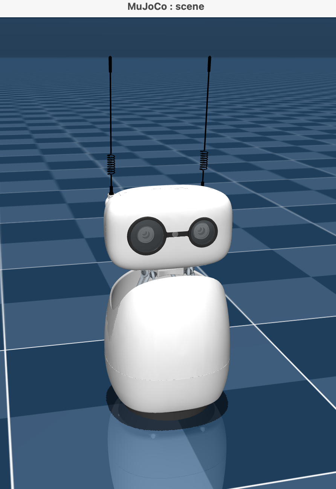

## What is MuJoCo?

MuJoCo is an open-source physics engine from Google DeepMind, used for simulating articulated bodies such as robots. It can model joints, contacts, gravity, and rigid-body dynamics, which makes it useful for robotics prototyping, control development, reinforcement learning, and safety testing before hardware is available.

In this project, MuJoCo lets you see Reachy Mini move without owning a physical
Reachy. It is not a perfect replacement for hardware: real cameras, lighting,
network latency, calibration, mechanical tolerances, and safety constraints
still matter. It is best treated as a fast development and validation tool
before moving to physical testing.

## Create or activate a simulation environment

The simulation host does not need the full `reachy_gladiator_lp` project. It
only needs the Reachy Mini SDK with MuJoCo support and the `start_sim.sh`
launcher script.

On the machine that will run the simulation, create a small workspace and a
Python virtual environment:

```bash
mkdir -p ~/reachy_projects/reachy_sim/scripts
cd ~/reachy_projects/reachy_sim
python3 -m venv .venv
source .venv/bin/activate
python -m pip install --upgrade pip
```

Install the Reachy Mini SDK with the MuJoCo simulation dependencies:

```bash
python -m pip install --upgrade "reachy-mini[mujoco]"
```

The `mujoco` extra is required for `--sim`. If you install only `reachy-mini`, the daemon can start but simulation fails with `MuJoCo is not installed`.

If you already have a working Reachy Mini simulation environment, you can activate that environment instead.

Download the simulation launcher script from the project repository:

```bash
curl -L https://raw.githubusercontent.com/matt-cossins/reachy_gladiator_lp/main/scripts/start_sim.sh -o scripts/start_sim.sh
chmod +x scripts/start_sim.sh
```

`curl` is available by default on macOS and is commonly available on Linux and
WSL distributions. If your Linux environment does not include it, install it
with your package manager.

## Start the Reachy Mini simulation

Start the daemon and MuJoCo simulation from the simulation workspace:

```bash
cd ~/reachy_projects/reachy_sim
source .venv/bin/activate
REACHY_SIM_PORT=18000 ./scripts/start_sim.sh
```

This can take several minutes to start up. Leave this terminal running after it completes and boots the simulation view.




The script starts the Reachy Mini daemon with simulation enabled, binds FastAPI to `0.0.0.0`, and disables localhost-only mode so the Raspberry Pi can connect. This Learning Path uses port `18000`.

The daemon is the network boundary between the Pi app and the simulated robot.
The Pi does not run MuJoCo. It connects to this daemon and sends the same SDK
motion commands that it would send to a physical Reachy daemon.

The script runs a command equivalent to:

```bash
mjpython -m reachy_mini.daemon.app.main \
  --sim \
  --fastapi-host 0.0.0.0 \
  --fastapi-port 18000 \
  --no-localhost-only
```

On macOS, `mjpython` is often needed because MuJoCo opens a native graphics
window. On Linux, regular `python` is usually enough. The provided script picks
an appropriate runtime when it can.

### Troubleshooting the simulation

If the script reports that address `0.0.0.0:18000` is already in use, another daemon or server is already using port `18000`. 

Find the process:

```bash
lsof -nP -iTCP:18000 -sTCP:LISTEN
```

If the process is an old Reachy daemon, stop it with `Ctrl+C` in its terminal. If you need to terminate it from the command line, replace `<pid>` with the process ID from `lsof`:

```bash
kill <pid>
```

You can also run the simulation on a different port:

```bash
REACHY_SIM_PORT=18001 ./scripts/start_sim.sh
```

If you change the simulation port, use the same port when configuring the Pi app later:

```bash
REACHY_GLADIATOR_DAEMON_PORT=18001 ./scripts/run_pi_app.sh <simulation-host-ip>
```

## Find the simulation host IP address

Use the tab for your simulation host operating system.

{}
On macOS, `en0` is usually Wi-Fi. If you use Ethernet or another network interface, the device name might be different.
{}


  
ipconfig getifaddr en0
  
  
hostname -I
  
  
hostname -I
  


{}
If the Pi cannot connect later, check that the simulation machine and Raspberry Pi are on the same network and that the local firewall allows inbound connections to port `18000`.
{}

## What you learned and what is next

You created a simulation environment, started the Reachy Mini MuJoCo daemon on a network-accessible port, and found the host IP address the Raspberry Pi needs when it connects to the simulated robot. You should now see a simulated Reachy robot in MuJoCo, and be ready to prepare the Raspberry Pi.
