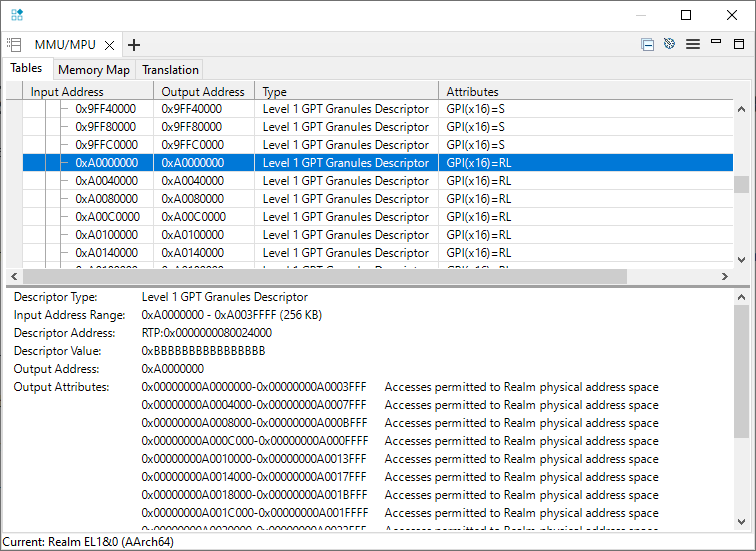
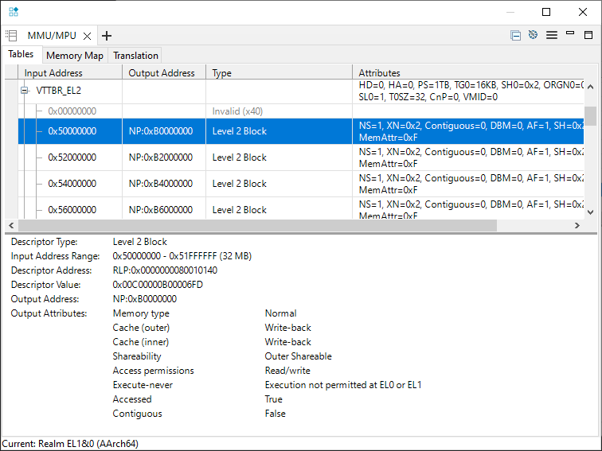
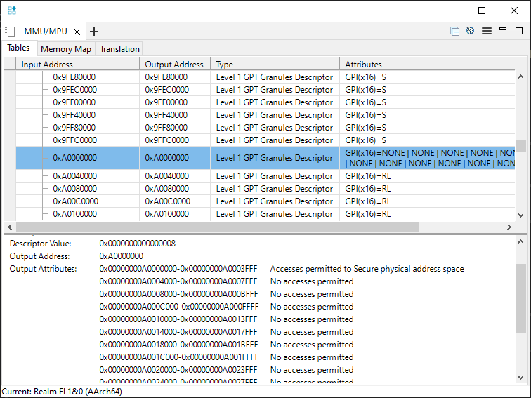
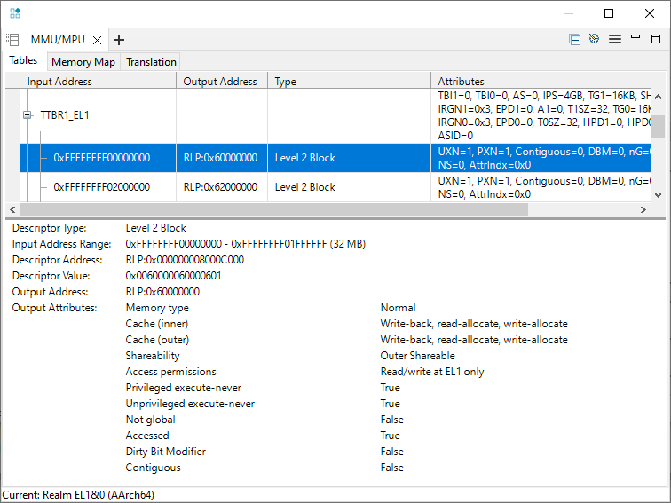

---
# User change
title: Bare-metal example

weight: 3 # 1 is first, 2 is second, etc.

# Do not modify these elements
layout: "learningpathall"
---
To start, let us consider a bare-metal example that illustrates the `Realm Management Extension` (`RME`) architectural feature of an Arm processor necessary to implement a CCA system.

The full example is provided with Arm Development Studio, 2023.0 and later. It executes on the `Arm Architecture Envelope Model (AEM)` Fixed Virtual Platform (FVP), supplied with Development Studio.

The example also illustrates debug features of the Arm Debugger to support such a system.

## Import the example

Open the Arm Development Studio IDE. Navigate to `File` > `Import...` > `Arm Development Studio` > `Examples & Programming Libraries` > `Examples` > `Armv9 Bare-Metal`, and select the `RME` example. Using the text filter at the top of the pane can help locate the example. Click `Finish` to import.

Alternatively extract the example on the command line from the `<install_dir>\examples\Bare-metal_examples_Armv9.zip` archive. For interactive debug (see later) using the IDE is recommended.

Though the project is provided pre-compiled, you can also rebuild with the `Build` icon, or the `make` command from the command line.

See the supplied with `readme.html` for more information.

## Load the example

There is a supplied `gpc_el10_rl_FVP.launch` debug connection which has all necessary settings configured.

Double-click on the file to open.

The `Arm Architecture Envelope Model (AEM)` is a generic Arm implementation, which can be configured appropriately to enable Arm architectural features.

The FVP is launched with appropriate settings, including:
```command
-C cluster0.has_arm_v9-0=1 -C cluster0.rme_support_level=2 -C cluster0.has_16k_granule=1
```

Click `Debug` to launch the FVP and load the image.

Execution can be controlled by the `Debug Control` pane icon bar (eg `Step Instruction` ), the command line (`stepi`), or short-cut keys (`F5`).

## Understand the example


### EL3

The example sets up a `Granule Protection Table` (`GPT`) that defines the access permissions of various 16KB `granules` of memory. These granules are the smallest memory size that can be individually protected by RME.

These settings are made at `EL3`, and so will be invisible to any application executing within a Realm.

The location of this table is set in the [Granule Protection Table Base Register (GPTBR_EL3)](https://developer.arm.com/documentation/ddi0601/2023-06/AArch64-Registers/GPTBR-EL3--Granule-Protection-Table-Base-Register).

The high level configuration is defined in the [Granule Protection Check Control Register (GPCCR_EL3)](https://developer.arm.com/documentation/ddi0601/2023-06/AArch64-Registers/GPCCR-EL3--Granule-Protection-Check-Control-Register--EL3-).

Notable fields in this register are:

* `Granule Protection Check Enable (GPC)` bit
* `Level 0 GPT Size (L0GPTSZ)` field, defining the size of the level 0 entries in this table, 1GB in this example. This will further be separated in the L1 table.
* `Physical Granule Size (PGS)` field, which in this example defines the granule size as 16KB (note that this matches the AEM configuration).
* `Protected Physical Address Size (PPS)` field, which defines the size of the `Realms` in your system (4GB in this example).

The `L0` table is at `0x80018000` and defines a flat memory translation (at `EL3`), but with access permissions defined in an `L1` table.

The `L1 table` defines permissions for each 16KB granule.

Use the Arm Debugger `MMU/MPU` pane to observe these attributes:




### EL2

The `EL2` translation table provides an `Intermediate Physical Address` (`IPA`), which is the Physical Address (from the Realm point of view) that addresses will be translated to.

This table is located by the [Virtualization Translation Table Base Register (VTTBR-EL2)](https://developer.arm.com/documentation/ddi0601/latest/AArch64-Registers/VTTBR-EL2--Virtualization-Translation-Table-Base-Register).

The example maps `0x5xxxxxxx` to the Physical Address `0x8xxxxxxx`.



### EL1 (and EL0)

The code moves to `EL1` (Realms are only defined for `EL1` and `EL0`), and translation tables mapping virtual addresses to the EL2 memory map are set up.

The debugger uses [address space prefixes](https://developer.arm.com/documentation/101471/latest/Arm-Debugger-commands/Conformance-and-usage-rules-for-Arm-Debugger-commands/Address-space-prefixes) to help understand how these addresses are used.

For the addresses used in the example:

```command
mmu translate EL1RL:0xD0000020
```
outputs:
```output
Realm EL1&0 Stage 1 (AArch64):
  EL1RL:0x00000000D0000020 -> RLP:0x0000000050000020
Realm EL1&0 Stage 2 (AArch64):
  RLP:0x0000000050000020 -> NP:0x00000000B0000020
```

These addresses can be read from the memory pane or the command line:
```command
x/g EL1RL:0xD0000020
x/g NP:0xB0000020
```
outputs:
```output
EL1RL:0x00000000D0000020:  0x0000000011111111
NP:0x00000000B0000020:  0x0000000011111111
```

Similarly:

```command
mmu translate EL1RL:0xffffffff00000100
```
outputs:
```output
Realm EL1&0 Stage 1 (AArch64):
  EL1RL:0xFFFFFFFF00000100 -> RLP:0x0000000060000100
Realm EL1&0 Stage 2 (AArch64):
  RLP:0x0000000060000100 -> RLP:0x00000000A0000100
```

## Break the example

The reference example successfully completes. We can make changes to the translation tables to see the effect of the protection that RME provides.

Disconnect the debugger, and reconnect.

Before execution, change the translation table entry defining Realms access for the 16KB region at `0xA0000000`.

For example, to set for Secure access only, set that least-significant half-byte to 0x8:
```command
memory set 0x80024000 64 0x8
```

Set a breakpoint on the `STR` instruction that writes to `0xFFFFFFFF00000100`, which translates to `0xA0000100`:

```asm
    MOV64 X1, 0xFFFFFFFF00000100 // mapped to 0xA0000100 RL via IPA 0x60000100
    MOV32 X0, 0x22222222
*   STR X0, [X1]
```
And run to there. Observe that physical address requires secure access permissions:



However `EL1` (inside the Realm) is not aware of this change.



Execute the `STR` instruction, and a memory exception correctly occurs, and the code branches to the vector table (not configured).

```output
Execution stopped in EL1h mode at EL1RL:0x0000000000000200
```
{}
The example has not configured the vector table, and so there will also be a debugger access error at the vector table. This can be ignored for the purposes of understanding RME behavior.
{}
