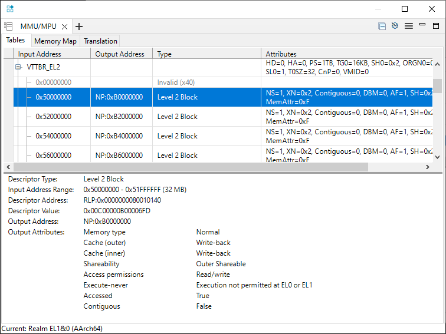

---
# User change
title: Bare-metal example

weight: 3 # 1 is first, 2 is second, etc.

# Do not modify these elements
layout: "learningpathall"
---
Consider a bare-metal example that illustrates the Realm Management Extension (RME) architectural feature of an Arm processor necessary to implement a CCA system.

The full example is provided with Arm Development Studio, 2023.0 or later. It executes on the Arm Architecture Envelope Model (AEM) Fixed Virtual Platform (FVP), supplied with Development Studio.

The example also illustrates features of the Arm Debugger to enable you to debug such a system.

## Import the example

Open the Arm Development Studio IDE. Navigate to File > Import... > Arm Development Studio > Examples & Programming Libraries > Examples > Armv9 Bare-Metal, and select the RME example. Using the text filter at the top of the pane can help locate the example. Click Finish to import.

Alternatively, extract the example on the command line from the <install_dir>(\examples\Bare-metal_examples_Armv9.zip archive. For interactive debug (see later) using the IDE is recommended.

Though the project is provided pre-compiled, you can also rebuild with the Build icon, or the `make` command from the command line.

See the supplied readme.html for more information.

## Load the example

There is a supplied gpc_el10_rl_FVP.launch debug connection which has all the necessary settings configured.

Double-click on the .launch file to open.

The Arm Architecture Envelope Model (AEM) is a generic Arm implementation, which can be configured appropriately to enable Arm architectural features.

The model is launched with appropriate settings to implement full RME support, including:
```command
-C cluster0.has_arm_v9-0=1 -C cluster0.rme_support_level=2 -C cluster0.has_16k_granule=1
```

Click `Debug` to launch the FVP and load the image.

Execution can be controlled by the Debug Control view icon bar, e.g., Step Instruction, the command line (`stepi`), or short-cut keys (F5).

## Understand the example


### EL3

The example sets up a Granule Protection Table (GPT) that defines the access permissions of various 16KB granules of memory. These granules are the smallest memory size that can be individually managed.

These settings are made at EL3 running in Root world, and so will be invisible to any application executing within a Realm.

The location of this table is set in the [Granule Protection Table Base Register (GPTBR_EL3)](https://developer.arm.com/documentation/ddi0601/2023-06/AArch64-Registers/GPTBR-EL3--Granule-Protection-Table-Base-Register).

The high level configuration is defined in the [Granule Protection Check Control Register (GPCCR_EL3)](https://developer.arm.com/documentation/ddi0601/2023-06/AArch64-Registers/GPCCR-EL3--Granule-Protection-Check-Control-Register--EL3-).

Notable fields in this register are:

* Granule Protection Check Enable (GPC) bit
* Level 0 GPT Size (L0GPTSZ) field, defining the size of the level 0 entries in this table, which is 1GB in this example. This will further be separated in the L1 table.
* Physical Granule Size (PGS) field, which in this example defines the granule size as 16KB (note that this matches the AEM configuration).
* Protected Physical Address Size (PPS) field, which defines the size of the Realms in your system (4GB in this example).

The L0 table is at 0x80018000 and defines a flat memory translation (at EL3), but with access permissions defined in an L1 table.

The L1 table defines permissions for each 16KB granule.

Use the Arm Debugger MMU/MPU pane to observe these attributes:


### EL2

The EL2 translation table provides an Intermediate Physical Address (IPA), which is the Physical Address (from the Realm point of view) that addresses will be translated to. This would be the role of a Hypervisor in a realistic implementation.

This table is located by the [Virtualization Translation Table Base Register (VTTBR-EL2)](https://developer.arm.com/documentation/ddi0601/latest/AArch64-Registers/VTTBR-EL2--Virtualization-Translation-Table-Base-Register).

The example maps 0x5xxxxxxx to the Physical Address 0xBxxxxxxx.



### EL1 (and EL0)

The code moves to EL1 (Realms are only defined for EL1 and EL0), and translation tables mapping virtual addresses to the EL2 memory map are set up.

The debugger uses [address space prefixes](https://developer.arm.com/documentation/101471/latest/Arm-Debugger-commands/Conformance-and-usage-rules-for-Arm-Debugger-commands/Address-space-prefixes) to help understand how these addresses are used.

For the addresses used in the example:

```command
mmu translate EL1RL:0xD0000020
```
outputs:
```output
Realm EL1&0 Stage 1 (AArch64):
  EL1RL:0x00000000D0000020 -> RLP:0x0000000050000020
Realm EL1&0 Stage 2 (AArch64):
  RLP:0x0000000050000020 -> NP:0x00000000B0000020
```

These addresses can be read from the memory pane or the command line:
```command
x/g EL1RL:0xD0000020
x/g NP:0xB0000020
```
outputs:
```output
EL1RL:0x00000000D0000020:  0x0000000011111111
NP:0x00000000B0000020:  0x0000000011111111
```

Similarly:

```command
mmu translate EL1RL:0xffffffff00000100
```
outputs:
```output
Realm EL1&0 Stage 1 (AArch64):
  EL1RL:0xFFFFFFFF00000100 -> RLP:0x0000000060000100
Realm EL1&0 Stage 2 (AArch64):
  RLP:0x0000000060000100 -> RLP:0x00000000A0000100
```

## Demonstrate the protection that RME provides

The reference example successfully completes. We can make changes to the translation tables to see the effect of the protection that RME provides.

Disconnect the debugger, and reconnect.

Before execution, change the translation table entry defining Realms access for the 16KB region at 0xA0000000.

For example, to set for Secure access only, set that least-significant half-byte to 0x8:
```command
memory set 0x80024000 64 0x8
```

Set a breakpoint on the STR instruction that writes to 0xFFFFFFFF00000100, which translates to 0xA0000100:

```asm
    MOV64 X1, 0xFFFFFFFF00000100 // mapped to 0xA0000100 RL via IPA 0x60000100
    MOV32 X0, 0x22222222
*   STR X0, [X1]
```
And run (F8) to there. Observe that the physical address (0xA0000100) requires secure access permissions:


However, the Realm (`0xFFFFFFFF00000100`) MMU is unchanged.


Execute (F5) the STR instruction, and a memory exception correctly occurs, and the code branches to the vector table (at 0x200).

```output
Execution stopped in EL1h mode at EL1RL:0x0000000000000200
```
{}
The example has not configured the Realm vector table, and so there will also be a memory access error at the vector table.

This can be ignored for the purposes of understanding RME behavior.
{}
