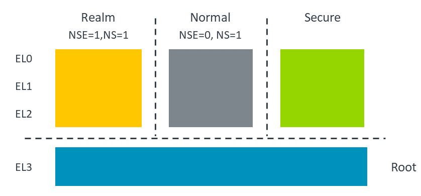

---
# User change
title: Arm Confidential Compute Architecture

weight: 2 # 1 is first, 2 is second, etc.

# Do not modify these elements
layout: "learningpathall"
---

[Arm Confidential Compute Architecture ](https://www.arm.com/architecture/security-features/arm-confidential-compute-architecture) (CCA) is a system solution consisting of hardware and software components to maximize the security of your data on devices and cloud.

CCA enhances the virtualization capabilities of your platform by separating the management of resources from access to those resources. It does this by extending the TrustZone for Cortex-A concepts of Normal world and Secure world, adding a Realm world, and an underlying Root world. A secure monitor runs in Root world and manages the transitions between these security states.

For a detailed explanation of how CCA is implemented, review the [Learn the Architecture](https://developer.arm.com/documentation/den0125/) documentation.

## Realms

The Realm Management Extension (RME) is the principal hardware Armv9-A architectural feature to enable CCA.

A Realm is an Arm CCA environment that can be dynamically allocated by the Normal world Host. The Host is the supervisory software that manages an application or Virtual Machine (VM).

The initial state of a Realm, and of the platform on which it executes, can be attested. Attestation allows the Realm owner to establish trust in the Realm. The Realm does not have to inherit the trust from the Non-secure hypervisor which controls it.

Memory can be dynamically assigned to different worlds by the MMU through Granule Protection Tables.

For a detailed explanation of RME, review the [Learn the Architecture](https://developer.arm.com/documentation/den0126) documentation.

In this learning path we will explore the basics of how Realms are managed.
