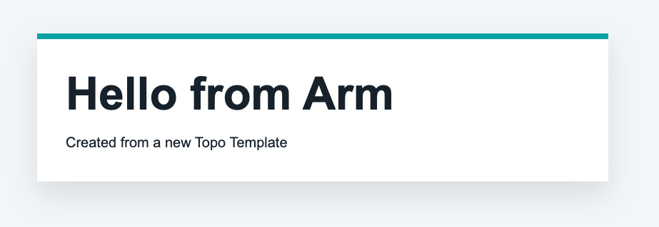

## Create a web page with configurable text and color

You've already cloned and modified an existing Topo Template. In this section, you'll create a new Template from an empty directory.

The new Template will serve a small web page with configurable text and color and demonstrate the core parts of a Topo Template:

- A `compose.yaml` file with standard Compose services
- An `x-topo` metadata block
- Build arguments exposed as Topo clone-time parameters
- A container image built for Arm Linux targets

### Create the project directory

Create a new directory for the Template:

```bash
mkdir -p ~/topo-message-card
cd ~/topo-message-card
```

A Topo Template is a normal project directory. At minimum, it needs to contain a `compose.yaml` file. Most Topo Templates also include a `Dockerfile` and application source code.

By the end of this section, the directory you created will have the following structure:

```output
topo-message-card/
├── compose.yaml
├── Dockerfile
└── src/
    └── index.html
```

### Create the source file for the web page

Create the `src/` subdirectory and `src/index.html`:

```bash
mkdir -p src
```

Open `src/index.html` in a text editor and add the following content:

```html
<!doctype html>
<html lang="en">
  <head>
    <meta charset="utf-8">
    <meta name="viewport" content="width=device-width, initial-scale=1">
    <title>__CARD_TITLE__</title>
    <style>
      body {
        margin: 0;
        min-height: 100vh;
        display: grid;
        place-items: center;
        font-family: Arial, sans-serif;
        background: #f3f6f8;
        color: #17212b;
      }

      main {
        width: min(720px, calc(100vw - 40px));
        border-top: 8px solid __ACCENT_COLOR__;
        background: white;
        padding: 40px;
        box-shadow: 0 18px 40px rgba(15, 23, 42, 0.12);
      }

      h1 {
        margin: 0 0 16px;
        font-size: clamp(2rem, 6vw, 4rem);
      }

      p {
        margin: 0;
        font-size: 1.25rem;
        line-height: 1.5;
      }
    </style>
  </head>
  <body>
    <main>
      <h1>__CARD_TITLE__</h1>
      <p>__CARD_MESSAGE__</p>
    </main>
  </body>
</html>
```

The values wrapped in double underscores are placeholders. The `Dockerfile` replaces them with values supplied by Topo.

### Create the Dockerfile

Create a file named `Dockerfile` in the `topo-message-card` directory with the following content:

```dockerfile
FROM nginx:alpine

COPY src/index.html /usr/share/nginx/html/index.html

ARG CARD_TITLE="Hello from Topo"
ARG CARD_MESSAGE="This page was created from a Topo Template."
ARG ACCENT_COLOR="#0091bd"

RUN sed -i "s|__CARD_TITLE__|${CARD_TITLE}|g" /usr/share/nginx/html/index.html
RUN sed -i "s|__CARD_MESSAGE__|${CARD_MESSAGE}|g" /usr/share/nginx/html/index.html
RUN sed -i "s|__ACCENT_COLOR__|${ACCENT_COLOR}|g" /usr/share/nginx/html/index.html
```

Topo passes configuration values to Topo Templates through Docker build arguments. The `ARG` lines define the values consumed during the image build.

`sed` is a command-line text replacement tool. The `sed` commands replace placeholder text in `index.html` during the image build. This way, each cloned project can customize the web page without manually editing the source file.

### Create the Compose file

Create `compose.yaml` in the `topo-message-card` directory with the following content:

```yaml
# yaml-language-server: $schema=https://raw.githubusercontent.com/arm/topo-template-format/refs/heads/main/schema/topo-template-format.json
services:
  message-card:
    platform: linux/arm64
    build:
      context: .
      args:
        CARD_TITLE: "Hello from Topo"
        CARD_MESSAGE: "This page was created from a Topo Template."
        ACCENT_COLOR: "#0091bd"
    ports:
      - "8088:80"

x-topo:
  name: "Message Card"
  description: |
    A minimal web application Template that shows a configurable title,
    message, and accent color.
  type: "application"
  deploy_success_message: |
    Message Card is running on port 8088.
  args:
    CARD_TITLE:
      description: "The title to show on the message card"
      required: true
      example: "Hello from Arm"
    CARD_MESSAGE:
      description: "The message to show below the title"
      required: false
      default: "This page was created from a Topo Template."
      example: "Built once and deployed with Topo"
    ACCENT_COLOR:
      description: "The CSS color used for the card accent"
      required: false
      default: "#0091bd"
      example: "#00a3a3"
```

This file is both a Compose file and a Topo Template definition.

The `services` section is standard Compose. The service builds the local `Dockerfile`, publishes the web server on port `8088`, and sets `platform: linux/arm64` so the service targets Arm-based Linux systems.

The `x-topo` section is the Topo metadata block:

- `name` gives the Template a human-readable name.
- `description` explains what the Template does.
- `type` identifies this as an application Template.
- `deploy_success_message` prints a useful hint after deployment.
- `args` defines the values Topo prompts for when someone clones the Template.

The argument names in `x-topo.args` match the keys under `services.message-card.build.args`. When Topo resolves the arguments, it writes the selected values into the build arguments.

The same argument name appears in three places: `x-topo.args` defines what Topo asks for, `build.args` passes the value to Docker, and the Dockerfile `ARG` consumes it.

### Clone the local Topo Template

Clone your local Topo Template into a new project directory. 

You can choose to answer interactive prompts for the arguments:
```bash
topo clone dir:$HOME/topo-message-card $HOME/message-card-demo
```

Alternatively, you can include the arguments in the command:
```bash
topo clone dir:$HOME/topo-message-card $HOME/message-card-demo \
  CARD_TITLE="Hello from Arm" \
  CARD_MESSAGE="Created from a new Topo Template" \
  ACCENT_COLOR="#00a3a3"
```

After using one of the commands, inspect the generated project:

```bash
cd ~/message-card-demo
cat compose.yaml
```

The `args` parameter under `build` contains the values you provided:

```yaml
services:
  message-card:
    platform: linux/arm64
    build:
      context: .
      args:
        CARD_TITLE: "Hello from Arm"
        CARD_MESSAGE: "Created from a new Topo Template"
        ACCENT_COLOR: "#00a3a3"
```

### Deploy the new project

Check that your target is ready:

```bash
topo health --target user@my-target
```

Deploy the cloned project to your target:

```bash
topo deploy --target user@my-target
```

When deployment completes, open `http://<target-ip-address>:8088/` in your browser. You can also forward the port over SSH:

```bash
ssh -L 8088:localhost:8088 user@my-target
```

Then open `http://localhost:8088/` in your browser.



Confirm that the container is running:

```bash
topo ps --target user@my-target
```

The output includes the `message-card` service and port `8088`.

## (Optional) Add hardware requirements

Add `features` only when your Topo Template needs specific Arm hardware features. For example, a SIMD benchmark that requires SVE can declare that it needs SVE:

```yaml
x-topo:
  name: "SIMD Visual Benchmark"
  description: |
    Visual demonstration of SIMD performance benefits on Arm processors.
  type: "application"
  features:
    - "SVE"
```

Topo can use these feature requirements when listing Templates against a target.

## Share the Topo Template

To share your Topo Template, publish the Template directory as a Git repository. Other users can then clone it with Topo:

```bash
topo clone https://github.com/<user-or-org>/topo-message-card.git
```

If you want the Template to be reused by the wider Topo community, include:

- `compose.yaml`
- Any Dockerfiles and source files required by the services
- A `README.md` with usage instructions
- A license file
- Clear `x-topo` metadata and argument descriptions

## What you've accomplished and what's next

You've now created a complete Topo Template from scratch. You created the web page HTML, added a Compose file, described the Template with `x-topo` metadata, supplied clone-time arguments, and deployed the generated project to an Arm-based Linux target.

Next, you'll learn where to find Agent Skills that can help you create, modify, and review Topo Templates.
