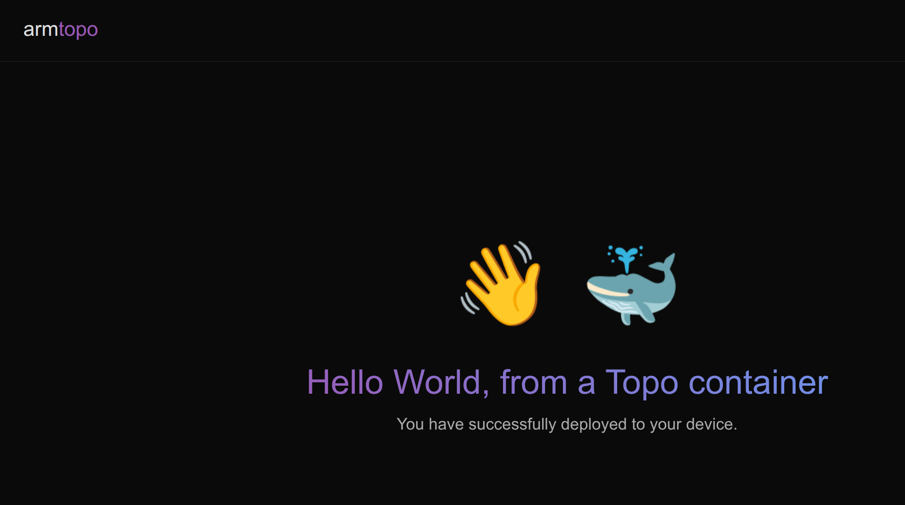

## Clone and deploy the Hello World Template

### List Topo Templates

List the available Topo Templates from the curated list in Topo:

```bash
topo templates
```

The output should be similar to the following, the Hello World Template should be present:

```output
Hello World | https://github.com/Arm-Examples/topo-welcome.git | main
  A minimal "Hello, World" web app for validating a Topo setup and deployment.
  It runs a single service that exposes a web page on the target,
  with the greeting text customizable via the GREETING_NAME parameter.

Lightbulb Moment | https://github.com/Arm-Examples/topo-lightbulb-moment.git | main
  Features: remoteproc-runtime
  Reads a switch over GPIO pins on an M class cpu, reports switch state over
  Remoteproc Message, then a web application on the A class reads this and
  displays a lightbulb in either the on or off state. The lightbulb state is
  described by an LLM in any user-specified style.

(...)
```

### Clone the Hello World Template

```bash
topo clone https://github.com/Arm-Examples/topo-welcome.git
```

The output should be similar to the following. You will be prompted for configuration arguments:

```output
┌─ Copy files ──────────────────────────────────────────
Cloning into 'topo-welcome'...
remote: Enumerating objects: 12, done.
remote: Counting objects: 100% (12/12), done.
remote: Compressing objects: 100% (9/9), done.
remote: Total 12 (delta 0), reused 8 (delta 0), pack-reused 0 (from 0)
Receiving objects: 100% (12/12), 62.64 KiB | 2.61 MiB/s, done.

┌─ Input args ──────────────────────────────────────────
Provide: The text to use in the greeting message
Example: Markus
Default: World
GREETING_NAME (required)>
```

You can fill the GREETING_NAME with your own name of press Enter to choose the defaults.
You will then see something similar to the following output:

```output
┌─ Project ready ───────────────────────────────────────
Created in 'topo-welcome'

Now run:
  cd topo-welcome
  topo deploy
```

### Prepare the host machine for emulation

Topo Templates are meant to be deployed to Arm-based Linux targets. In this learning path, we are going to be deploying to your host machine. If your machine is an x86 machine, you may need to install an arm64 emulator, such as:

```bash
docker run --privileged --rm tonistiigi/binfmt --install arm64
docker run --rm --platform linux/arm64 alpine uname -m
```

The expected output should be:

```output
aarch64
```

### Deploy the template to localhost

You can now deploy the project to the host/build machine:

```bash
cd topo-welcome
topo deploy --target localhost
```

Wait for the build and deploy to complete. The expected output is similar to:

```output
$ topo deploy --target localhost
10:52:52 WRN registry transfer is not yet supported with this configuration. Falling back to direct transfer.

┌─ Build images ────────────────────────────────────────
[+] Building 6.4s (11/11) FINISHED                                                                                                  
 => [internal] load local bake definitions    0.0s
 => => reading from stdin 654B    0.0s
 => [internal] load build definition from Dockerfile    0.0s
 => => transferring dockerfile: 223B    0.0s
 => [internal] load metadata for docker.io/library/nginx:alpine    1.4s
 => [internal] load .dockerignore    0.1s
 => => transferring context: 2B    0.0s
 => [internal] load build context    0.1s
 => => transferring context: 3.76kB    0.0s
 => [1/3] FROM docker.io/library/
 (...)
 
 [+] build 1/1
 ✔ Image topo-welcome-app Built    6.4s 

┌─ Pull images ─────────────────────────────────────────

┌─ Start services ──────────────────────────────────────
[+] up 2/2
┌─ Deployment Success ──────────────────────────────────  0.1s 
Run `topo ps` to see deployed containers    0.2s 
```

Confirm that the container is running correctly:

```bash
topo ps
```

The output should be similar to:

```output
Image              Status                  Processing Domain   Address
topo-welcome-app   Up Less than a second   Linux Host          localhost:8000, [::]:8000
```

### Visualize the application

Open your browser on `http://localhost:8000/`, you should see the Hello World application running.


The Hello World application appears as follows:



