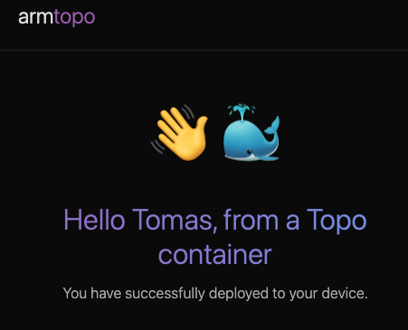

## Clone the Hello World Topo Template

On your host machine, use the terminal to clone the Hello World Topo Template into your home directory to confirm your setup:

```bash
topo clone https://github.com/Arm-Examples/topo-welcome.git ~/topo-welcome
```
The Hello World Topo Template follows the same deployment pattern as the `CPU LLM Chat` Topo Template covered in [Deploy containerized workloads to Arm-based Linux targets with Topo](/learning-paths/cross-platform/deploy-containerized-workloads-with-topo/).

The output is similar to:

```output
┌─ Copy files ──────────────────────────────────────────
Cloning into '/home/user/topo-welcome'...
remote: Enumerating objects: 12, done.
remote: Counting objects: 100% (12/12), done.
remote: Compressing objects: 100% (9/9), done.
remote: Total 12 (delta 0), reused 8 (delta 0), pack-reused 0 (from 0)
Receiving objects: 100% (12/12), 62.64 KiB | 2.61 MiB/s, done.

┌─ Input args ──────────────────────────────────────────
Provide: The text to use in the greeting message
Example: Markus
Default: World
GREETING_NAME (required)>
```

Provide a name for the `GREETING_NAME` argument, for example, `Tomas`, and then Press Enter.

The output is similar to:

```output
┌─ Project ready ───────────────────────────────────────
Created in '/home/user/topo-welcome'

Now run:
  cd ~/topo-welcome
  topo deploy
```

## Prepare your target

Topo Templates are meant to be deployed to Arm-based Linux targets. In this Learning Path, use the Arm-based Linux target you prepared in the previous Learning Path. The target can be a Raspberry Pi, an Arm-based Amazon EC2 instance, or another Arm-based Linux target accessible over SSH.

Confirm that Topo can inspect your target, and that there are no compatibility issues:

```bash
topo health --target user@my-target
```

If your host machine is a Linux machine and you want to use it as the target, you can use `--target localhost`.

## Deploy the template to your target

You can now deploy the project to your target:

```bash
cd ~/topo-welcome
topo deploy --target user@my-target
```

Wait for the build and deploy to complete. 

The output is similar to:

```output
┌─ Build images ────────────────────────────────────────
[+] Building 6.4s (11/11) FINISHED                                                                                                  
 => [internal] load local bake definitions    0.0s
 => => reading from stdin 654B    0.0s
 => [internal] load build definition from Dockerfile    0.0s
 => => transferring dockerfile: 223B    0.0s
 => [internal] load metadata for docker.io/library/nginx:alpine    1.4s
 => [internal] load .dockerignore    0.1s
 => => transferring context: 2B    0.0s
 => [internal] load build context    0.1s
 => => transferring context: 3.76kB    0.0s
 => [1/3] FROM docker.io/library/
 (...)
 
 [+] build 1/1
 ✔ Image topo-welcome-app Built    6.4s 

┌─ Pull images ─────────────────────────────────────────

┌─ Start services ──────────────────────────────────────
[+] up 2/2
┌─ Deployment Success ──────────────────────────────────  0.1s 
Run `topo ps` to see deployed containers    0.2s 
```

Confirm that the container is running correctly:

```bash
topo ps --target user@my-target
```

The `topo ps` command lists the services that Topo deployed to the target. 

The output is similar to:

```output
Image              Status                  Processing Domain   Address
topo-welcome-app   Up 58 seconds           Linux Host          my-target:8000, [::]:8000
```

The columns show:

- `Image`: the container image or service that Topo started
- `Status`: whether the service is running, and how long it has been running
- `Processing Domain`: where the workload is running, such as the Linux host on the target
- `Address`: the exposed address and port for the service

### View the application

If the target is reachable on your network, open `http://<target-ip-address>:8000/` in your browser.

If you prefer to forward the port over SSH, run:

```bash
ssh -L 8000:localhost:8000 user@my-target
```

Then open `http://localhost:8000/` in your browser.


The `Hello World` application appears as follows:



## What you've accomplished and what's next

You've now deployed the `Hello World` Topo Template to an Arm-based Linux target and confirmed the application is accessible in your browser.

Next, you'll modify the template to add a new configurable clone-time argument.
