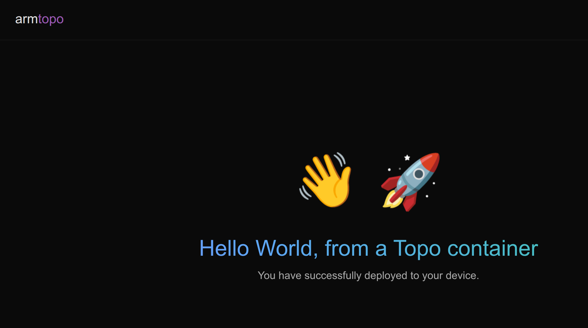

## Make the greeting emoji configurable

In the previous section, you cloned and deployed the Hello World Topo Template. In this section, you'll modify the template so the greeting emoji can be configured when someone clones it.

### Add a new template argument

On your host machine, navigate to the Hello World Topo Template directory:

```bash
cd ~/topo-welcome
```
Open the `compose.yaml` file in the text editor of your choice.

Find the `args` section under `x-topo`. It currently contains the `GREETING_NAME` argument:

```yaml
args:
  GREETING_NAME:
    description: The text to use in the greeting message
    required: true
    default: "World"
    example: "Markus"
```

Add a new `GREETING_EMOJI` argument as a second clone-time argument after `GREETING_NAME` under `args`:

```yaml
args:
  GREETING_NAME:
    description: The text to use in the greeting message
    required: true
    default: "World"
    example: "Markus"
  GREETING_EMOJI:
    description: The emoji to show next to the greeting
    required: false
    default: "🐳"
    example: "🚀"
```

The argument is optional, so users can press Enter to accept the default whale emoji.

{}
Make sure that `GREETING_NAME` and `GREETING_EMOJI` are indented under `args`. If they're aligned with `args`, Topo won't detect them as clone-time arguments and won't prompt for values.
{}

### Pass the emoji to the build

In the same `compose.yaml` file, find the service build arguments:

```yaml
services:
  app:
    build:
      context: .
      args:
        GREETING_NAME: World
```

Add `GREETING_EMOJI` to the build arguments to make the emoji available to the `Dockerfile` when Topo builds the application image:

```yaml
services:
  app:
    build:
      context: .
      args:
        GREETING_NAME: World
        GREETING_EMOJI: "🐳"
```

## Replace the hard-coded emoji in the web application

Open `src/index.html`, the HTML file used by the web application, in a text editor of your choice. 

Find the line with the hard-coded emoji:

```html
<span class="emoji floating">🐳</span>
```

Replace it with the `GREETING_EMOJI` variable from the Topo Template:

```html
<span class="emoji floating">{{GREETING_EMOJI}}</span>
```

Topo replaces `{{GREETING_EMOJI}}` with the value provided during `topo clone`.

## Update the Dockerfile

Open the `Dockerfile`, which is inside the `topo-welcome` directory. It currently defines `GREETING_NAME` as a build argument and uses `sed` to replace the `{{GREETING_NAME}}` placeholder:

```dockerfile
ARG GREETING_NAME="World"

RUN sed -i "s|{{GREETING_NAME}}|${GREETING_NAME}|" /usr/share/nginx/html/index.html
```

Add a `GREETING_EMOJI` build argument, then add a second `sed` command to replace the `{{GREETING_EMOJI}}` placeholder:

```dockerfile
FROM nginx:alpine

COPY src/index.html /usr/share/nginx/html/index.html

ARG GREETING_NAME="World"
ARG GREETING_EMOJI="🐳"

RUN sed -i "s|{{GREETING_NAME}}|${GREETING_NAME}|" /usr/share/nginx/html/index.html
RUN sed -i "s|{{GREETING_EMOJI}}|${GREETING_EMOJI}|" /usr/share/nginx/html/index.html
```

## Clone the modified Topo Template

Create a new directory for a fresh clone of your modified local Topo Template:

```bash
mkdir -p ~/topo-new-welcome/
```

Clone the local template into the new directory:

```bash
topo clone dir:$(pwd) ~/topo-new-welcome/topo-welcome
```

Topo prompts for the configured template arguments. You'll now see prompts for both `GREETING_NAME` and `GREETING_EMOJI`. Use the default value for `GREETING_NAME` and the example value for `GREETING_EMOJI`:

```output
┌─ Copy files ──────────────────────────────────────────

┌─ Input args ──────────────────────────────────────────
Provide: The text to use in the greeting message
Example: Markus
Default: World
GREETING_NAME (required)> 

Provide: The emoji to show next to the greeting
Example: 🚀
Default: 🐳
GREETING_EMOJI (optional)> 🚀
```

When cloning completes, Topo creates the new project in `~/topo-new-welcome/topo-welcome`.

## Deploy the modified Topo Template

Deploy the updated Topo Template to the target:

```bash
cd ~/topo-new-welcome/topo-welcome
topo deploy --target user@my-target
```

### Visualize the application

If the target is reachable on your network, open `http://<target-ip-address>:8000/` in your browser. You can also forward the port over SSH:

```bash
ssh -L 8000:localhost:8000 user@my-target
```

Then open `http://localhost:8000/` in your browser.

The Hello World application appears as follows:



## What you've accomplished and what's next

You've now modified the `Hello World` Topo Template to add a new optional clone-time argument, updated the Dockerfile to consume the argument, and deployed the result to your Arm-based Linux target.

Next, you'll create a new Topo Template from scratch.
