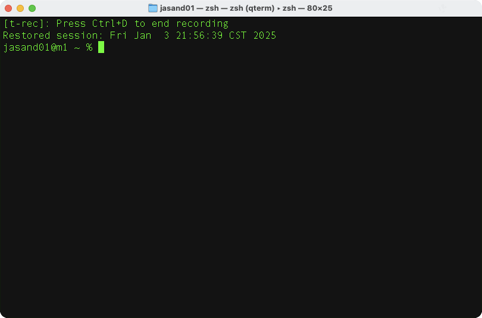

Daytona makes it easy to manage local development environments. 

Follow these steps to learn how to create and manage an example local development environment.

To have a go, you can use a small dev container example from Microsoft. The example is a small Python application which uses Flask to serve a single HTML page.

Visit the [GitHub repository](https://github.com/microsoft/vscode-remote-try-python) to review the project. 

## Create a workspace

### Option 1: use an example repository

If you want to create a workspace with the example repository and are not pushing any changes back to GitHub, you can use the URL to create a workspace.

Create a workspace with the command below:

```console
daytona create --no-ide https://github.com/microsoft/vscode-remote-try-python/tree/main
```

The workspace is created without starting any IDE. More information about how to connect to the workspace is given below. 

### Option 2: use a repository from your GitHub account

If you want to work with a repository in your GitHub account and learn how to make changes and push them to GitHub, you can click the **Use this template** button on the GitHub repository.

The template option creates a new repository in your account. Putting the repository in your account allows you to commit changes back to GitHub.

```console
daytona create --no-ide 
```

You will go through a series of prompts including:

- Select a GitHub provider.
- Find the repository in your GitHub account.

{}
Use the / command to find the repo if you have many repositories in your GitHub account.
{}

- Select a branch.
- Specify a workspace name.
- Select the local (default) target using the Docker provider.

The sequence is shown below: 



The first time you create a workspace there are some delays while Docker images are pulled to your computer. This initial setup delay is usually unique to the first time you do this, and when you create a workspace subsequently, it should be much faster.

## Connect to the workspace

Once your workspace is running, you can use various commands to connect and performing coding tasks. Some options are shown below.

List the available workspaces:

```console
daytona list
```

The output is similar to:

```output

    Workspace                          Repository                                    Target        Status
    ─────────────────────────────────────────────────────────────────────────────────────────────────────────────
    vscode-remote-try-python           microsoft/vscode-remote-try-python.git        local         STOPPED

```

### Connect using VS Code

To open VS Code on your computer and connect to the workspace run:

```console
daytona code
```

### Connect using SSH

To connect to the dev container using SSH in your current terminal run:

```console
daytona ssh
```

### Connect using VS Code running in a browser tab

To open a browser tab with VS Code running in the browser tab and connect to the workspace run:

```console
daytona code -i browser
```

Any of these options can be used to connect to a Daytona workspace. 

A number of other IDEs can be used with Daytona. Refer to the [IDE documentation](https://www.daytona.io/docs/usage/ide/) for details. 

## Start the Flask application

To start the Flask application, run:

```console
python -m flask run --port 9000 --no-debugger --no-reload
```

If you start Python in VS Code, it will automatically forward port 9000 and open a browser tab to see the web page. 

If you run the Python command in a terminal after using SSH to connect to a workspace, you can forward the port by running the command below on your local machine with the name of your workspace:

```console
daytona forward 9000 vscode-remote-try-python
```

## Useful workspace commands

Now that you can create a workspace and connect to it, there are some other commands that you will find useful.


Use the stop command to stop the workspace. The dev container will stop on your local computer: 

```console
daytona stop 
```

Use the start command to restart a workspace which is stopped:

```console
daytona start
```

You can also delete a stopped workspace:

```console
daytona delete
```

The container is removed from the system.

You have now learned the basic commands to manage local development environments with Daytona. 

You can now move on to learn how to manage remote development environments.
