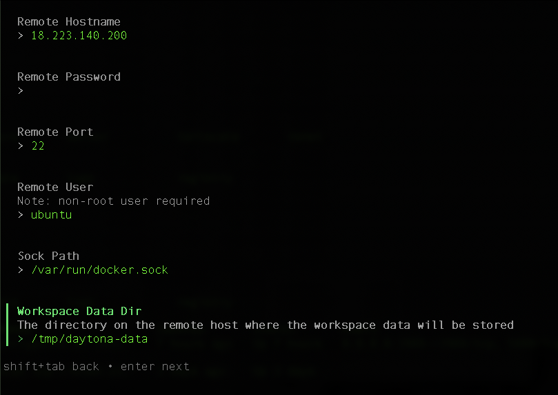

With Daytona, you can create and manage workspaces on another computer that is not your local computer.

This is useful if you have Arm-based servers on your local network or in the cloud and you want to use them for development.

There are two common use cases:
1. The remote computer is always running. 
2. The remote computer should stop when you stop your workspace.

The first case is typical for computers on your local network or in the cloud that you do not pay for by the minute or hour. 

The second case is for cloud resources that are billed as you use them (pay as you go) and you do not want to leave idle computers running.

## Daytona targets

By default, only the local Docker target is installed, but you can install additional targets. You can also configure multiple targets for each Daytona provider.

For example, Docker is a provider and you can configure the local Docker target, and multiple remote Docker targets. Each target corresponds to a different computer where you create and manage workspaces.

You can list the available targets using:

```console
daytona target list
```

The output is:

```output
Target Name:  local

Target Provider:  docker-provider

Default:  Yes

Target Options:  {
  "Sock Path": "/var/run/docker.sock"
}
```

You can use Daytona to manage remote development environments for always-on computers, which corresponds to the first use case, using the Docker providers and SSH access to the computer. 

{}
Make sure Docker is installed on the remote computer. 
{}

### SSH access

You can use key based SSH to configure Daytona targets and manage remote workspaces. 

If you are using a password to SSH to the remote computer, create a key-based SSH by putting a public key on the remote computer at `$HOME/.ssh/authorized_keys`

If you need to create a key pair, then you can use `ssh-keygen` to create a key pair with a public and private key. 

See the [SSH install guide](/install-guides/ssh/) for more details. 

Confirm that you can SSH to the remote computer using a private key:

```console
ssh -i <private-key-file> user@ip
```

You need the name of the private key file on your local computer to configure a Daytona target. 

## Managing remote Docker development environments

Daytona allows you to manage remote development environments for always-on computers using the Docker provider. 

```console
daytona target set
```

1. Select the Docker provider then select `New Target`. 

2. Enter a name for the new target, such as the name of the machine, so that you can recognize it in the future.

3. Configure the target with the information below:

**Remote Hostname**: This is the IP address or the DNS name of the remote computer, if you have one. 

**Remote Password**: This is not used, so leave it blank.

**Remote Port**: This is the SSH port, and the default is 22 unless you have changed the SSH configuration on the remote computer to use a different port. 

**Remote User**: This is the username you use to SSH. It cannot be root.

**Sock Path**: This is the path to the Docker daemon. Keep the default. 

**Workspace Data Dir**: This is the location where Daytona will store information on the remote computer. Leave the default, or change it to your preference. 

The values are shown below:



In the next screen, enter the Remote Private Key Path. This is the path to the private key file that you use to SSH to the remote computer. It is the same file used to `ssh -i <private-key-file>`

Your target configuration is complete. 

4. List the targets to confirm your information:

```console
daytona target list 
```

The output is:

```output
daytona target list

Target Name:  local

Target Provider:  docker-provider

Target Options:  {
  "Sock Path": "/var/run/docker.sock"
}

===

Target Name:  arm-server-1

Target Provider:  docker-provider

Default:  Yes

Target Options:  {
  "Remote Hostname": "XXX.XXX.XXX.XX",
  "Remote Port": 22,
  "Remote Private Key Path": "/home/jasand01/s1.key",
  "Remote User": "ubuntu",
  "Sock Path": "/var/run/docker.sock",
  "Workspace Data Dir": "/tmp/daytona-data"
}
```

You see your new target and the parameters listed. It is now the default target. 

### Create a new workspace on the remote computer 

You can use `daytona create` to create a workspace on the remote computer. The command is the same as on the local computer. The default target is used: the new Docker remote computer. 

```console
daytona create --no-ide https://github.com/microsoft/vscode-remote-try-python/tree/main
```

You can also specify the target using the `-t` option be explicit about which target to use: 

```console
daytona create -t arm-server-1 --no-ide https://github.com/microsoft/vscode-remote-try-python/tree/main
```

The `daytona list` command shows the target where each workspace is running.

```console
daytona list
```

If you have a workspace on both the local computer and the remote computer, the values in the target column are similar to:

```output
    Workspace                          Repository                                    Target                Status
    ─────────────────────────────────────────────────────────────────────────────────────────────────────────────────────────────────
    vscode-remote-try-python           microsoft/vscode-remote-try-python.git        local                 RUNNING (1 minute)

    vscode-remote-try-python2          microsoft/vscode-remote-try-python.git        arm-server-1          RUNNING (3 minutes)
```

Be patient the first time you create the new workspace on the remote computer as it takes time to pull the Docker images. 

The management commands from the previous section are the same on the local computer and the remote computer. This includes `daytona code` and `daytona ssh`. Use them in the same way for the remote workspace.

You have now learned how to manage remote development environments using the Docker provider. 

In the next section, you can learn how to manage remote development environments using the AWS provider.