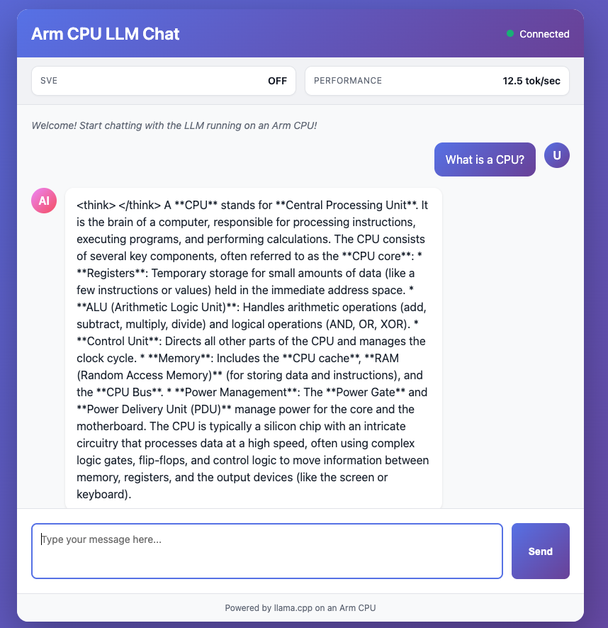

## Choose a starter template and clone it

Choose one of the pre-existing templates that is compatible with your target hardware. This learning path will showcase deploying an LLM chatbot, but the same steps apply for the other templates.

To use a template, we clone it from git on our host device by running the following command:

```bash
topo clone https://github.com/Arm-Examples/topo-cpu-ai-chat.git
```

If a template asks for build arguments, Topo prompts you interactively.

This creates a project directory using the template. The directory will contain template source files and `compose.yaml`.

You may find it interesting to examine the `compose.yaml` file. An example for the LLM chatbot application is provided below:

```output
services:
  llama-server:
    platform: linux/arm64
    build:
      context: ./llama-inference
      args:
        ENABLE_SVE: OFF
        HF_MODEL: bartowski/Qwen_Qwen3.5-0.8B-GGUF
        HF_MODEL_FILE: ""
    ports:
      - "8080:8080"
    healthcheck:
      test: ["CMD", "curl", "-f", "http://localhost:8080/health"]
      interval: 10s
      timeout: 5s
      retries: 3
      start_period: 60s
  chat-ui:
    platform: linux/arm64
    build:
      context: ./simple-chat
      args:
        ENABLE_SVE: OFF
    depends_on:
      llama-server:
        condition: service_healthy
    ports:
      - "3000:3000"
x-topo:
  name: "Topo CPU AI Chat"
  description: "Complete LLM chat application optimized for Arm CPU inference.\n\nThis project demonstrates running large language models on CPU\nusing llama.cpp compiled with Arm baseline optimizations and \naccelerated using NEON SIMD and SVE (when supported and enabled).\n\nThe stack includes:\n- llama.cpp server with Arm NEON optimizations (SVE optional)\n- Quantized Qwen3.5-0.8B model bundled in the image\n- Simple web-based chat interface\n- No GPU required - pure CPU inference\n\nPerfect for demos and testing! The bundled Qwen3.5-0.8B model allows the\nproject to run immediately without downloading additional models.\n\nIdeal for testing LLM workloads on Arm hardware without GPU dependencies,\nshowcasing how far you can push NEON acceleration. Rebuild with SVE enabled\nwhen wider vectors are available.\n"
  features:
    - "SVE"
    - "NEON"
  args:
    HF_MODEL:
      description: "Hugging Face model repo ID containing a supported single-file GGUF model"
      default: "bartowski/Qwen_Qwen3.5-0.8B-GGUF"
      example: "unsloth/SmolLM2-135M-Instruct-GGUF"
    HF_MODEL_FILE:
      description: "Exact supported GGUF filename to download; sharded and mmproj files are rejected"
      default: ""
      example: "Qwen_Qwen3.5-0.8B-Q4_0.gguf"
    ENABLE_SVE:
      description: "Enables building with SVE instructions (OFF/ON)"
      default: "OFF"
      example: "ON"
```

Changes can be made to the `compose.yaml` files to adjust arguments after the fact - for example, SVE can be turned ON or OFF for the LLM chatbot, and the LLM can be changed to use a different model.

## Deploy the app on the target

On your host device, enter the project directory created by the `topo clone` command. In the case of the LLM chatbot, this directory is `topo-cpu-ai-chat`:

```bash
cd topo-cpu-ai-chat/
```

Then use `topo deploy` to automatically build the container images on the host, transfer the images to the target via SSH, and start the application on the target:

```
topo deploy --target user@my-target
```

Once deployed, you can view the webpage at `http://<ip_address_of_target>:3000`. The port used depends on the template application chosen - you can see this in the `compose.yaml`.

The LLM chatbot application will appear as below:



Depending on the permissions you have setup with your target device, you may not be able to use the IP address directly. In this case, you may need to forward to a local port and view at `http://localhost:<port_number>` instead:

```bash
ssh -L <port_number>:localhost:<port_number> user@my-target
```

To stop a deployed Topo application on the target, run `topo stop` on the host:

```bash
topo stop --target user@my-target
```

## (Optional) Repeat this learning path, using a CLI Agent

Topo is packaged as a single executable with a `README.md` file. It is straightforward for agents to leverage.

Choose your preferred agent. If you do not have a CLI Agent pre-configured, you can follow our guides to [Install Codex](https://learn.arm.com/install-guides/codex-cli/), [Install Claude Code](https://learn.arm.com/install-guides/claude-code/), or [Install Gemini](https://learn.arm.com/install-guides/gemini/).

Once your agent is ready, ensure you have setup your host and target to have the required dependencies. Then ask your agent to leverage Topo to deploy an application to your target device.
