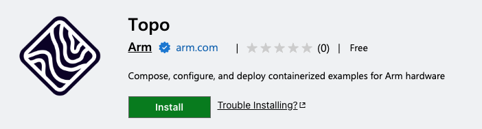
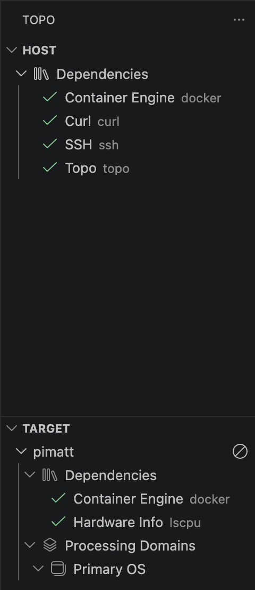
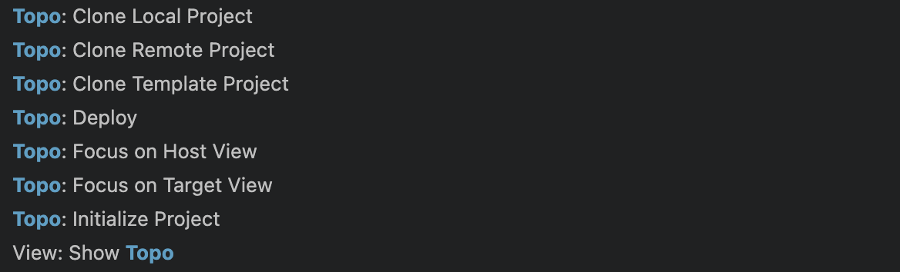
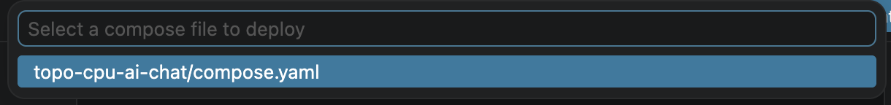
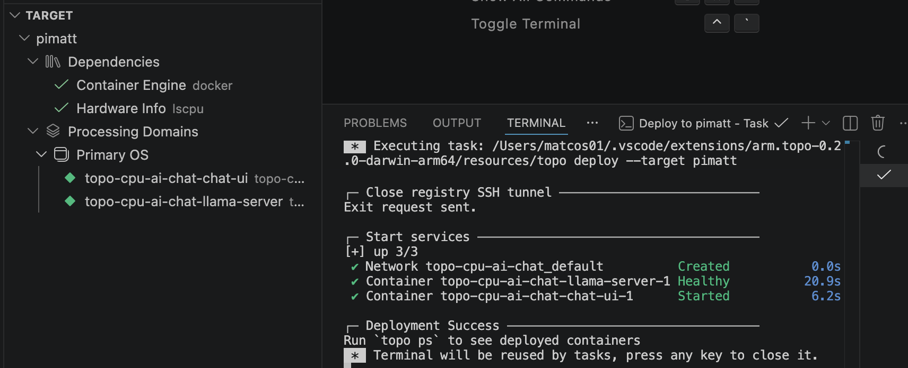

## Use Topo from VS Code

You have used the Topo CLI to check your target, list compatible projects, clone a project, deploy the workload, and inspect the running application.

You can also perform the same workflow from Visual Studio Code using the [Topo extension](https://marketplace.visualstudio.com/items?itemName=Arm.topo). The extension provides a graphical interface for Topo deployment.

## Install the extension

Install the Topo extension from the Visual Studio Marketplace using the link above.



A guide is provided on the extension page, but some brief steps are also shown here. If you are familiar with Topo CLI, you should have little trouble using the extension. After installation, open the Topo view from the VS Code activity bar.

## Add and inspect a target

The Topo sidebar shows your host by default. Use the sidebar to also add your Arm-based Linux target. The target is the same SSH destination you used with the CLI, for example `user@my-target`.

The extension shows the host and target state, available Topo actions, and deployed applications, providing similar insights to `topo health` and `topo ps`.



## Run Topo commands

The command palette exposes the usual Topo commands such as listing compatible projects, cloning projects, and deploying projects.



These commands correspond to the CLI commands you used earlier, such as:

```bash
topo projects --target user@my-target
topo clone <project-url>
topo deploy --target user@my-target
```

## Deploy from VS Code

After cloning or selecting a Topo Project, you can deploy it. Open or clone the LLM chat example, then deploy it using the VS Code extension.



When deployment completes, you will see the processes running on the target in the Topo sidebar:



Open the application in your browser just as you did with the CLI workflow:

```output
http://<target-ip>:8080
```

## What you've accomplished

You have now seen two ways to deploy Topo workloads: directly from the command line and from Visual Studio Code. Both approaches use the same target checks, project metadata, and deployment flow, so you can choose the interface that best fits your workflow.
