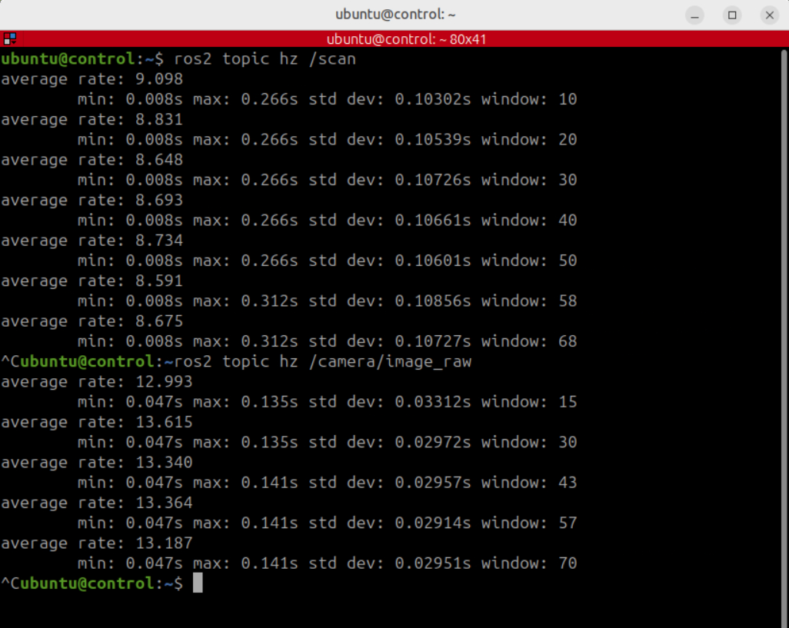

## Configure the control container as a Zenoh client

The control container needs its own session configuration, set to client mode and pointed at the robot's router.

{}
Remember: Do not expose ports `6080`, `6081`, or `7447` directly to the public internet. Use a private network or VPN, access ports `6080` and `6081` through an SSH tunnel, and restrict port `7447` to trusted IP addresses or subnets using firewall rules.
{}

Open the control desktop at `http://<server_ip>:6081/`. The password is `ubuntu`.

In a **control** container terminal, copy the installed `rmw_zenoh` session template into the persistent volume:

```bash
cp /opt/ros/jazzy/share/rmw_zenoh_cpp/config/DEFAULT_RMW_ZENOH_SESSION_CONFIG.json5 \
  ~/container_data/SESSION_CONFIG.json5
source ~/workshop_env.bash
nano ~/container_data/SESSION_CONFIG.json5
```

Find the active `mode` field and change it from `peer` to `client`:

```json
mode: "client",
```

Find the active `connect` section and change its endpoint from `localhost` to the robot container:

```json
connect: {
  endpoints: ["tcp/172.1.0.2:7447"],
},
```

The same field names can also appear in comments. Edit the active JSON5 values, not a commented example. Save the file and exit Nano with **Ctrl+O**, **Enter**, and **Ctrl+X**.

## Restart ROS 2 graph discovery

Confirm that the environment points to the session file you edited:

```bash
echo $RMW_IMPLEMENTATION
echo $ZENOH_SESSION_CONFIG_URI
```

Expected output includes:

```text
rmw_zenoh_cpp
/home/ubuntu/container_data/SESSION_CONFIG.json5
```

The ROS 2 command-line daemon can retain graph information from an earlier middleware configuration. Stop it before testing the new client session:

```bash
ros2 daemon stop
ros2 topic list
```

The list should now contain topics published in the robot container, including:

```text
/camera/image_raw
/camera/points
/cmd_vel
/map
/scan
```

Seeing `/parameter_events` and `/rosout` alone does not confirm a connection; those topics are created locally by ROS 2 processes.

Verify that data, rather than only graph information, reaches the control container:

```bash
ros2 topic hz /scan
ros2 topic hz /camera/image_raw
```

Collect several samples and press **Ctrl+C**. The rate should be close to the rate measured in the robot container, since the Docker Network is not a bottleneck.

<!--  -->
<div style="text-align:center;">
  
  <div style="font-style:italic;">Contol terminal showing data transfer rate in Hz</div>
</div>

{}
This example uses an NVIDIA DGX Spark as the host. Topic rates may vary on other systems, such as AWS Graviton instances.
{}

## Run RViz remotely

Start RViz in the control container:

```bash
just rviz_nav2
```

RViz now subscribes to the map, transforms, laser scans, costmaps, and robot state across the client connection. The simulation and Navigation2 remain in the robot container.

<!-- IMAGE PLACEHOLDER: Add a screenshot of RViz running in the control container and displaying the simulated ROX robot, map, and laser scan. Suggested filename: control-container-rviz.png -->
<div style="text-align:center;">
  
  <div style="font-style:italic;">RViz window opened from the control terminal</div>
</div>

This demonstrates the first distributed boundary: the visualisation process and the simulated robot are in separate container network namespaces, while ROS 2 communication continues through `rmw_zenoh`.

