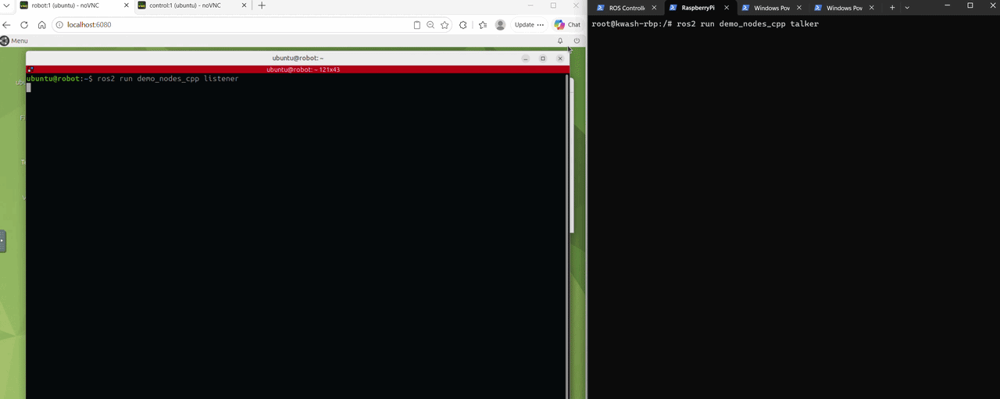

## Verify the ROS 2 graph on the Raspberry Pi

In the Pi container, list the topics received through the Zenoh client session:

```bash
ros2 daemon stop
ros2 topic list
```

Expected result: the full topic list, roughly 80 entries including:

```output
/camera/image_raw
/cmd_vel
/map
/scan
```

This confirms graph discovery. It does not yet prove that message data is arriving.

## Verify sensor data from the server to the Raspberry Pi

In a **robot** container terminal, measure the source rate:

```bash
source ~/workshop_env.bash
ros2 topic hz /scan
```

Let the command collect several samples, record the approximate average, and press **Ctrl+C**.

Now run the same command inside the **Raspberry Pi** container:

```bash
ros2 topic hz /scan
```

The remote result should be stable and reasonably close to the source rate. 

## Verify messages from the Raspberry Pi to the server

Keep the Pi container open and start a ROS 2 talker on the **Raspberry Pi**:

```bash
ros2 run demo_nodes_cpp talker
```

In a new **robot** container terminal, load the LP1 environment and start a listener:

```bash
source ~/workshop_env.bash
ros2 run demo_nodes_cpp listener
```

The robot listener should receive messages published by the Raspberry Pi:

```text
[INFO] [listener]: I heard: [Hello World: 1]
[INFO] [listener]: I heard: [Hello World: 2]
```

<!-- GIF PLACEHOLDER: Add a short terminal recording showing the talker running on the Raspberry Pi and the listener receiving messages in the robot container. Suggested filename: pi-to-robot-talk-listen.gif -->

This proves the uplink path. The same client connection can carry other ROS 2 traffic, including `/cmd_vel` messages, service calls, and Navigation2 actions.

## Troubleshooting

The following table summarizes common failures:

| Symptom | Cause |
|---|---|
| `Connection refused` | Packets reach the host but nothing listens on the port — the router is not running on the server. After `docker compose up`, the router, simulation and Nav2 must all be started again |
| `Name or service not known` | The `<server_ip>` placeholder was not replaced with the actual address |
| Timeout / no route to host | Network-layer problem — check that both devices are on the same subnet and that port 7447 is not blocked |
| `ros2 topic list` shows only 2 topics | The client configuration is not in effect — re-check the three environment lines and run `ros2 daemon stop` |
| `libzenohc.so` cannot be opened | Only applies to the manual setup — the shell was opened before the packages were installed. Run `source /opt/ros/jazzy/setup.bash` again |
| `docker exec` reports the container is not running | The shell started with `docker start -ai` was closed, stopping the container. Use `docker start` followed by `docker exec` |
