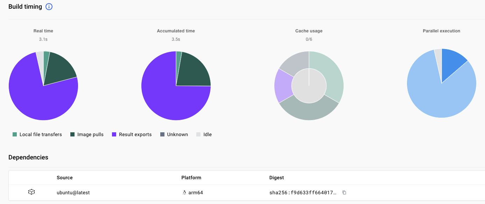

## Use GitHub Actions

You can use GitHub Actions to build multi-architecture images and automate the process with Docker Build Cloud as your builder. 

## Before you begin

You will need a [GitHub](https://github.com) account to try out Docker Build Cloud from GitHub Actions. Use the Sign up button in the upper right hand corner of the GitHub website.

## Create a new GitHub repository

To get started, create a new GitHub repository in your GitHub account. There are numerous tutorials on how to create a repository or refer to the [GitHub documentation](https://docs.github.com/en/repositories/creating-and-managing-repositories/creating-a-new-repository)

## Set up secrets

To run GitHub Actions, you will need secrets for your Docker Hub username and Personal Access Token (PAT). This enables you to automate the login to your Docker Hub account. 

You will also need a secret for the Docker Organization. If you don't have an organization, use your Docker ID for this secret.

Access the secrets from the `Settings` tab on your repository. Expand the `Secrets and variables` on the left side and click `Actions`.

Add three secrets using the `New repository secret` button:
- `DOCKER_USER` with your Docker ID
- `DOCKER_PAT` with your Personal Access Token 
- `DOCKER_ORG` with your Docker Organization (this can be your Docker ID if you are not in an organization)


## Add files to the repository

To try GitHub Actions with Docker Build Cloud, you need to add two files to your repository.

First, add the Dockerfile from the previous section to the top of the repository.

As a reminder, here is the file contents:

```dockerfile
FROM ubuntu:latest
CMD echo -n "Architecture is " && uname -m
```

You can do this in the browser using the `Add file` button to create a new file or upload the file from your computer. You can also use `git` from the command line.

Next, add the `build.yml` file below to the `.github/workflows` directory in your repository: 

```yml
name: image-build

on:
  workflow_dispatch:

jobs:
  docker:
    runs-on: ubuntu-latest
    steps:
      - name: Checkout
        uses: actions/checkout@v4
      - name: Log in to Docker Hub
        uses: docker/login-action@v3
        with:
          username: ${{ secrets.DOCKER_USER }}
          password: ${{ secrets.DOCKER_PAT }}
      - name: Set up Docker buildx with cloud support
        uses: docker/setup-buildx-action@v3
        with:
          version: "lab:latest"
          driver: cloud
          endpoint: "${{ secrets.DOCKER_ORG }}/arm-cloud-builder1"
          install: true
      - name: Build and push
        run: |
            docker buildx build --platform linux/arm64,linux/amd64 --tag $USER/cloud-build-test --push .
        env:
           USER: ${{ secrets.DOCKER_USER }}
```

## Test the GitHub Action

When the two files and the three secrets are added to the repository, you are ready to try to run the action.

{}
If you are using Docker Personal or Docker Pro, remove one of the platform values because these subscriptions do not support multiple architectures. For example, remove `linux/amd64` from the `--platform` list and build the `linux/arm64` image only. 
{}

To run the action, navigate to the `Actions` tab in your repository. 

Select the `image-build` on the left side. 

Use the `Run workflow` drop down on the right-hand side to click `Run workflow`. 

This triggers the `build.yml` file to manually start the following steps:
- Checkout the repository
- Log in to Docker Hub
- Set up a builder on Docker Build Cloud
- Run the `docker buildx build` command to build an image from the `Dockerfile` and push the image to your Docker Hub account.

If it succeeds, the new image will be in your Docker Hub account. 

You can use the `Actions` tab in your repository to see the workflow runs and click into each one to review the commands and check errors.

## Build stats

If you have Docker Desktop, you can look at the build stats from your cloud builder. 

From the Docker Desktop dashboard, click `Builds` on the left-hand side and then click the name of a completed build. The builds initiated from GitHub have the URL for the GitHub repository. There are stats about the build time including the time spent pulling images, transferring files, accessing the build cache, and the number of steps run in parallel.

You can click on the info symbol next to `Build timing` for explanations of the data presented. Here is the data for this example:



## Automate the build

Instead of manually triggering the build, you can modify the `build.yml` to automatically run the action when changes are made to the `Dockerfile`. Add the `push:` line as shown below to automatically run the action when a push is made to any branch in the repository.

```yml
name: image-build

on:
  workflow_dispatch:
  push:
```

If you make a change to your `Dockerfile` and push it to the repository, the action will automatically run.

You can now use GitHub Actions to build Arm images or multi-architecture images using Docker Build Cloud. You don't need to provide your own Arm self-hosted runner and you don't need to use emulation.
