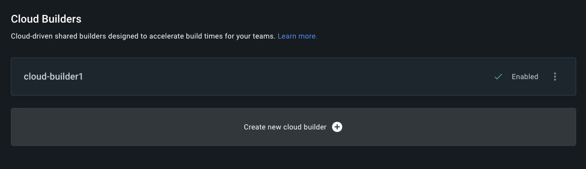

---
# User change
title: "Setup and build images with Docker Build Cloud"

weight: 2

layout: "learningpathall"

---

## Building multi-architecture container images

Building multi-architecture container images is challenging for complex projects. 

There are 2 common ways to build multi-architecture images, and both are explained in [Learn how to use Docker](/learning-paths/cross-platform/docker/).

The first method is to use instruction emulation. You can learn about this method in [Build multi-architecture images with Docker buildx](/learning-paths/cross-platform/docker/buildx/). The drawback of emulation is slow performance, especially for complex builds which involve tasks such as compiling large C++ applications. 

The second method is to use multiple machines, 1 for each architecture, and join the container images to make a multi-architecture image using Docker manifest. You can learn about this method in [Use Docker manifest to create multi-architecture images](/learning-paths/cross-platform/docker/manifest/). The drawback of using manifest is complexity, multiple machines are required to execute a multi-step process. 

Docker Build Cloud provides a way to build multi-architecture images with higher performance and lower complexity compared to the two methods listed above. With Docker Build Cloud you don't need to worry about build hardware, instruction emulation, or joining images together manually. Docker Build Cloud is a cloud service that takes care of everything, transparently. 

## Before you begin

You can use any computer running Docker to complete this Learning Path.

To confirm that Docker is installed correctly run the following command:

```console
docker run hello-world
```

If Docker is installed and working correctly you see the following message:

```output
Hello from Docker!
This message shows that your installation appears to be working correctly.
<extra output omitted>
```
         
{}
If you do not see the message above, go to [Installing Docker](/install-guides/docker/) and follow the instructions to complete the installation.
{}

In addition to having Docker installed, You will also need a Docker Hub account. 

{}
You will need a credit card to use Docker Build Cloud. You don't need to pay anything to try it, but you need to enter your credit card.

You will need a Docker subscription for Docker Team or Docker Business to build multi-architecture images. Visit [Docker Build Cloud pricing](https://www.docker.com/products/build-cloud/#pricing) for more information.
{}

It may help to review the first two sections of [Learn how to use Docker](/learning-paths/cross-platform/docker/) so you are familiar with the basics before trying Docker Build Cloud.

## Create a Cloud Builder

To get started, log in to Docker Build Cloud at https://build.docker.com using your Docker ID and password.

Click on `Create new cloud builder`. The button is shown on the screen shot bellow .

Enter a name for the builder. For example, `cloud-builder1`.

It will take a few minutes to create the new builder, but it will appear on your dashboard with a green check mark saying enabled as shown below:



## Add the builder on your local machine

Open a terminal on your local computer and log in with your Docker ID and password (or Personal Access Token (PAT)).

```console
docker login
```

Create the connection to the cloud builder on your local machine. Replace `username` with your Docker ID.

```console
docker buildx create --use --driver cloud username/cloud-builder1
```

If you are using Docker Engine on Linux (not Docker Desktop) you will get an error:

```output
ERROR: failed to find driver "cloud"
```

If you see this error follow the steps in the next section. 

If you don't see the error you are likely using Docker Desktop and you can continue to the next section [Display the new cloud builder](#display-the-new-cloud-builder)

### Additional steps for Docker Engine (Linux) 

To fix the error install a version of `buildx` that includes cloud builder support. 

Use a text editor to copy the code below into a file named `update-buildx.sh`.

The architecture is set to `arm64`, but you can change to match your system as needed.

```console
#!/bin/bash

# Get download link for latest buildx binary. Set $ARCH to the CPU architecture (e.g. amd64, arm64)
ARCH=arm64
BUILDX_URL=$(curl -s https://raw.githubusercontent.com/docker/actions-toolkit/main/.github/buildx-lab-releases.json | jq -r ".latest.assets[] | select(endswith(\"linux-$ARCH\"))")

# Download docker buildx with Hyrdobuild support
mkdir -vp ~/.docker/cli-plugins/
curl --silent -L --output ~/.docker/cli-plugins/docker-buildx $BUILDX_URL
chmod a+x ~/.docker/cli-plugins/docker-buildx
```

The script comes from the Docker documentation on using Docker Build Cloud for CI. Refer to [Use Docker Build Cloud in CI](https://docs.docker.com/build/cloud/ci/) for more details. 

The script also requires the `jq` command. Install it using your package manager.

```console
sudo apt-get install jq -y
```

Run the script:

```console
bash -x ./update-buildx.sh
```

Try again to create the cloud builder. Replace `username` with your Docker ID.

```console
docker buildx create --use --driver cloud username/cloud-builder1
```

## Display the new cloud builder

Confirm the builder is available using the `ls` command:

```console
docker buildx ls
```

You will see a new builder listed:

```output
NAME/NODE                     DRIVER/ENDPOINT                           STATUS  BUILDKIT PLATFORMS
cloud-username-cloud-builder1 * cloud
  linux-arm64                 cloud://username/cloud-builder1_linux-arm64 running v0.12.5  linux/arm64*
  linux-amd64                 cloud://username/cloud-builder1_linux-amd64 running v0.12.5  linux/amd64*, linux/amd64/v2, linux/amd64/v3, linux/amd64/v4
```

Your cloud builder is now ready to use. 

## Build a Docker image from a Dockerfile

Use a text editor to create a new file named `Dockerfile` with the contents:

```dockerfile
FROM ubuntu:latest
CMD echo -n "Architecture is " && uname -m
```

Build the image with the new cloud builder (substitute your Docker ID for `username`). 

```console 
docker buildx build --builder cloud-username-cloud-builder1 --tag cloud-build-test .
```

When the build completes you will have an image for the architecture of your local computer.

```console
docker images
```

The output shows the image:

```output
REPOSITORY         TAG       IMAGE ID       CREATED        SIZE
cloud-build-test   latest    ec5a0a70e7d3   2 weeks ago    69.2MB
hello-world        latest    ee301c921b8a   9 months ago   9.14kB
```

{}
The commands below are for the Arm architecture. If you have another architecture, you can change the `--platform` argument to match your architecture. 
{}

Run the new image it will print the architecture of your local machine.

```console
docker run --rm cloud-build-test
```

The output is:

```output
Architecture is aarch64
```

The image created is for the architecture of your computer.

You can build an image for a different architecture using the cloud builder.

Replace `username` with your Docker ID in the commands as needed.

For example:

```console 
docker buildx build --platform linux/amd64 --builder cloud-username-cloud-builder1 --tag cloud-build-test .
```

The new image replaces the one on your local computer. 

To run it, specify the architecture it was built for:

```console
docker run --platform linux/amd64 --rm cloud-build-test
```

The output is now:

```output
Architecture is x86_64
```

If you are using Docker Engine on Linux you may need to enable instruction emulation.

```console
sudo apt-get install qemu-user-static -y
```

## Multi-architecture build

To build a multi-architecture image with a single command, you need to specify the list of architectures you want the image to support.

For example:

```console 
docker buildx build --platform linux/arm64,linux/arm/v7 --builder cloud-username-cloud-builder1 --tag cloud-build-test .
```

Multi-architecture images cannot be pulled automatically. The above command will generate an error: 

```output
ERROR: cloud pull for multi-node builds currently not supported
```

To build the multi-architecture image use `--push` to save it to your Docker Hub account. Make sure to add your Docker ID to the tag so it can be pushed to your Docker Hub account.

```console 
docker buildx build --platform linux/arm64,linux/arm/v7 --builder cloud-username-cloud-builder1 --tag username/cloud-build-test --push .
```

You now have a multi-architecture image in your Docker Hub account which can be pulled and run on any computer which is one of the architectures specified during the build. 

To build for different architectures you can change the list specified with `--platform`:

```console 
docker buildx build --platform linux/arm64,linux/amd64 --builder cloud-username-cloud-builder1 --tag username/cloud-build-test --push .
```

{}
The above command will fail if you do not have a Docker Team or Docker Business subscription. 

If you have Docker Personal or Docker Pro the error is:
```console
ERROR: failed to solve: FailedPrecondition: build cannot proceed concurrent build limit of 1 reached
```
{}

Using a cloud service simplifies multi-architecture builds and shortens build time for complex images.