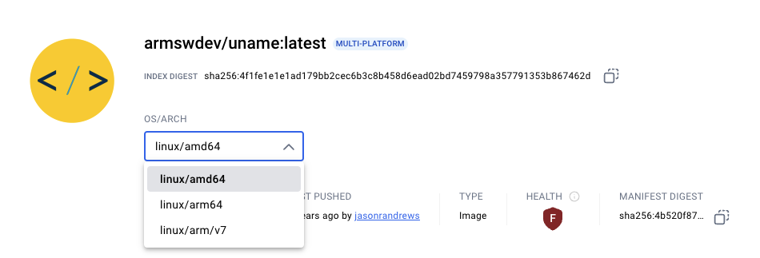
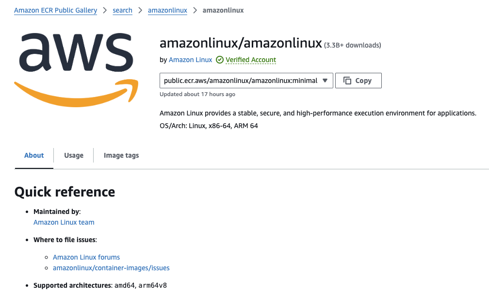

There are many ways to check if container images are built for multiple architectures and if they support the Arm architecture. 

Some of the common ways are provided below.

## Look at the image information in the container registry

One way to check images is to use a browser and inspect the image in the registry. 

For example, on Docker Hub, the architectures are printed.



AWS ECR Public registry also prints the architectures.



If you see `arm64`, `ARM64`, or `arm64v8` on the list, then the image supports Arm.

Not all container registries have a web view showing architecture support. Additional ways to find the information are provided below. 

## Use Docker CLI commands

#### Inspect the image manifest

```bash
docker manifest inspect armswdev/uname:latest
```

Look for "arm64" in the output.

You can use `grep` to check for `arm64`:

```bash
docker manifest inspect armswdev/uname:latest | grep arm64
```

The output confirms `arm64` support:

```output
"architecture": "arm64",
```

#### Use Docker buildx to inspect the image

```bash
docker buildx imagetools inspect --format '{{json (index .Image "linux/arm64")}}' armswdev/uname:latest
```

If this command returns JSON data, the image supports Arm.

If the image does not support Arm an error is printed:

```output
ERROR: template: :1:8: executing "" at <index .Image "linux/arm64">: error calling index: can't index item of type v1.Image
```

#### Inspect image metadata

The `image inspect` command works on local images so use `docker pull` to get the image.

```bash
docker image inspect armswdev/uname:latest
```

Look for "Architecture": "arm64" in the output.

### Use a formatted inspect command

For concise output print only the architecture:

```bash
docker inspect -f '{{.Architecture}}' armswdev/uname:latest
```

This will directly output the architecture.

```output
arm64
```

### Can I use a script to check if a container image supports the Arm architecture?

You can run a script to check container images for `arm64` support.

The script performs the following tasks:
- Get a token for the registry
- Read the image manifest
- Check the manifest for architecture support 

Make sure Python3 is installed on your computer. 

Use a text editor to copy the Python code below to a file named `check-image.py`.

```python
import requests
import sys
import os
import argparse
from typing import List, Dict, Tuple

# Target architectures to check
TARGET_ARCHITECTURES = {'amd64', 'arm64'}
TIMEOUT_SECONDS = 10

def get_auth_token(repository: str) -> str:
    """Get Docker Hub authentication token."""
    url = "https://auth.docker.io/token"
    params = {
        "service": "registry.docker.io",
        "scope": f"repository:{repository}:pull"
    }
    try:
        response = requests.get(url, params=params, timeout=TIMEOUT_SECONDS)
        response.raise_for_status()
        return response.json()['token']
    except requests.exceptions.RequestException as e:
        print(f"Failed to get auth token: {e}", file=sys.stderr)
        sys.exit(1)

def get_manifest(repository: str, tag: str, token: str) -> Dict:
    """Fetch manifest for specified image."""
    headers = {
        'Accept': 'application/vnd.docker.distribution.manifest.list.v2+json',
        'Authorization': f'Bearer {token}'
    }
    url = f"https://registry-1.docker.io/v2/{repository}/manifests/{tag}"
    try:
        response = requests.get(url, headers=headers, timeout=TIMEOUT_SECONDS)
        response.raise_for_status()
        return response.json()
    except requests.exceptions.RequestException as e:
        print(f"Failed to get manifest: {e}", file=sys.stderr)
        sys.exit(1)

def check_architectures(manifest: Dict) -> List[str]:
    """Check available architectures in the manifest."""
    if manifest.get('manifests'):
        archs = [m['platform']['architecture'] for m in manifest['manifests']]
        return archs
    else:
        return []

def parse_image_spec(image: str) -> Tuple[str, str]:
    """Parse image specification into repository and tag."""
    if ':' in image:
        repository, tag = image.split(':', 1)
    else:
        repository, tag = image, 'latest'
    
    if '/' not in repository:
        repository = f'library/{repository}'
    return repository.lower(), tag

def parse_args():
    """Parse command line arguments."""
    parser = argparse.ArgumentParser(description='Check Docker image architectures')
    parser.add_argument('image', help='Docker image name (format: name:tag)')
    return parser.parse_args()

if __name__ == "__main__":
    args = parse_args()
    repository, tag = parse_image_spec(args.image)
    
    token = get_auth_token(repository)
    manifest = get_manifest(repository, tag, token)
    architectures = check_architectures(manifest)

    if not architectures:
        print(f"No architectures found for {args.image}", file=sys.stderr)
        sys.exit(1)

    available_targets = TARGET_ARCHITECTURES.intersection(architectures)
    missing_targets = TARGET_ARCHITECTURES - set(architectures)

    if not missing_targets:
        print(f"✓ Image {args.image} supports all required architectures")
    else:
        print(f"✗ Image {args.image} is missing architectures: {', '.join(missing_targets)}")
        print(f"Available architectures: {', '.join(architectures)}")
```

The script queries Docker Hub. If needed, you can change the registry and the architecture list to meet your needs.

Run the script asking about Alpine Linux:

```bash
python3 ./check-image.py alpine:3.21.0
```

The output indicates that the image supports both `arm64` and `amd64`:

```output
✓ Image alpine:3.21.0 supports all required architectures
```

You can now identify if container images are built for multi-architecture support, including the Arm architecture. 

