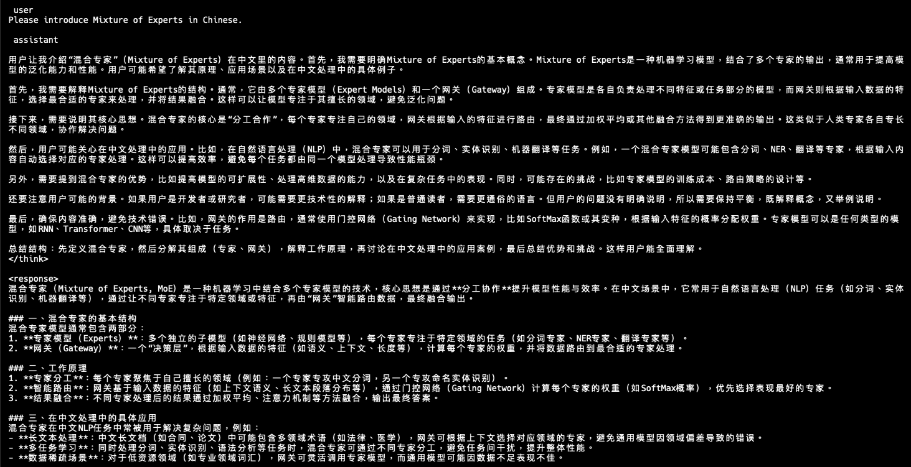

## Overview

In the previous section, you learned how Mixture of Experts (MoE) models reduce resource consumption by activating only a fraction of parameters. 
Now, you'll walk through how to prepare your environment to deploy ERNIE-4.5 models on an Armv9 platform using llama.cpp.

In this section, you verify model inference on a Radxa Orion O6 board and validate multilingual outputs using ERNIE's Thinking variant.

This section prepares the foundation for deploying ERNIE-4.5 on an Armv9 platform. You begin by reviewing the hardware, the Radxa Orion O6 development board equipped with an Armv9 CPU. From there, you install llama.cpp, a lightweight inference engine, build it from source, and download ERNIE-4.5 models in GGUF format (quantized to Q4 for efficient CPU inference). Finally, you run a basic inference test to confirm that the environment is properly configured and ready for benchmarking and optimization in the next section.

### Armv9 development board

This Learning Path uses the [Radxa Orion O6](https://radxa.com/products/orion/o6/), a compact Armv9 development board powered by the [CIX CD8180](https://en.cixtech.com/Personal-Computing/) SoC. 

The board features:

- 12-core Armv9.2 CPU
- Support for SVE, dotprod, and i8mm instruction sets
- Multiple HDMI ports, PCIe slot with Gen4x8, dual 5 Gbps Ethernet ports, and USB-C for I/O expansion

This board balances affordability and performance, and most importantly, it supports vector instructions you'll benchmark.

The default system image for the board is Debian, which includes a ready-to-use user environment. You can verify or reflash the OS by following the instructions on the Radxa O6 [download page](https://docs.radxa.com/en/orion/o6/getting-started/quickly-start).

With the Radxa Orion O6 ready, you can set up the software stack beginning with llama.cpp.

### Clone and build llama.cpp

First, ensure your system is up to date and install the required tools and libraries:

```bash
sudo apt update
sudo apt install build-essential cmake python3 python3-pip htop libcurl4-openssl-dev -y
```

Next, build llama.cpp, an open-source C++ framework for running and experimenting with large language models. Designed to be lightweight and fast, llama.cpp supports inference on edge devices (CPU-only) and implements many of the most popular LLM architectures.

In the context of MoE models, llama.cpp currently supports:
- Openai-moe
- Oleo
- lm4-moe
- Qwen2 moe, Qwen3 moe
- Grok
- Ernie4.5

These models use diverse routing and expert management strategies, and llama.cpp provides a unified backend for efficient MoE inference.
For more in-depth coverage of llama.cpp capabilities and use cases, see the [llama.cpp Learning Paths](/tag/llama.cpp/).

```bash
cd $HOME
git clone https://github.com/ggerganov/llama.cpp.git
cd llama.cpp
mkdir build && cd build
cmake ..
make -j$(nproc)
```

This generates binaries like `llama-cli` in the `~/llama.cpp/build/bin` directory, which you use to run inference in later steps.
Once llama.cpp is compiled, download the models you'll use for evaluation.

### Download ERNIE-4.5 Q4 GGUF model

In this Learning Path, you use [ERNIE-4.5](https://huggingface.co/collections/baidu/ernie-45) to deploy on Armv9.

Download both model variants so you can experiment with each one:

```bash
mkdir -p $HOME/models/ernie-4.5 && cd $HOME/models/ernie-4.5
wget https://modelscope.cn/models/unsloth/ERNIE-4.5-21B-A3B-PT-GGUF/resolve/master/ERNIE-4.5-21B-A3B-PT-Q4_0.gguf
wget https://modelscope.cn/models/unsloth/ERNIE-4.5-21B-A3B-Thinking-GGUF/resolve/master/ERNIE-4.5-21B-A3B-Thinking-Q4_0.gguf
```

You can see the size of both models is 12 GB, and they're quantized to Q4, making them suitable for CPU-only inference.

{}
The Q4 quantized models reduce memory footprint and allow CPU-only inference. You still need around 12 GB of RAM for good performance.
{}

While both the Thinking and PT variants of ERNIE-4.5 share the same MoE architecture, they're fine-tuned for different objectives. The Thinking model is optimized for logical reasoning and structured generation, making it the main focus of subsequent benchmarking and hardware optimization. You're encouraged to install both variants and observe behavioral differences using the same prompt.

### Run a basic inference test

Navigate to the build directory and run the following command to verify that the model loads correctly and supports multilingual input:

```bash
cd $HOME/llama.cpp/build
./bin/llama-cli \
    --jinja \
    -m ~/models/ernie-4.5/ERNIE-4.5-21B-A3B-Thinking-Q4_0.gguf \
    -p "Please introduce Mixture of Experts in Chinese." \
    -c 4096 -t 12 \
    --jinja
```

Note the flags:
- `-p`: Passes the input prompt directly as a string.
- `-c 4096`: Sets the context length (in tokens). A longer context allows the model to "remember" more input text, which is crucial for long-form tasks. Here, you use the recommended 4096 tokens.
- `-t 12`: Specifies the number of CPU threads used for inference. You should match this number to the physical cores (or logical threads) available on your system to maximize performance.
- `--jinja`: Enables Jinja-style prompt templates. Many Chinese-oriented MoE models rely on this template format for structured inputs.

If everything is set up correctly, you see metadata output from llama.cpp indicating the model's architecture and size:

```output
print_info: model type       = 21B.A3B
print_info: model params     = 21.83 B
print_info: general.name     = Ernie-4.5-21B-A3B-Thinking
```

Once inference is complete, the expected output looks like this (in Chinese):



This answer demonstrates the model's multilingual and structured reasoning ability. It begins with a narrative explanation introducing the concept of Mixture of Experts (MoE), followed by a well-organized markdown-style summary with section headers and bullet points. The response describes MoE as a model combining multiple specialized sub-models (experts) and a routing mechanism (gateway) to activate only a few experts per input. It explains how routing selects top experts based on input features and how the system reduces computation by activating only a small number of experts per token. The answer also gives examples such as word segmentation and translation, explaining how different experts might focus on distinct subtasks in Chinese NLP applications.

This confirms the GGUF model is successfully loaded, the llama.cpp build functions as expected, and CPU-only inference on Armv9 is working.

The prompt "Please introduce Mixture of Experts in Chinese." was chosen because it tests two important capabilities. First, it verifies bilingual capability since the instruction is in English but the answer is expected in Chinese, confirming that ERNIE-4.5's multilingual support works correctly. Second, it engages MoE behavior by having the model explain a technical concept in Chinese, which likely activates different experts within the model during inference. Even though routing isn't explicitly logged, the richness and precision of the output suggest that MoE routing functions as designed. This type of prompt increases the likelihood of multiple experts being activated simultaneously, including language generation, machine learning knowledge, and Chinese translation experts.

## What you've accomplished and what's next

You've successfully set up llama.cpp on Armv9 hardware, deployed the ERNIE-4.5 model, and confirmed that multilingual inference works correctly. With this foundation in place, you're ready to explore expert routing behavior and compare model variants in the next section.
