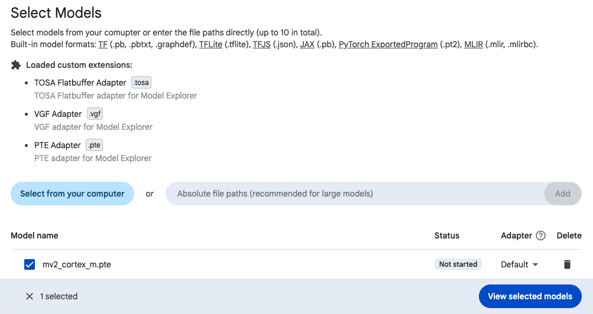
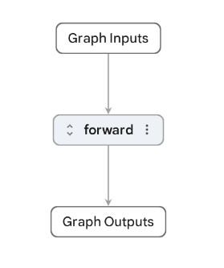
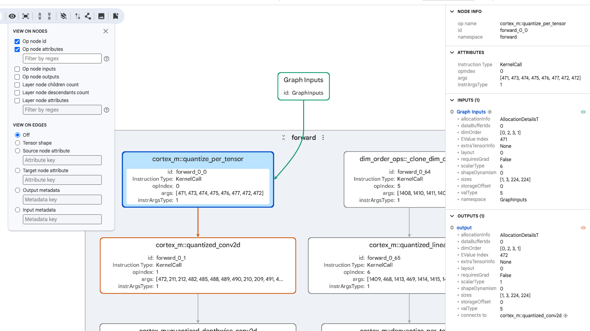

## Clone the repo of example models

In this section, you install Model Explorer in a clean Python virtual environment, along with the Arm adapters, and confirm it is working using the PTE adapter. First you will clone the repo of example models to use across the course of this learning path.

Use a machine capable of displaying a browser e.g, a laptop.

This repository uses Git LFS for model artifacts. After cloning, run `git lfs pull` to download the files.

```bash
git clone https://github.com/arm-education/ml-model-artifacts.git
cd ml-model-artifacts
git lfs pull
```

## Create a virtual environment

Use a separate environment to avoid dependency conflicts with any ExecuTorch build, notebook, or application environment you already use:

If you use WSL on Windows, follow the Linux/macOS commands.


  
python3 -m venv model_explorer_env
source model_explorer_env/bin/activate
python -m pip install --upgrade pip
  
  
py -m venv model_explorer_env
.\model_explorer_env\Scripts\Activate.ps1
python -m pip install --upgrade pip
  


{}
On Windows, if PowerShell blocks `Activate.ps1`, allow local activation scripts for your user account:

```powershell
Set-ExecutionPolicy -ExecutionPolicy RemoteSigned -Scope CurrentUser
```
{}

## Install Model Explorer

Install Model Explorer and PyTorch in the active virtual environment.

The Linux command pins PyTorch to the CPU wheel index because this Learning Path does not need CUDA. On macOS and Windows, the standard PyPI install is usually sufficient.


  
pip install torch --index-url https://download.pytorch.org/whl/cpu
pip install ai-edge-model-explorer
  
  
pip install torch ai-edge-model-explorer
  
  
pip install torch ai-edge-model-explorer
  


## Install the Arm adapters

{}
Update this installation section after the ExecuTorch Model Explorer extension is released.

The intended install flow is to install the PTE, ETRecord, and ETDump adapters/data provider as one ExecuTorch extension, then launch Model Explorer with that ExecuTorch extension alongside the TOSA and VGF adapters. Until that package is available, keep the ETRecord and ETDump install and launch instructions under review.
{}

Install the PTE, TOSA, and VGF adapters used for the static artifact sections:

```bash
pip install pte-adapter-model-explorer
pip install tosa-adapter-model-explorer
pip install vgf-adapter-model-explorer
```

## Launch Model Explorer

Launch Model Explorer with the Arm adapters. This is the recommended route for the static artifact sections because you will open `.pte`, `.tosa`, and `.vgf` artifacts. Also shown are examples of running the base model explorer without adapters, and running with a single adapter.

This will launch a webpage in your browser.


  
model-explorer --extensions=pte_adapter_model_explorer,tosa_adapter_model_explorer,vgf_adapter_model_explorer
  
  
model-explorer --extensions=pte_adapter_model_explorer
  
  
model-explorer
  


{}
Use `CTRL + C` to stop Model Explorer.
{}

{}
If you have a specific interest in one model format, such as `.pte`, `.tosa`, or `.vgf`, or in a particular target (e.g., Cortex-M, Cortex-A, Ethos-U, Neural Graphics) you can skip to the appropriate section.
{}

## Open the Cortex-M PTE

We will start with a `.pte` generated for the Cortex-M backend. This `.pte` was generated for the MobileNetV2 model, a typical Convolutional Neural Network (CNN) used in embedded ML.

The ExecuTorch Cortex-M backend prepares models for Arm Cortex-M microcontrollers, where memory and compute resources are much more limited than on application-class CPUs. It rewrites supported quantized operators so they can use CMSIS-NN, an Arm library of optimized neural network kernels for Cortex-M processors. CMSIS-NN exists to make common ML operations such as convolutions, fully connected layers, activations, and quantization-related operations run efficiently on small embedded CPUs. Treat this first `.pte` as a good way to learn the Model Explorer interface while seeing how an ExecuTorch graph can reflect Cortex-M-specific lowering.

{}
The Cortex-M backend is a work-in-progress proof of concept. It is not intended for production use, and APIs may change without notice. However, the `.pte` is pre-generated for you in the provided repo. If you would like to find out more about the Cortex-M backend, use the [Cortex-M Backend Documentation](https://docs.pytorch.org/executorch/1.2/backends/arm-cortex-m/arm-cortex-m-overview.html), which also links to a Jupyter Notebook.
{}

In the Model Explorer UI, open:

```output
ml-model-artifacts/pte/mv2_cortex_m.pte
```

Your view in browser should appear as follows:



Click `View selected models` and your view should appear as below:



A right-hand bar tells you the graph info, including the `op node count` and the `layer count`. The `op node count` is the number of operator nodes in the graph. The `layer count` is the number of hierarchical graph components represented in the current view, not necessarily the number of neural network layers in the original model.

Double click the `forward` layer to see the various operators comprising the layer. Click a specific operator, e.g., `cortex_m::quantize_per_tensor` to see various attributes, as well as inputs and outputs, in the right-hand bar.



When you inspect a `.pte` for the first time, focus on the higher-level graph information first:

- **Operator names** show the work the ExecuTorch program will perform.
- **Inputs and outputs** show how tensors flow through the graph.
- **Tensor shapes and types** help you check whether the model was exported and quantized as expected.
- **Hierarchical layers** let you expand or collapse parts of the graph so you can move between an overview and individual operators.
- **Delegate or backend-specific names** show where a backend flow has changed the graph. In this Cortex-M example, names such as `cortex_m::...` indicate operators affected by the Cortex-M backend flow.

You might also see lower-level `.pte` execution fields in the node attributes. These fields come from the serialized ExecuTorch program:

| Field | What it means |
| --- | --- |
| `instruction type: KernelCall` | This instruction calls an ExecuTorch operator kernel. A kernel is the code that executes a model operator for a runtime or backend. |
| `instr_args_type: 1` | The internal FlatBuffer type tag for the instruction arguments. In this case, `1` identifies the arguments as a `KernelCall`. |
| `op_index` | An index into the `.pte` operator table. It tells ExecuTorch which operator this instruction calls. |
| `args: [471, 473, 474, ...]` | Indexes into the `.pte` values table. These entries identify the tensors or other values used as inputs and outputs by the instruction. |

You do not need to memorize these internal fields. Use them as clues when you want to connect a visible graph node to the underlying ExecuTorch program structure.

Click the `eye symbol` in the top left bar to select data to view on nodes and edges. Select the data you want to see - e.g., `op node id` and `op node attributes` to include more data within the graph itself.

## What you have learned

You have installed Model Explorer, launched it with the Arm adapters, and opened your first `.pte` artifact. You have also learned how to inspect the graph overview, expand into the `forward` layer, read operator metadata, and interpret common low-level `.pte` fields such as `KernelCall`, `op_index`, and `args`.

Next, you will keep the same browser tab open and compare portable and XNNPACK `.pte` artifacts to see how backend delegation changes the graph.
