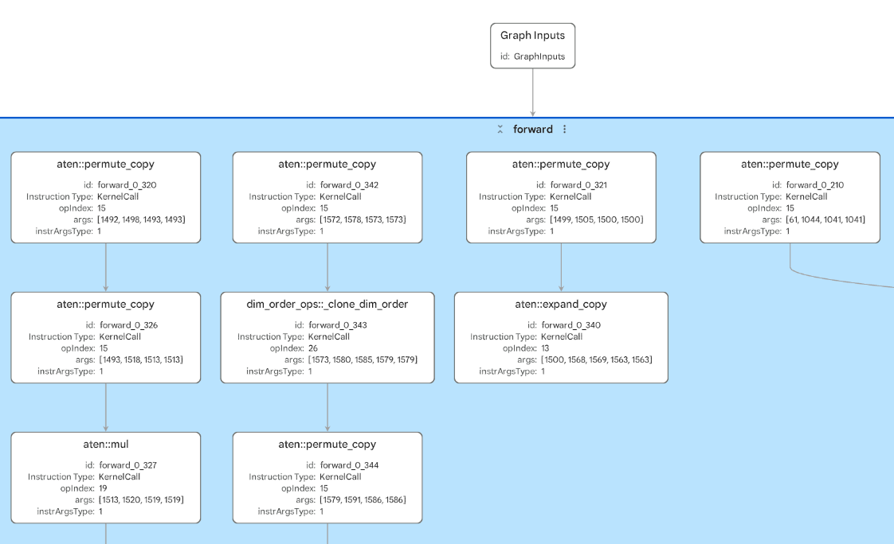
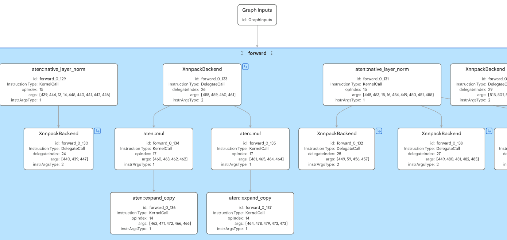
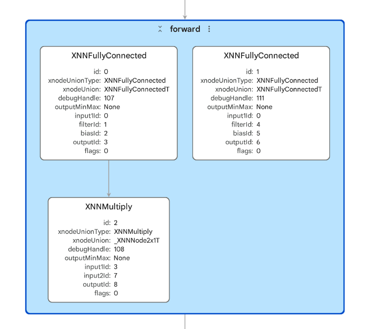

## Understand the CPU paths

This section focuses on Cortex-A CPU deployment. Cortex-A processors are application-class CPUs used in systems such as phones, Raspberry Pi-class Linux devices, laptops, and cloud instances.

The portable `.pte` uses ExecuTorch portable kernels. A portable kernel is a general ExecuTorch implementation of an operator. Portable kernels exist so ExecuTorch programs can run with a small runtime and broad operator coverage, even when no specialized backend is available. They are important for correctness, portability, fallback, and bring-up on new targets.

Portable kernels are not usually the fastest CPU path. They prioritize broad support and a lightweight deployment model, rather than using every architecture-specific optimization available on a modern Cortex-A CPU. For transformer models such as OPT-125M, much of the runtime cost comes from linear layers and matrix multiplications. Those operations benefit strongly from optimized CPU kernels.

[XNNPACK](https://github.com/google/XNNPACK) is the optimized CPU backend used by ExecuTorch for many Arm CPU deployments. During [export and lowering](https://docs.pytorch.org/executorch/stable/using-executorch-export.html), the XNNPACK partitioner finds supported parts of the graph and turns them into delegated regions. At runtime, those regions execute with XNNPACK instead of the default portable-kernel path. Operators that XNNPACK does not support, or graph sections that cannot be grouped into an XNNPACK region, remain on the default ExecuTorch path.

On Arm CPUs, XNNPACK can use Arm KleidiAI micro-kernels. [KleidiAI](https://developer.arm.com/dev2/ai/kleidi-libraries) is Arm's open-source library of optimized low-level AI routines for Arm CPUs. It provides architecture-tuned compute kernels for operations such as matrix multiplication, using Arm features such as Neon, SVE2, and SME2 where supported. You do not call KleidiAI directly in this workflow; ExecuTorch delegates to XNNPACK, and XNNPACK can use KleidiAI-optimized kernels internally when the operator, data type, and hardware are supported.

If you are interested in understanding how SME2 can accelerate performance of ExecuTorch models, take a look at [Profile ExecuTorch models with SME2 on Arm](https://learn.arm.com/learning-paths/cross-platform/sme-executorch-profiling/).

To summarize the different CPU paths:

| Artifact | Target CPU path | What to expect |
| --- | --- | --- |
| Cortex-M `.pte` | Cortex-M backend lowering with CMSIS-NN optimized kernels where supported | Quantized operator patterns and Cortex-M-specific names |
| Portable Cortex-A `.pte` | Default ExecuTorch portable kernels | Broad operator coverage, useful baseline, usually slower for heavy transformer compute |
| XNNPACK Cortex-A `.pte` | XNNPACK delegated regions, with portable fallback where needed | Faster supported CPU regions, possible graph fragmentation, larger `.pte` metadata |

## Compare CPU deployment artifacts

In this section, you compare two `.pte` files generated from the same model: [`facebook/opt-125m`](https://huggingface.co/facebook/opt-125m).

OPT stands for Open Pre-trained Transformer. OPT-125M is a 125-million-parameter, decoder-only transformer language model from Meta. It is a small member of the OPT family, which makes it useful for demonstrations because it is large enough to contain transformer operations such as embeddings, attention, linear layers, matrix multiplication, reshapes, and masking, but small enough to inspect and run on edge-class Arm systems.

The FP32 artifacts used here come from the [ExecuTorch on Arm Practical Labs](https://github.com/arm-education/executorch_on_arm_labs).

Open these files in Model Explorer:

```output
model-explorer-artifacts/pte/opt125m_cortex_a_portable.pte
model-explorer-artifacts/pte/opt125m_cortex_a_xnnpack.pte
```

## Open the portable kernel PTE

Open `opt125m_cortex_a_portable.pte` in Model Explorer and inspect the graph structure. This file is the baseline ExecuTorch program without XNNPACK delegation. It shows how the model looks when the graph runs through the default ExecuTorch portable-kernel path. 

Inspect the graph and answer:

- Are there any backend delegate regions?
- Do the operator names look like regular PyTorch/ATen operators or backend-specific operators?
- What are the model input and output shapes?
- Which transformer operator patterns appear repeatedly?
- Which shape or layout operators might become boundaries for optimized backend delegation?

A small snippet image is shown below:



In this artifact, notice:

- The graph has 600 operator nodes and no XNNPACK delegate regions. The visible operators are regular ExecuTorch `KernelCall` nodes.
- Most visible operator names use the `aten::` namespace. ATen is PyTorch's core operator library.
- The model has two fixed-shape inputs with shape `[1, 128]`, corresponding to a batch size of 1 and a fixed sequence length of 128 tokens.
- The output shape is `[1, 50272]`, which represents logits over the OPT vocabulary for the wrapped last-token output.
- Repeated transformer patterns are visible. Look for groups of `aten::addmm`, `aten::bmm`, `aten::_softmax`, `aten::native_layer_norm`, `aten::relu`, and residual `aten::add` operations.
- Many layout and shape-manipulation operators are present, such as `aten::permute_copy`, `aten::expand_copy`, `aten::unsqueeze_copy`, and `dim_order_ops::_clone_dim_order`. These are useful to notice because they can affect memory movement and can become boundaries around optimized backend regions.

## Open the XNNPACK PTE

Open `opt125m_cortex_a_xnnpack.pte` and compare it with the portable graph. 

Inspect the graph and answer:

- Are there XNNPACK delegate regions?
- Is the delegated work one large block or many smaller blocks?
- Which inputs and outputs cross the delegate boundaries?
- Does any visible work remain outside the delegated regions?
- Which `aten::` operators remain on the default ExecuTorch path?
- Can you open a delegate subgraph and identify backend-level XNNPACK operators?

The backend has clearly changed the execution plan:



- The top-level graph is smaller than the portable graph, with about 335 operator nodes instead of about 600.
- The graph contains many `XnnpackBackend` nodes. In this artifact, these represent the delegated regions that will execute through XNNPACK.
- Model Explorer exposes the XNNPACK delegate subgraphs. Open a delegate subgraph to see backend-level operators such as `XNNFullyConnected`, `XNNBatchMatrixMultiply`, `XNNStaticTranspose`, `XNNAdd`, `XNNMultiply`, and `XNNSoftmax`.
- The input and output contract remains the same as the portable artifact: two `[1, 128]` inputs and one `[1, 50272]` output.
- Some `aten::` operators still remain at the top level, including shape, masking, normalization, and elementwise operations. These are the parts of the graph that stayed on the default ExecuTorch path.
- The graph is not one single XNNPACK region. OPT-125M is a transformer with attention, masking, reshapes, and layout changes, so delegation is useful but fragmented into many backend regions.



This is the key difference to notice: XNNPACK does not replace the whole `.pte`. It captures supported subgraphs and leaves the rest of the program in ExecuTorch. In performance work, the balance between large delegated regions and remaining default-path operators is often more important than the raw number of delegate nodes.

## Compare the two artifacts

Use this table to guide your comparison:

| Question | What to look for |
| --- | --- |
| Did XNNPACK group expensive work? | A larger delegated region can indicate that supported transformer operations were grouped for optimized CPU execution. |
| Did the graph fragment? | Multiple small delegate regions can indicate unsupported operators or boundaries between supported regions. |
| What stayed on the CPU default path? | Remaining portable operators may explain residual latency or integration requirements. |
| Did the artifact size change? | Backend delegation can improve latency but may increase the `.pte` size. |

## What you have learned

You have compared the same FP32 OPT-125M model exported as a portable Cortex-A `.pte` and as an XNNPACK-delegated Cortex-A `.pte`. The portable artifact shows the baseline ExecuTorch execution plan with mostly `aten::` `KernelCall` nodes. The XNNPACK artifact shows how supported CPU subgraphs are replaced by `XnnpackBackend` regions while unsupported or awkward graph sections remain on the default ExecuTorch path.

You have also seen that backend delegation is not all-or-nothing. For transformer models, shape changes, masking, normalization, and layout operations can fragment the graph, so performance analysis depends on both what was delegated and what stayed outside the delegate.

Next, you will inspect Ethos-U `.pte` artifacts and see how NPU delegation differs from Cortex-A CPU delegation.
