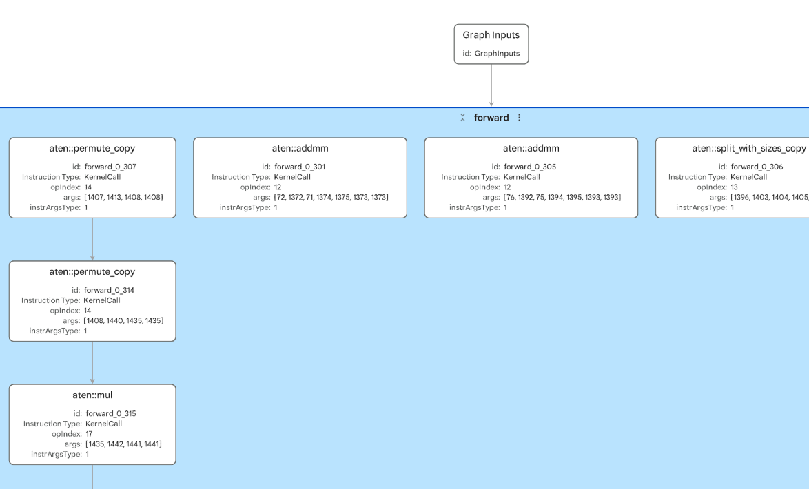
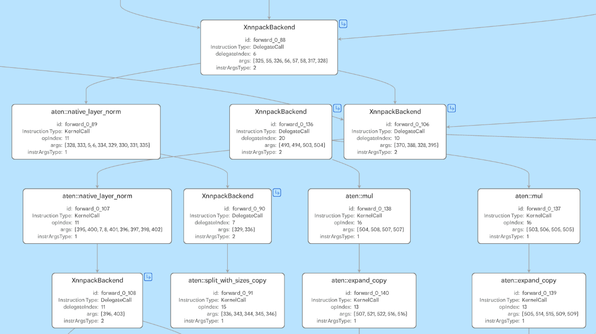
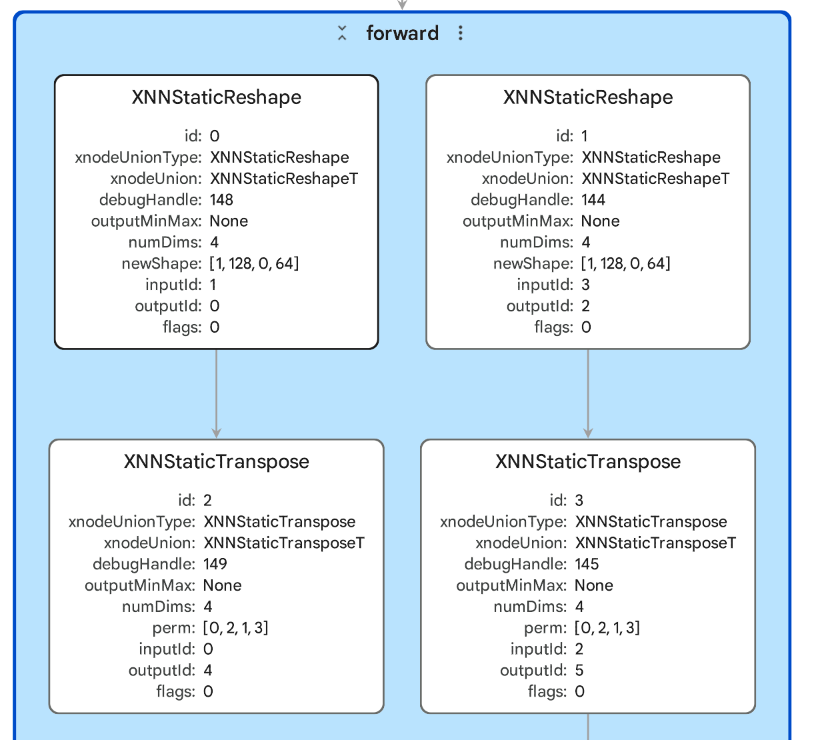

## Understand the CPU paths

You'll focus on Cortex-A CPU deployment. Cortex-A processors are application-class CPUs used in systems such as phones, Raspberry Pi-class Linux devices, laptops, and cloud instances.

The portable `.pte` uses ExecuTorch portable kernels. A portable kernel is a general ExecuTorch implementation of an operator. Portable kernels exist so ExecuTorch programs can run with a small runtime and broad operator coverage, even when no specialized backend is available. They are important for correctness, portability, fallback, and bring-up on new targets.

Portable kernels aren't usually the fastest CPU path. The kernels prioritize broad support and a lightweight deployment model, rather than using every architecture-specific optimization available on a modern Cortex-A CPU. For transformer models such as GPT-2, much of the runtime cost comes from linear layers and matrix multiplications. Those operations benefit strongly from optimized CPU kernels.

[XNNPACK](https://github.com/google/XNNPACK) is the optimized CPU backend used by ExecuTorch for many Arm CPU deployments. During [export and lowering](https://docs.pytorch.org/executorch/stable/using-executorch-export.html), the XNNPACK partitioner finds supported parts of the graph and turns them into delegated regions. At runtime, those regions execute with XNNPACK instead of the default portable-kernel path. Operators that XNNPACK doesn't support, or graph sections that can't be grouped into an XNNPACK region, remain on the default ExecuTorch path.

On Arm CPUs, XNNPACK can use Arm KleidiAI micro-kernels. [KleidiAI](https://developer.arm.com/dev2/ai/kleidi-libraries) is Arm's open-source library of optimized low-level AI routines for Arm CPUs. The library provides architecture-tuned compute kernels for operations such as matrix multiplication, using Arm features such as Neon, SVE2, and SME2 where supported. 

You won't call KleidiAI directly in this workflow. Instead, ExecuTorch delegates to XNNPACK, and XNNPACK can use KleidiAI-optimized kernels internally when the operator, data type, and hardware are supported.

{}
If you're interested in understanding how SME2 can accelerate the performance of ExecuTorch models, see the [Profile ExecuTorch models with SME2 on Arm](https://learn.arm.com/learning-paths/cross-platform/sme-executorch-profiling/) Learning Path.
{}

To summarize the different CPU paths:

| Artifact | Target CPU path | What to expect |
| --- | --- | --- |
| Cortex-M `.pte` | Cortex-M backend lowering with CMSIS-NN optimized kernels where supported | Quantized operator patterns and Cortex-M-specific names |
| Portable Cortex-A `.pte` | Default ExecuTorch portable kernels | Broad operator coverage, useful baseline, usually slower for heavy transformer compute |
| XNNPACK Cortex-A `.pte` | XNNPACK delegated regions, with portable fallback where needed | Faster supported CPU regions, possible graph fragmentation, larger `.pte` metadata |

## Compare CPU deployment artifacts

You'll compare two `.pte` files generated from the same [`openai-community/gpt2`](https://huggingface.co/openai-community/gpt2) model.

GPT-2 is a decoder-only transformer language model from OpenAI. It contains embeddings, attention, linear layers, matrix multiplication, reshapes, masking, and GELU activations, so it provides a useful example for comparing portable and optimized CPU execution paths.

## Open the portable kernel PTE

Open `gpt2_cortex_a_portable.pte` in Model Explorer and inspect the graph structure.
This file is the baseline ExecuTorch program without XNNPACK delegation. It shows how the model looks when the graph runs through the default ExecuTorch portable-kernel path. 

Inspect the graph and look for the following:

- Any backend delegate regions
- Whether the operator names look like regular PyTorch or ATen operators, or backend-specific operators
- Model input and output shapes
- Transformer operator patterns that appear repeatedly
- Shape or layout operators that might become boundaries for optimized backend delegation

The following is a small snippet image:

In the artifact, notice the following:

- The graph has 589 operator nodes and no XNNPACK delegate regions. Including the graph input and output nodes, Model Explorer displays 591 nodes.
- Most visible operator names use the `aten::` namespace. ATen is PyTorch's core operator library.
- The model has two fixed-shape inputs with shape `[1, 128]`, corresponding to a batch size of 1 and a fixed sequence length of 128 tokens.
- The output shape is `[1, 50257]`, which represents logits over the GPT-2 vocabulary for the wrapped last-token output.
- Repeated transformer patterns are visible. Look for groups of `aten::addmm`, `aten::bmm`, `aten::_softmax`, `aten::native_layer_norm`, residual `aten::add`, and the `aten::pow`, `aten::tanh`, and `aten::mul` operations used by the GELU activations.
- Many layout and shape-manipulation operators are present, such as `aten::permute_copy`, `aten::expand_copy`, `aten::unsqueeze_copy`, and `dim_order_ops::_clone_dim_order`. These operators are useful to notice because they can affect memory movement and become boundaries around optimized backend regions.

## Open the XNNPACK PTE

Open `gpt2_cortex_a_xnnpack.pte` and compare it with the portable graph.

Inspect the graph and look for the following:

- XNNPACK delegate regions
- Whether the delegated work is one large block or many smaller blocks
- Inputs and outputs that cross the delegate boundaries
- Whether any visible work remains outside the delegated regions
- `aten::` operators that remain on the default ExecuTorch path
- Whether you can open a delegate subgraph and identify backend-level XNNPACK operators

The backend has changed the execution plan:

- The top-level graph is smaller than the portable graph, with 336 operator nodes instead of 589. Including the graph input and output nodes, Model Explorer displays 338 nodes.
- The graph contains 75 `XnnpackBackend` nodes. These represent the delegated regions that'll execute through XNNPACK.
- Model Explorer exposes the XNNPACK delegate subgraphs. Open a delegate subgraph to see backend-level operators such as `XNNFullyConnected`, `XNNBatchMatrixMultiply`, `XNNStaticTranspose`, `XNNStaticReshape`, `XNNAdd`, `XNNMultiply`, `XNNTanh`, and `XNNSoftmax`.
- The input and output contract remains the same as the portable artifact: two `[1, 128]` inputs and one `[1, 50257]` output.
- Some `aten::` operators still remain at the top level, including shape, masking, normalization, and elementwise operations. These are the parts of the graph that stayed on the default ExecuTorch path.
- The graph isn't one single XNNPACK region. GPT-2 contains attention, masking, reshapes, and layout changes, so delegation is fragmented into many backend regions.

This is the key difference to notice: XNNPACK doesn't replace the whole `.pte`. It captures supported subgraphs and leaves the rest of the program in ExecuTorch. In performance work, the balance between large delegated regions and remaining default-path operators is often more important than the raw number of delegate nodes.

## Compare the two artifacts

Use the following table to guide your comparison:

| Question | What to look for |
| --- | --- |
| Did XNNPACK group expensive work? | A larger delegated region can indicate that supported transformer operations were grouped for optimized CPU execution. |
| Did the graph fragment? | Multiple small delegate regions can indicate unsupported operators or boundaries between supported regions. |
| What stayed on the CPU default path? | Remaining portable operators might explain residual latency or integration requirements. |
| Did the artifact size change? | Backend delegation can improve latency but might increase the `.pte` size. |

## What you've accomplished and what's next

You've compared the same FP32 GPT-2 model exported as a portable Cortex-A `.pte` and as an XNNPACK-delegated Cortex-A `.pte`. The portable artifact shows the baseline ExecuTorch execution plan with mostly `aten::` `KernelCall` nodes. The XNNPACK artifact shows how supported CPU subgraphs are replaced by `XnnpackBackend` regions, while unsupported or awkward graph sections remain on the default ExecuTorch path.

You've also seen that backend delegation is not all-or-nothing. For transformer models, shape changes, masking, normalization, and layout operations can fragment the graph. Performance analysis depends on both what was delegated and what stayed outside the delegate.

Next, you'll inspect Ethos-U `.pte` artifacts and see how NPU delegation differs from Cortex-A CPU delegation.
