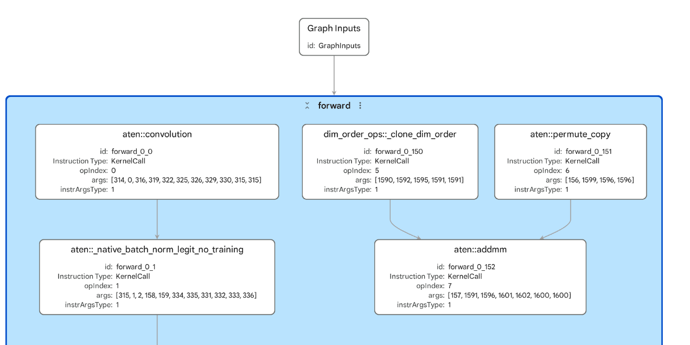
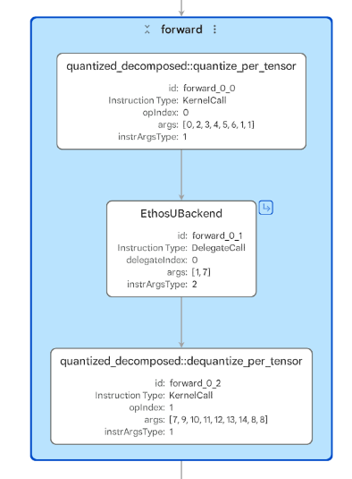
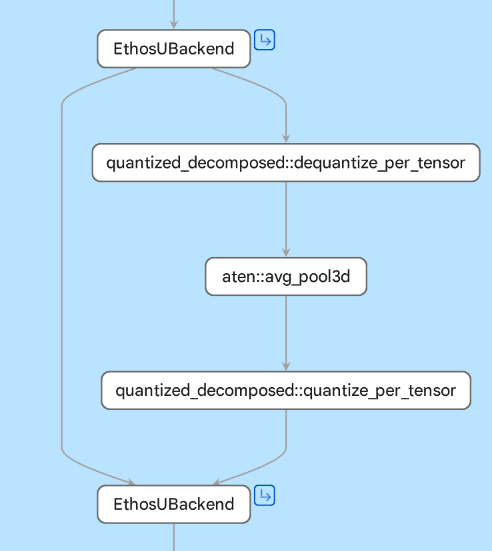

## Inspect NPU delegation

Ethos-U is Arm's microNPU family for embedded and edge AI acceleration. In ExecuTorch Arm Ethos-U flows, suitable quantized subgraphs are lowered for the Ethos-U backend and compiled through the Arm toolchain.

Model Explorer is useful because the final `.pte` shows whether the ExecuTorch program contains a clean NPU delegate region, fragmented delegate regions, or work outside the NPU delegate.

Ethos-U execution is heterogeneous: supported subgraphs are delegated to the NPU, while unsupported operators remain outside the NPU delegate. Whether that remaining work can execute on the CPU depends on the kernels included in the deployed ExecuTorch runtime. 

The PyTorch blog [Efficient Edge AI on Arm CPUs and NPUs](https://pytorch.org/blog/efficient-edge-ai-on-arm-cpus-and-npus/) describes this flow as the following:

- Quantizing the model
- Lowering supported regions to Tensor Operator Set Architecture (TOSA)
- Running Vela to produce an optimized Ethos-U command stream
- Packaging the result into the final `.pte`. 

You'll inspect three MobileNetV2 artifacts in order: FP32 with no NPU delegation, INT8 with clean delegation, and INT8 with fragmented delegation.

The artifacts that you'll use come from [ExecuTorch on Arm Practical Labs](https://github.com/arm-education/executorch_on_arm_labs).

## Open the FP32 Ethos-U artifact

First, you'll use a MobileNetV2 model, in FP32 form.

Open `ml-model-artifacts/pte/mv2_fp32_ethos_u85.pte`.

Inspect the graph and look for the following:

- Whether there is an Ethos-U delegate region
- Whether the operators are still regular `aten::` operators
- The input and output shapes
- What this tells you about targeting Ethos-U without quantization



Ethos-U execution expects quantized integer workloads. This artifact was generated from an FP32 MobileNetV2 model, so the graph isn't in the form Ethos-U needs for NPU execution. As a result, the work remains outside an Ethos-U delegate region.

- The graph is much larger at the top level, with many visible `aten::convolution`, `aten::_native_batch_norm_legit_no_training`, and `aten::hardtanh` nodes.
- You shouldn't see an `EthosUBackend` delegate node.
- The input and output shapes still match the image classification model: `[1, 3, 224, 224]` to `[1, 1000]`.

This shows why quantization matters for Ethos-U. A model can be structurally valid and still fail to produce an NPU delegate region if it's not in a supported quantized form.

## Open a delegated INT8 Ethos-U artifact

Now you'll use the same MobileNetV2 model, but quantized with the `EthosUQuantizer` into INT8.

Open `ml-model-artifacts/pte/mv2_int8_ethos_u85.pte`.

Inspect the graph and look for the followiing:

- Whether there's an Ethos-U delegate region
- Whether the NPU region is one large block or several smaller blocks
- Inputs and outputs that cross the delegate boundary
- Whether any visible work remains outside the delegated region



A clean delegated example should have most supported quantized work inside the Ethos-U region. In this example, the compute-heavy quantized CNN operators are suitable for Ethos-U and appear as one large delegated region.

In Model Explorer, the artifact looks very compact at the top level:

- The graph has one input with shape `[1, 3, 224, 224]` and one output with shape `[1, 1000]`.
- You'll see a `quantized_decomposed::quantize_per_tensor` node near the start.
- You'll see a single `EthosUBackend` delegate node for the main accelerated region.
- You'll see a `quantized_decomposed::dequantize_per_tensor` node near the end.

Most of the quantized MobileNetV2 compute is hidden behind one Ethos-U delegate call, so the top-level `.pte` graph mostly shows data entering the delegate, leaving the delegate, and returning to ExecuTorch.

## Open a fragmented Ethos-U artifact

To create this example, the original MobileNetV2 graph was modified by inserting a Local Response Normalization (LRN) layer. This is a useful example because the rest of the model still looks like the clean INT8 MobileNetV2 case, but the inserted LRN operation introduces work that the Ethos-U flow cannot keep inside one contiguous delegated region.

Open `ml-model-artifacts/pte/mv2_lrn_int8_ethos_u85.pte`

Inspect the graph and look for the following:

- Multiple delegate regions
- Operators between delegate regions
- Unsupported operations or graph patterns outside the NPU delegate
- Quantize, dequantize, or non-delegated operators between delegate regions



Fragmentation often means that the model was only partly suitable for the target backend. Common causes include unsupported operators, unsupported tensor shapes, quantization issues, or target-specific compiler constraints.

LRN isn't natively supported by the Ethos-U flow used here, so it's decomposed into lower-level operations during lowering. Not all of those operations can be delegated to the NPU. Model Explorer should therefore show supported regions delegated to Ethos-U and unsupported work left outside the NPU delegate. 

In summary: a single unsupported operation can break an otherwise clean NPU region into multiple segments, increasing the number of delegate boundaries.

In Model Explorer, compare it with the clean delegated artifact:

- The graph still has one input with shape `[1, 3, 224, 224]` and one output with shape `[1, 1000]`.
- You'll see two `EthosUBackend` delegate nodes instead of one.
- You'll see quantize and dequantize nodes around the delegated regions.
- You'll see an `aten::avg_pool3d` node between the delegate regions. This is visible non-delegated work that breaks the otherwise contiguous NPU path.

This is what fragmentation looks like in a `.pte`: the NPU still accelerates supported regions, but unsupported work splits the graph and creates extra delegate boundaries. Additional boundaries can introduce data conversion, synchronization, or tensor movement. 

Non-delegated operators can also dominate runtime, or fail to run if the deployed runtime doesn't include compatible kernels for their operators, data types, layouts, and shapes. The static graph shows where delegation splits, but it doesn't show which cost dominates.

{}
An artifact generated for one Ethos-U target doesn't fully explain another target. You should, therefore, compare targets only with target-specific artifacts.

For example, an Ethos-U85 artifact doesn't provide full insight into Ethos-U55 behavior. Generate and inspect separate `.pte` files when comparing targets because operator support constraints, Vela behavior, memory configuration, MAC configuration, and fragmentation can differ.
{}

## (Optional) Visualize TFLite and PT2 files

<details>
<summary>Click to reveal</summary>

The artifacts repository also includes MobileNetV2 `.pt2` and `.tflite` files:
```output
ml-model-artifacts/pt2/mv2_fp32.pt2
ml-model-artifacts/tflite/mv2_fp32.tflite
ml-model-artifacts/tflite/mv2_int8.tflite
ml-model-artifacts/tflite/mv2_lrn_int8.tflite
```

Model Explorer supports PyTorch exported programs and TensorFlow Lite files directly, so visualizing these files does not require an adapter.

Try visualizing these files. Compare differences in the model graphs between TensorFlow Lite and ExecuTorch, and between the `.pte` stage and the `.pt2` stage.

</details>

## What you've learned and what's next

You've inspected three Ethos-U `.pte` artifacts and seen how quantization and operator support affect NPU delegation. 

The FP32 MobileNetV2 artifact doesn't produce an Ethos-U delegate region because Ethos-U expects supported quantized integer workloads.

The INT8 MobileNetV2 artifact shows the clean delegated pattern: quantize, run a compact `EthosUBackend` region, then dequantize. 

The LRN example shows fragmentation, where unsupported work splits one clean NPU region into multiple delegate regions with non-delegated work between them.

Next, you'll inspect TOSA artifacts directly to see the intermediate representation that sits between model lowering and backend compilation.
